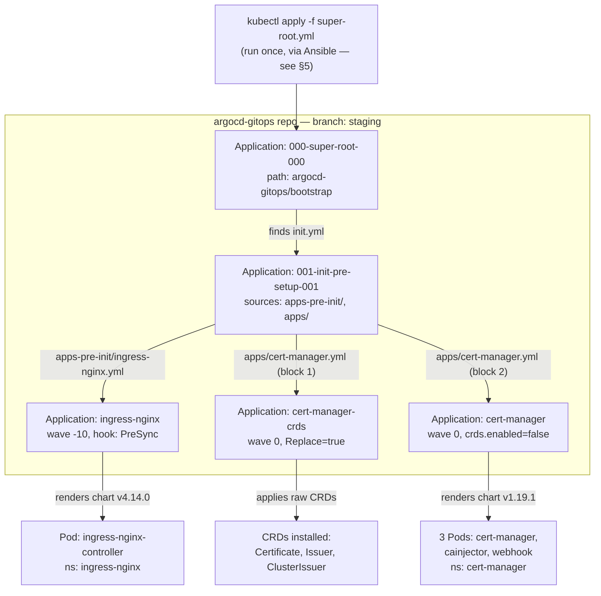
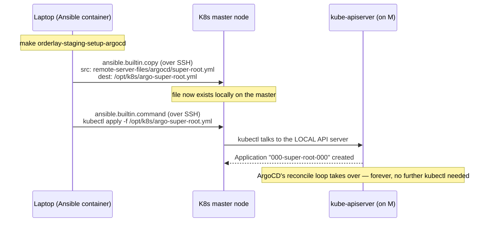
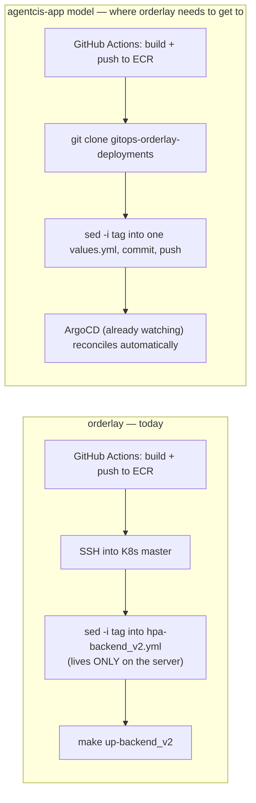

# Session Notes: Understanding the ArgoCD GitOps Model End-to-End, and Planning orderlay's Missing App-Deployment Repo

> **Audience:** Myself, mid-onboarding onto ArgoCD/GitOps — this is the session where the *mental model* finally clicked, traced against real files instead of guessed at. Written immediately after the discussion, 2026-09-10 → 2026-09-11.
> **Starting point:** `orderlay-staging`'s K8s cluster (created via Terraform) already had ArgoCD installed and syncing 5 Applications — `ingress-nginx` and `cert-manager` were up. I understood *that it worked*, not *why*, and had no idea what to do next to get orderlay's own app containers (`backend_v2`, `web-v2`, etc.) actually deployed.
> **Companion reading:** `note/ORDERLAY_TERRAFORM_BOOTSTRAP_IAM_AND_ASG_LIFECYCLE_NOTES.md` (how the server got created), `note/ORDERLAY_ARGOCD_INSTALL_AND_APP_OF_APPS_NOTES.md` (how ArgoCD got installed on it — this session picks up immediately after that one and goes much deeper on *why* it works), `note/ORDERLAY_ARGOCD_APP_OF_APPS_CASCADE_DIAGRAM.html` (the visual diagram version of §4 below).

---

## 0. Where this session started — the live cluster state

Confirmed working, before any of this discussion began:

```
ubuntu@root-master-nginx-ingress-172-34-21-146:~$ kubectl get pods -n argocd
NAME                                                READY   STATUS    RESTARTS   AGE
argocd-application-controller-0                     1/1     Running   0          5m20s
argocd-applicationset-controller-857dd4cd8b-zs5qd   1/1     Running   0          5m19s
argocd-dex-server-6b444dc946-4qtgj                  1/1     Running   0          5m20s
argocd-notifications-controller-6dd695698-cm7sj     1/1     Running   0          5m20s
argocd-redis-6ddd68458c-jn2cj                       1/1     Running   0          5m20s
argocd-repo-server-6546c667f8-5bl2r                 1/1     Running   0          5m20s
argocd-server-7565f8c89c-cc5nq                      1/1     Running   0          5m20s

$ kubectl get application -n argocd
NAME                     SYNC STATUS   HEALTH STATUS
000-super-root-000       Synced        Healthy
001-init-pre-setup-001   Synced        Healthy
cert-manager             Synced        Healthy
cert-manager-crds        Synced        Healthy
ingress-nginx            Synced        Healthy

$ kubectl get pods -n ingress-nginx
NAME                                        READY   STATUS    RESTARTS   AGE
ingress-nginx-controller-58bc5d5fd4-mlw76   1/1     Running   0          4m37s

$ kubectl get pods -n cert-manager
NAME                                       READY   STATUS    RESTARTS   AGE
cert-manager-5688bcfc59-7b88q              1/1     Running   0          4m46s
cert-manager-cainjector-5c97cd55f5-6xmp2   1/1     Running   0          4m46s
cert-manager-webhook-6645d87d9-gdg5g       1/1     Running   0          4m46s
```

The question driving this whole session: **"I only created the server and set up ArgoCD — what next, and how does any of this actually work?"**

---

## 1. TL;DR

1. There are **two conceptually separate GitOps repos** in play, not one: `argocd-gitops` (cluster *addons* — ingress, cert-manager — shared between agentcis's and orderlay's clusters) and `gitops-agentcisapp-deployments` (agentcis-app's actual *application workloads*). **orderlay has the first, and is missing an equivalent of the second entirely.** See §2.
2. ArgoCD is not "a service the server integrates with" — it's pods running *inside* the cluster (`argocd-application-controller`, `argocd-repo-server`) that continuously pull Git and force the cluster to match it. This is a control loop, not a one-shot deploy. See §3.
3. The 5 Applications you saw in `kubectl get application` are the result of exactly **one manual command, run once**, cascading through Git via the **App-of-Apps pattern** — an `Application` object's job can itself be "go apply more `Application` objects." Traced against the actual 5 files on disk in §4.
4. That one manual command (`kubectl apply -f super-root.yml`) isn't typed by a human over SSH — it's run **by Ansible**, as the tail end of `make orderlay-staging-setup-argocd`, and it's the *only* imperative step in the entire pipeline. Every downstream Application is 100% Git-driven from that point on. See §5.
5. `gitops-agentcisapp-deployments`'s `pre-apps`/`external-service`/`public-traffic` directories are **not a prerequisite gate** you need to clear before deploying an app — they're mostly solving **AWS ALB/Gateway-API problems that orderlay doesn't have**, because orderlay already chose plain `ingress-nginx`. See §6.
6. The generic Helm chart agentcis uses (`helm-charts/self-managed/backend`) **already supports `ingress-nginx` natively** (a real `nginx-ingress.yml` template, `ingress.className: nginx` in its values) and **already supports mounting an env file from an NFS-backed PVC** — the exact same pattern orderlay's `config/*.env` files already use. This makes it a strong reuse candidate for orderlay's own services. See §7.
7. **orderlay still has no equivalent of `gitops-agentcisapp-deployments`.** Its current CI/CD (`.github/workflows/k8s-*.yml`) SSHes into the K8s master and runs `sed` + `make up-<service>` directly — no Git-driven deploy exists for orderlay's actual containers yet. This is the concrete, well-scoped gap the rest of this note plans around. See §8.

---

## 2. Part A — Correcting the mental model: two repos, not one

My original assumption: *"agentcisapp has the `gitops-agentcisapp-deployments` repo where all the ArgoCD deployments are stored, and the server integrates with this repo."*

Corrected version:

- **The server doesn't "integrate with" a repo.** ArgoCD (pods running *inside* the cluster) is configured with Git credentials (a `repository`-type Kubernetes `Secret`, created by `1.2-repo-secret-setup.yml`) and continuously **polls/reconciles** whatever it finds in the repo(s) it's pointed at.
- **What ArgoCD watches is defined by `Application` custom resources** — plain Kubernetes objects that say "watch path X in repo Y, deploy it into namespace Z." One `Application` pointing at a directory of *more* `Application` manifests is the **App-of-Apps** pattern — this is exactly what produced the 5 entries in `kubectl get application`.
- There are genuinely **two separate repos** doing two different jobs for agentcis:

  | Repo | Watches for | Shared across clusters? |
  |---|---|---|
  | `argocd-gitops` (subdirectory *inside* `GH-infra-and-k8s-charts-central`) | Cluster **addons**: `ingress-nginx`, `cert-manager`, `external-secrets`, `promtail`, etc. | **Yes** — both agentcis's and orderlay's clusters sync the exact same repo/branch (`staging`) for this |
  | `gitops-agentcisapp-deployments` (own repo) | agentcis-app's actual **containers** — its API, microservices | No — agentcis-specific, own branch (`live-values`) |

- The real chain for an agentcis-app deploy: **CI builds/pushes an image → CI git-clones `gitops-agentcisapp-deployments` on `live-values`, `sed`-bumps one `tag:` field in one values file, commits, pushes → ArgoCD (already watching that repo/branch) notices the commit and syncs it onto the cluster.** The cluster is never `kubectl apply`'d directly for a routine deploy — Git is the single source of truth, exactly as the workspace's CLAUDE.md GitOps rule requires.
- **orderlay has the left column (`argocd-gitops`, shared, already working) but has no equivalent of the right column at all.** That's the actual gap — not "orderlay needs ArgoCD," which it already has, but "orderlay needs its own `gitops-agentcisapp-deployments`-shaped repo for its own services."

---

## 3. Part B — What's actually running, and the reconcile loop underneath it all

- `argocd-repo-server` and `argocd-application-controller` are **pods inside the cluster ArgoCD manages** — not an external service. The direction of control is *inward*: the cluster runs the thing that watches Git, not the other way around.
- `argocd-repo-server` reads Git credentials from the `Secret` created in `1.2-repo-secret-setup.yml` to clone/fetch private repos.
- `argocd-application-controller` runs a loop, roughly every ~3 minutes by default (no webhook is configured in this ansible pipeline, so it's polling, not push-triggered): **fetch** the Git state → **diff** it against the live cluster state → **act** (create/update/delete) if `syncPolicy.automated` is set — every Application seen in this session has `selfHeal: true`.
- This is why **`kubectl edit`/`kubectl apply` against an ArgoCD-managed object is pointless** — the next reconcile (≤~3 min later) reads Git again and reverts the manual change. This is also literally why the workspace's CLAUDE.md forbids manual `kubectl` against ArgoCD-managed resources.
- An `Application` is a real Kubernetes **Custom Resource** (`kind: Application`), stored in etcd in the `argocd` namespace — `kubectl get application -n argocd` lists genuine cluster objects, the same way `kubectl get deployment` would.

---

## 4. Part C — Tracing the live App-of-Apps cascade, file by file

One `kubectl apply -f super-root.yml`, run once, produced all 5 Applications and every Pod/CRD under `ingress-nginx` and `cert-manager`. Here is every file involved, verified by opening each one directly (paths relative to `GH-infra-and-k8s-charts-central/`):

| # | File | Role |
|---|---|---|
| 1 | `ansible-config-mgmt/remote-server-files/argocd/super-root.yml` | The only file ever applied by hand/script |
| 2 | `argocd-gitops/bootstrap/init.yml` | Found *by* File 1 — not applied directly |
| 3 | `argocd-gitops/applications/apps-pre-init/ingress-nginx.yml` | Found by File 2's source A |
| 4 | `argocd-gitops/applications/apps/cert-manager.yml` | Found by File 2's source B — contains **two** `Application` objects in one file |
| 5 | `argocd-gitops/values/general/nginx-ingress.yml` | Referenced *from inside* File 3, merged into an upstream public chart |

### File 1 — `super-root.yml`

```yaml
apiVersion: argoproj.io/v1alpha1
kind: Application
metadata:
  name: 000-super-root-000
spec:
  destination:
    namespace: argocd
    server: https://kubernetes.default.svc
  project: default
  sources:
  - repoURL: "https://github.com/GlobalyHub/GH-infra-and-k8s-charts-central.git"
    path: "argocd-gitops/bootstrap"
    targetRevision: "staging"
    directory:
      recurse: true
  syncPolicy:
    automated:
      selfHeal: true
      prune: false
    syncOptions:
      - CreateNamespace=true
      - ServerSideApply=true
      - ApplyOutOfSyncOnly=true
      - PruneLast=true
      - PrunePropagationPolicy=foreground
```

Says exactly one thing: *watch `argocd-gitops/bootstrap` on branch `staging`, and whatever `.yml` you find there (`recurse: true`), treat it as more things to apply.* `prune: false` here deliberately — this root object won't delete anything just because something vanishes from Git at this top level; that caution is reserved for this one root node, not the leaves further down.

### File 2 — `argocd-gitops/bootstrap/init.yml`

```yaml
apiVersion: argoproj.io/v1alpha1
kind: Application
metadata:
  name: 001-init-pre-setup-001
spec:
  sources:
  - repoURL: "https://github.com/GlobalyHub/GH-infra-and-k8s-charts-central.git"
    path: "argocd-gitops/applications/apps-pre-init"
    targetRevision: "staging"
    directory: { recurse: true }
  - repoURL: "https://github.com/GlobalyHub/GH-infra-and-k8s-charts-central.git"
    path: "argocd-gitops/applications/apps"
    targetRevision: "staging"
    directory: { recurse: true }
  # (commented out below: manifest-static, apps-post — future growth points)
```

`directory.recurse: true` from File 1 doesn't distinguish "a plain manifest" from "another `Application`" — it applies whatever `kind:` it finds. It found this. **This is the entire App-of-Apps mechanism, end to end** — nothing more exotic than "the desired-state file happened to itself be more Applications."

### File 3 — `argocd-gitops/applications/apps-pre-init/ingress-nginx.yml`

```yaml
apiVersion: argoproj.io/v1alpha1
kind: Application
metadata:
  name: ingress-nginx
  annotations:
    argocd.argoproj.io/sync-wave: "-10"
    argocd.argoproj.io/hook: PreSync
    argocd.argoproj.io/hook-delete-policy: BeforeHookCreation
spec:
  sources:
  - repoURL: https://kubernetes.github.io/ingress-nginx
    chart: ingress-nginx
    targetRevision: 4.14.0
    helm:
      valueFiles:
        - $values/argocd-gitops/values/general/nginx-ingress.yml
  - repoURL: https://github.com/GlobalyHub/GH-infra-and-k8s-charts-central.git
    targetRevision: "staging"
    ref: values
  destination:
    namespace: ingress-nginx
```

Two mechanics worth being precise about:

- **`sync-wave: -10` + `hook: PreSync` together, not just a wave.** `sync-wave` orders things *within* a normal sync; `hook: PreSync` puts this Application in an earlier phase that must finish before the parent's regular sync even starts — belt-and-suspenders to guarantee the ingress controller exists before anything might route through it.
- **The `$values` / `ref: values` two-source trick.** This Application deploys a real upstream chart (`kubernetes.github.io/ingress-nginx`) but needs *our own* custom values merged in. The fix: list our own repo as a second `source`, tag it `ref: values` (an arbitrary name), and `$values/<path>` in the first source's `valueFiles:` means "fetch this path from whichever source is tagged `ref: values`." That's how File 5 below actually reaches an otherwise-generic public chart.

### File 5 — `argocd-gitops/values/general/nginx-ingress.yml` (pulled in via the mechanic above)

```yaml
controller:
  hostNetwork: false
  ingressClass: nginx
  dnsPolicy: ClusterFirstWithHostNet
  hostPort:
    enabled: true
    ports:
      http: 80
      https: 443

ingressClassResource:
  name: nginx
  enabled: true
  default: false
  controllerValue: k8s.io/ingress-nginx
```

Confirms the "no LoadBalancer, binds straight to the node via hostPort 80/443" setup — the reason the earlier ArgoCD-install note could say ingress-nginx *is* the whole public-networking layer for this cluster, no AWS ALB/Gateway API involved.

### File 4 — `argocd-gitops/applications/apps/cert-manager.yml` — one file, two `Application`s

```yaml
# First: Install CRDs
apiVersion: argoproj.io/v1alpha1
kind: Application
metadata:
  name: cert-manager-crds
  annotations: { argocd.argoproj.io/sync-wave: "0" }
spec:
  source:
    repoURL: https://github.com/cert-manager/cert-manager.git
    targetRevision: v1.19.1
    path: deploy/crds
  syncOptions: [..., Replace=true, ...]
---
# Second: Install cert-manager
apiVersion: argoproj.io/v1alpha1
kind: Application
metadata:
  name: cert-manager
  annotations: { argocd.argoproj.io/sync-wave: "0" }
spec:
  sources:
  - repoURL: https://charts.jetstack.io
    chart: cert-manager
    targetRevision: v1.19.1
    helm:
      parameters:
        - name: crds.enabled
          value: "false"
        - name: global.leaderElection.namespace
          value: "cert-manager"
      valueFiles:
        - $values/argocd-gitops/values/general/cert-manager.yml
  - repoURL: .../GH-infra-and-k8s-charts-central.git
    targetRevision: "staging"
    ref: values
  destination: { namespace: cert-manager }
```

One YAML file, split by `---`, is why `kubectl get application` shows two independent objects. They're deliberately split because of a real ordering dependency: **CRDs must exist before the chart that assumes them can be validated.** `cert-manager-crds` applies raw upstream manifests (`path: deploy/crds`, no chart at all, `Replace=true` because CRDs are large enough to need a full replace, not a patch); `cert-manager` explicitly passes `crds.enabled: "false"` so the chart doesn't try to install CRDs its sibling already installed.

### Where it lands — confirmed against the real `kubectl get pods` output in §0

- `ingress-nginx` → renders its chart → **1 Pod**, `ingress-nginx-controller-...`, namespace `ingress-nginx`
- `cert-manager-crds` → applies raw manifests → **0 Pods** — just new API types (`Certificate`, `Issuer`, `ClusterIssuer`) the API server now understands
- `cert-manager` → renders its chart → **3 Pods** (`cert-manager`, `cert-manager-cainjector`, `cert-manager-webhook`), namespace `cert-manager`

**Full diagram of this exact cascade:** `note/ORDERLAY_ARGOCD_APP_OF_APPS_CASCADE_DIAGRAM.html`



---

## 5. Part D — How `super-root.yml` itself actually gets applied

Confirmed by reading `ansible-config-mgmt/tasks/argo-cd-helm/2.0-super-root-setup.yml` directly:

```yaml
- name: 2.0 A. Copying manifest to remote system
  ansible.builtin.copy:
    src: "../remote-server-files/argocd/super-root.yml"
    dest: "/opt/k8s/argo-super-root.yml"
    mode: '0644'

- name: B. Apply Kubernetes manifest
  ansible.builtin.command: kubectl apply -f /opt/k8s/argo-super-root.yml
  register: manifest_output
```

Two machines, same bridge pattern as the Helm-values `copy` task from the ArgoCD-install note:

1. **Copy** — Ansible (running in the `cytopia/ansible` Docker container on the laptop) transfers `super-root.yml` from the local Git checkout, over SSH, onto the K8s master's own disk at `/opt/k8s/argo-super-root.yml`. Nothing is applied to Kubernetes yet — pure file transfer.
2. **Apply** — Ansible then runs `kubectl apply -f /opt/k8s/argo-super-root.yml` **on the master itself**, over the same SSH session. `kubectl` there reads a purely local file and talks to the local API server — it has no notion of the laptop or GitHub at all.



**Key distinction:** this is *automated to run* (Ansible does it, not a human typing at a terminal), but it's still an **imperative** command — "make this object exist, right now" — not GitOps. It runs exactly **once per cluster bootstrap**, as the tail end of `make orderlay-staging-setup-argocd`. The moment `000-super-root-000` exists, the reconcile loop from §3 takes over permanently, and no further `kubectl apply` of any kind happens in normal operation.

---

## 6. Part E — Clearing up `pre-apps` / `external-service` / `public-traffic` / `application`

My instinct was that these `gitops-agentcisapp-deployments` directories might be a required order — "do `external-service` before `application`." Checked the real files; that's not what they are:

| Directory | What it actually contains (verified) | Blocks orderlay's first service? |
|---|---|---|
| `apps/staging/pre-apps/` | AWS Load Balancer Controller + Gateway API CRDs — needed **only** because agentcis uses AWS ALB/Gateway API for public routing | **No** — orderlay already uses `ingress-nginx` (hostPort mode), a different, simpler mechanism |
| `apps/staging/public-traffic/` | AWS API Gateway `HTTPRoute` manifests plugging services into that same ALB | **No** — orderlay's equivalent is a plain `Ingress` object, `className: nginx`, usually just a block inside a service's own Helm values |
| `apps/staging/external-service/` | Optional cluster tooling: Grafana Alloy scrapers, AWS Secret Manager sync, Dragonfly caching, ELK, Headlamp, Mailpit UI | **No** — nice-to-have observability/tooling, zero dependency in the other direction |
| `apps/staging/application/services/` | **The actual Deployments** — one `Application` per real microservice, generic chart + a per-service values file | **Yes — this is the one directory that matters to start.** |

Proof from `bootstrap/staging-root.yml` (agentcis's root, not orderlay's): `application/`, `public-traffic/`, and `external-service/` are **three equal sibling sources on one Application** (`111-stage-application-111`) — ArgoCD does not enforce "finish one folder before the next." Ordering between individual pieces is controlled per-manifest with `sync-wave` annotations (exactly like File 3/4 above), not by which top-level folder gets populated first.

**Conclusion, and why my senior's advice was exactly right:** most of `pre-apps`/`public-traffic`/`external-service` is solving an AWS-ALB problem orderlay doesn't have. The dependency graph that actually matters collapses to:

```
ingress-nginx + cert-manager  (✅ already done, via argocd-gitops)
        │
        ▼
ONE service's Application CR + values file   ← the one file to start with
        │
        ▼
(later, optional) monitoring/caching/secrets-sync add-ons
```

---

## 7. Part F — Confirming the generic Helm chart is actually reusable for orderlay

Checked `GH-infra-and-k8s-charts-central/helm-charts/self-managed/backend/` directly (the chart every agentcis Application in `application/services/` points at):

```
helm-charts/self-managed/backend/
  Chart.yaml
  values.yaml
  templates/
    deployment.yaml
    service.yaml
    hpa.yaml
    pdb.yaml
    nginx-ingress.yml        ← plain K8s Ingress, ingressClassName-driven
    aws-http-route.yml       ← AWS Gateway API variant (not needed for orderlay)
    aws-alb-target-healthcheck.yml
    gcp-http-route.yml       ← GCP variant (not needed)
    gcp-healthcheck.yml
    secretstore.yml / secretexternal.yaml   ← AWS Secrets Manager variant
```

Two findings that matter directly for orderlay:

**1. `templates/nginx-ingress.yml` already targets exactly orderlay's setup:**

```yaml
{{- if .Values.backend.ingress.enabled }}
apiVersion: networking.k8s.io/v1
kind: Ingress
metadata:
  annotations:
    cert-manager.io/cluster-issuer: {{ .Values.backend.ingress.clusterIssuer }}
    nginx.ingress.kubernetes.io/rewrite-target: /
spec:
  ingressClassName: {{ .Values.backend.ingress.className }}   # "nginx"
  ...
{{- end }}
```

`values.yaml` has this ready to flip on: `ingress: { enabled: false, clusterIssuer: lets-encrypt, className: nginx, host: ..., path: / }`, alongside `httproute.enabled` (ALB) and `gcphttproute.enabled` (GCP) — both of which orderlay simply leaves `false`.

**2. `templates/deployment.yaml`'s env-var mechanism matches orderlay's existing pattern.** Two options exist: `externalSecrets` (AWS Secrets Manager → `envFrom.secretRef`), or `volumes.defaultpvc` — a PVC mounted straight into the container, e.g. at `/app/.env`:

```yaml
volumes:
  defaultpvc:
    enabled: false
    volumeName: "microservice-backend-consumer-env-volume"
    pvcName: "nfs-data-import-config-pvc"
    containerMountPath: "/app/.env"
```

This is the **exact same shape** as orderlay's current setup (per earlier session notes): config `.env` files living on an NFS export, read via `dotenv` at Node startup. **This chart isn't AWS-only — it already speaks orderlay's existing "env file on NFS" dialect.** Strong candidate to reuse as-is rather than writing a new chart from scratch.

---

## 8. Part G — The actual gap, and the roadmap to close it

Confirmed by reading orderlay's real CI/CD (`.github/workflows/k8s-backend_v2.yml` and siblings):

**orderlay's current deploy pipeline is not GitOps at all.** It builds an image, pushes to ECR, then **SSHes directly into the K8s master** and runs `sed -i` on a manifest sitting raw on that server's filesystem (`$K8S_MANIFEST_DIR/orderlay-backend/hpa-backend_v2.yml`), followed by `make up-backend_v2`. No Git repo is involved in the deploy step at all — matching the earlier "server-only Makefile/manifests" quirk already on file from the NepBooks incident.



### Gap checklist

| Piece | Status |
|---|---|
| Terraform server + K8s cluster | ✅ Done |
| ArgoCD installed + reachable | ✅ Done |
| Cluster addons (ingress-nginx, cert-manager) | ✅ Done, via shared `argocd-gitops` |
| A `gitops-agentcisapp-deployments`-equivalent repo for orderlay's own apps | ❌ Doesn't exist — must be created |
| Reusable Helm chart for orderlay's services | ✅ Likely reusable as-is (§7) — `helm-charts/self-managed/backend`, `ingress.className: nginx` + `volumes.defaultpvc` |
| `Application` CRs for orderlay's services | ❌ None exist |
| ArgoCD repo credentials for the new repo | ❌ Not set up — orderlay's ArgoCD only knows about `argocd-gitops` today |
| CI/CD rewritten to push tag bumps to Git instead of SSH+`make` | ❌ Still SSH+`make` |

### Proposed roadmap (not yet started — open items, see §9)

1. **Create `gitops-orderlay-deployments`**, mirroring `gitops-agentcisapp-deployments`'s shape, scaled to staging only:
   ```
   gitops-orderlay-deployments/
     bootstrap/staging-root.yml
     apps/staging/application/services/     # one Application CR per real service
     gitops-values/staging/apps/             # one values.yml per service
     projects/staging.yml                    # optional AppProject
   ```
2. **Confirm the generic `backend` chart fits `backend_v2`** end-to-end (ports, probes) before writing the first values file.
3. **Register a repo-credential Secret** for the new repo against orderlay's ArgoCD (same mechanism as `1.2-repo-secret-setup.yml`, extended or duplicated for the new repo).
4. **Pilot with ONE service** (candidate discussed: `backend_v2`, the active core API) — write its `Application` CR + values file, one-time `kubectl apply` the new bootstrap root, verify it syncs and comes up healthy.
5. **Rewire that one service's CI workflow** (`k8s-backend_v2.yml`) from SSH+`make` to git-clone/sed/commit/push, mirroring agentcis-app's `1-microservice-backend.yml`.
6. **Repeat for the rest**: `web-v2`, `notification-service`, `brevo-integration-service`, `nepbooks-integration-service`, `order-service`, `back-office`.
7. **Retire the old SSH+make path**, then repeat the whole staging journey for production, mirroring how agentcis-app went staging → production.

---

## 9. Open / unclear items

- ~~Pilot service not yet decided~~ **Superseded 2026-09-13**: rather than pick one pilot, all 7 real services got their `Application`+values pairs built at once (§14.4) — `backend-v2`, `web-v2`, `back-office`, `website-v2`, `notification-service`, `brevo-integration-service`, `nepbooks-integration-service`. Still not applied to the cluster yet (§14.8).
- **Repo-creation approach** — resolved: `gitops-orderlay-deployments` was created on GitHub on 2026-09-11 and is being built out directly (branch `alija-init-gitops-structure`), no placeholder-URL drafting phase was needed.
- ~~Whether the generic `backend` chart truly fits every orderlay service as-is~~ **Resolved 2026-09-13** (§14.4): confirmed per-service, grounded in each one's real source code — `frontend` chart for the 3 Next.js apps, `backend` chart for everything else, `httproute.enabled: false` for the 3 internal-only services. One real fix needed along the way: `backend_v2` needs `pm2-runtime`, not `pm2`, to run correctly as a container's foreground process.
- ~~How ArgoCD gets credentials for the new `gitops-orderlay-deployments` repo~~ **Resolved 2026-09-12**: mechanism was `1.2-repo-secret-setup.yml`'s shared, non-project-scoped `.env` (§11.9); fix applied and proven working via a real `git ls-remote` test from inside `argocd-repo-server` itself (§12.5b). agentcis's existing token turned out to already have access — no new PAT needed.
- Everything in this note covers **staging only**; production for orderlay is a later, separate phase once staging is proven, same as agentcis-app's own history.
- **New, from the addendum**: the ingress mechanism itself changed from the plan in §2/§6/§7 above — see §11.2. Those sections are kept as-written for historical accuracy (they reflect the reasoning at the time), but their conclusion ("orderlay doesn't need agentcis's ALB/Gateway API machinery") is superseded.
- **New, 2026-09-12 (§13.2)**: a real domain + AWS ACM certificate for orderlay-staging doesn't exist yet — needed before the Gateway file (now `apps/staging/public-traffic/aws-gw-orderlay.yml`, renamed §14.7) can be finished. **Still open as of 2026-09-13** — pending an access request to the user's senior (§10 of the companion install note).
- **New, 2026-09-13 (§14.8), urgent**: `live-values` branch exists but is stale — created before all of today's service-file work, none of which has been committed or pushed yet. Do this before anything else.
- **New, 2026-09-13 (§14.9)**: two genuinely open decisions — whether `order-service` is bundled inside `backend_v2`'s own pod or simply not deployed yet (no separate deployment exists in production), and whether `website-v2` (a real but currently-orphaned migration, §14.5) belongs in this GitOps buildout at all.

---

## 10. Quick reference — files touched or read this session

| What | Path |
|---|---|
| Root app-of-apps (the one manual apply) | `GH-infra-and-k8s-charts-central/ansible-config-mgmt/remote-server-files/argocd/super-root.yml` |
| Ansible task that copies + applies it | `GH-infra-and-k8s-charts-central/ansible-config-mgmt/tasks/argo-cd-helm/2.0-super-root-setup.yml` |
| App-of-apps bootstrap (found by super-root) | `GH-infra-and-k8s-charts-central/argocd-gitops/bootstrap/init.yml` |
| ingress-nginx leaf Application | `GH-infra-and-k8s-charts-central/argocd-gitops/applications/apps-pre-init/ingress-nginx.yml` |
| cert-manager leaf Applications (2-in-1 file) | `GH-infra-and-k8s-charts-central/argocd-gitops/applications/apps/cert-manager.yml` |
| ingress-nginx custom values (hostPort 80/443) | `GH-infra-and-k8s-charts-central/argocd-gitops/values/general/nginx-ingress.yml` |
| agentcis-app's app-workload repo (the pattern to mirror) | `gitops-agentcisapp-deployments/` (own repo) |
| The generic reusable chart | `GH-infra-and-k8s-charts-central/helm-charts/self-managed/backend/` |
| orderlay's current (non-GitOps) CI/CD | `orderlay/.github/workflows/k8s-*.yml` |
| Visual diagram of §4's cascade | `note/ORDERLAY_ARGOCD_APP_OF_APPS_CASCADE_DIAGRAM.html` |

See §11.11 for the full file-by-file table of `gitops-orderlay-deployments` as it stood at the end of the 2026-09-11 session.

---

## 11. Session Addendum (2026-09-11): Building the AWS Gateway API Skeleton — a Reversed Decision, an IAM Mystery Solved, and a Live Credential Bug

> **Context:** this picks up the very next day. `gitops-orderlay-deployments` (proposed but not yet created as of §8 above) now exists on GitHub, scaffolded on branch `alija-init-gitops-structure`. This section is a detailed, chronological log of everything worked through in that follow-up session — including one outright reversal of §6/§7's conclusion above, a piece of IAM archaeology that changed the risk picture for the better, and a real misconfiguration found live on orderlay's cluster that's still unresolved as this addendum was written.

### 11.1 TL;DR of this addendum

1. **Reversed decision**: orderlay will mirror agentcis's **AWS Gateway API / ALB** pattern in full, not plain `ingress-nginx` as §6/§7 concluded — deliberate call, because upstream `kubernetes/ingress-nginx` has reached end-of-life. See §11.2.
2. **Confirmed live** (not just from files) that agentcis runs its *entire* ArgoCD setup — both staging and production — on the single built-in `project: default` AppProject; the `orderlay`-specific `AppProject` that had been scaffolded was deleted for parity. See §11.3.
3. **A resource named "IRSA role" turned out not to be IRSA at all.** It's a plain EC2 instance-profile role (trust policy is `ec2.amazonaws.com`, not an OIDC provider), already created and attached to *every* orderlay node — master, workers, and ASG launch templates — automatically by the same shared Terraform template agentcis uses. No new AWS/IAM provisioning was needed, reversing an earlier (wrong) assessment that this was a hard blocker. Confirmed live via the AWS EC2 console. See §11.5.
4. **A `nodeAffinity` block in agentcis's own reference file turned out to be dead code** — verified live on agentcis-staging that no node carries the label it looks for. Dropped entirely from orderlay's version rather than copied forward. See §11.6.
5. **Found a real, live misconfiguration**: the ArgoCD repo-credential Secret meant for `gitops-orderlay-deployments` was actually created pointing at `GH-infra-and-k8s-charts-central.git` (the *infra* repo, not even agentcis's app repo) — because the shared `.env` file used to provision it had `GITOPS_REPO_URL` mistakenly set equal to `ARGO_REPO_URL`. **As of this writing, orderlay's ArgoCD has no working credential for its own app-workload repo.** Fix identified but not yet applied — see §11.9–§11.10.

---

### 11.2 Decision reversal: AWS Gateway API instead of ingress-nginx, and why

§6/§7 above concluded orderlay didn't need agentcis's ALB/Gateway API machinery (`pre-apps/aws-crd-and-controller.yml`, `public-traffic/`, `GatewayClass`) because orderlay already runs plain `ingress-nginx`. When `gitops-orderlay-deployments` was actually scaffolded, it was built as a structural mirror of `gitops-agentcisapp-deployments` *including* that ALB/Gateway API layer — at first glance this looked like scaffolding drift (copied structure not yet pruned to match the ingress-nginx conclusion).

It wasn't drift — it was a deliberate, informed reversal: **the upstream `kubernetes/ingress-nginx` project has reached end-of-life**, so building orderlay's public-traffic layer on it now would mean inheriting a dead dependency from day one. The decision is to fully mirror agentcis's proven AWS Load Balancer Controller + Gateway API pattern instead, not a partial adoption. This makes §6's conclusion ("orderlay doesn't need this") obsolete, though §6 is left as-written above since it accurately reflects the reasoning *at the time* — orderlay's cluster still has `ingress-nginx` running too (via the shared `argocd-gitops` repo, §2 above), it's just not going to be the mechanism for the app-workload public traffic layer.

---

### 11.3 AppProject: confirmed agentcis runs entirely on `project: default`

The scaffolded `gitops-orderlay-deployments/projects/orderlay.yml` was a dedicated `AppProject` — scoped `sourceRepos` (just the one repo), scoped `destinations` (only `orderlay-{development,staging,production}` + `argocd` namespaces), and an explicit `clusterResourceWhitelist` (only `Namespace`, CRDs, `ClusterRole`, `ClusterRoleBinding`, `GatewayClass`). This diverged from what a grep of every `Application` file in `gitops-agentcisapp-deployments` and `argocd-gitops` showed: **every single Application in both repos, on every branch checked (including `live-values`, the branch ArgoCD actually watches), uses `project: default`** — the wide-open, built-in AppProject every ArgoCD install ships with. The one exception, `project: infra` in a `.disable`d file, references an AppProject that doesn't exist anywhere in the repo. A `projects/production.yml` file exists in `gitops-agentcisapp-deployments` but nothing actually references `project: production` — it's dead weight.

This was then verified **live**, not just from Git, by running on both real agentcis clusters:
```bash
kubectl get appprojects -n argocd
```
Both agentcis production and agentcis staging returned only:
```
NAME      AGE
default   168d   # production
default   83d    # staging
```
Confirming `production` and `infra` were never actually created as live objects in either cluster — the whole agentcis setup, in both environments, runs on `default` with zero AppProject-level scoping.

**Decision**: orderlay matches this for parity. `projects/orderlay.yml` was deleted, and both root Applications in `bootstrap/staging-root.yml` were changed from `project: orderlay` to `project: default`.

---

### 11.4 Branch convention: switched to `live-values`

agentcis's root Applications all use `targetRevision: "live-values"` — a dedicated deploy branch, separate from `main`, that CI pushes `sed`-bumped image tags to (keeping automated commits out of PR/dev history). Orderlay's scaffold originally used `targetRevision: "main"`. Changed to `"live-values"` in `bootstrap/staging-root.yml` for consistency and because that's the branch CI will need once the pipeline-rewiring phase (§8's roadmap) happens — no reason to defer this rename to later. **The `live-values` branch does not exist yet** in `gitops-orderlay-deployments` (only `main` and the local working branch `alija-init-gitops-structure` exist) — this is a known, accepted forward-reference; the plan (stated directly by the person doing this work) is to finish building out the file structure first, then create and push `live-values`, then do the actual ArgoCD-side registration/apply against that branch.

---

### 11.5 The "IRSA role" is actually a plain EC2 instance-profile role — no new AWS provisioning needed

agentcis's real `pre-apps/aws-crd-and-controller.yml` installs, in order (`sync-wave: -100` on both): the Gateway API CRDs (`kubernetes-sigs/gateway-api` v1.4.1) and the AWS Load Balancer Controller Helm chart (`aws.github.io/eks-charts`, `aws-load-balancer-controller` v3.0.0). The controller's Helm values reference a `serviceAccount.annotations["eks.amazonaws.com/role-arn"]` pointing at `arn:aws:iam::834033184010:role/Agentcis-staging-K8s-EC2-IRSA-role`.

The `eks.amazonaws.com/role-arn` annotation and the `-IRSA-role` name both strongly imply IRSA (IAM Roles for Service Accounts) — an OIDC/web-identity-token mechanism that requires a registered IAM OIDC identity provider. Orderlay's own Terraform bootstrap note (`ORDERLAY_TERRAFORM_BOOTSTRAP_IAM_AND_ASG_LIFECYCLE_NOTES.md`) records `oidc_create = false` for orderlay's staging/development environments — which, taken at face value, looked like a hard blocker: no OIDC provider, so no working IRSA role, so the AWS Load Balancer Controller would have no AWS credentials.

**This turned out to be a wrong inference.** Reading the actual Terraform module (`infrastructure/modules/create-services/aws-permissions/k8s-policy-and-roles/k8s-irsa-roles.tf`) shows the role's real trust policy:
```hcl
assume_role_policy = jsonencode({
  Statement = [{
    Effect    = "Allow"
    Principal = { Service = "ec2.amazonaws.com" }
    Action    = "sts:AssumeRole"
  }]
})
```
That's an **EC2 instance-profile trust policy**, not an OIDC trust policy — there is no IAM OIDC provider involved anywhere in this mechanism. `oidc_create` is unrelated; it only gates a *separate* resource (`iam-github-action-irsa-role.tf`) used for GitHub Actions' own OIDC federation into AWS, a completely different concern.

Better still: this role's instance profile (`aws_iam_instance_profile.main_aws_load_balancer_controller_profile`) is **already wired onto every node** — master, standalone EC2s, and every ASG launch template — in `infrastructure/templates-agentcis/main-template.tf` (the shared template both agentcis's and orderlay's `project/*/main.tf` call), at multiple points (lines ~113–115, ~224–229, ~384–385). It's also already attached to the full, real upstream AWS Load Balancer Controller IAM policy (`aws-elb-policy-file.json`, sourced directly from the `kubernetes-sigs/aws-load-balancer-controller` repo's official install policy) via `attach-policy-with-role.tf`.

**Net effect: this was created and attached automatically the moment `terraform apply` ran for orderlay-staging.** No new IAM/OIDC provisioning was needed at all — every pod on every orderlay node already inherits these AWS permissions via the node's EC2 instance metadata (IMDS), regardless of which Kubernetes ServiceAccount it runs as. The `eks.amazonaws.com/role-arn` annotation is inert in this setup (there's no pod-identity-webhook on a self-managed cluster to interpret it) — harmless to keep for parity with agentcis's file, but not what's actually granting access.

**Confirmed live** via the AWS EC2 console: instance `i-0a3f76c7e1745525d` (`[orderlay-staging]-k8s-root-master-nginx`, account `381491939487`, `ap-south-1`) shows `IAM role: orderlay-staging-K8s-EC2-IRSA-role` already attached, VPC `vpc-0956141e90f4f7a4e (orderlay-staging-vpc)`. Naming convention confirmed as `${project_name}-${environment}-K8s-EC2-IRSA-role`.

---

### 11.6 The `nodeAffinity` block in agentcis's reference file is dead code

agentcis's `gateway-api-aws.yml` Helm values (for the AWS Load Balancer Controller chart) include:
```yaml
affinity:
  nodeAffinity:
    preferredDuringSchedulingIgnoredDuringExecution:
      - weight: 100
        preference:
          matchExpressions:
            - key: role
              operator: In
              values:
                - aws-elb-master
```
with an adjacent comment showing the manual command needed to make it do anything: `kubectl label node aws-elb--master-172-34-17-55 role=aws-elb-master`.

Mechanically, `preferredDuringSchedulingIgnoredDuringExecution` is a **soft** preference — if no node carries the matching label, it silently has zero effect and the pod schedules normally via the default scheduler; there's no error either way. Since §11.5 already established that *every* orderlay node carries the IAM instance profile (not just one specially-labeled node), there was no IAM-based reason to expect this pinning was actually required.

**Verified empirically, live, on agentcis's own staging cluster:**
```bash
kubectl get nodes -L role
# NAME                                    ...  ROLE
# default-server-worker-172-34-13-92      ...  (blank)
# default-server-worker-172-34-16-76      ...  (blank)
# root-master-nginx-ingress-172-34-6-25   ...  (blank)

kubectl get nodes -l role=aws-elb-master
# No resources found
```
No node in agentcis's real, running staging cluster carries this label. The block has been sitting in agentcis's file doing nothing — the controller pod has simply been scheduled wherever the default scheduler put it. **Decision: dropped this block entirely from orderlay's `gateway-api-aws.yml`** rather than copying forward dead configuration. If node-pinning is ever needed for an unrelated reason later (e.g. wanting a stable host for the controller's `hostNetwork: true` webhook port), it should be added back deliberately *and* the matching `kubectl label` step actually performed — otherwise it repeats the exact same no-op agentcis has carried for months.

---

### 11.7 `gitops-values/staging/others/gateway-api-aws.yml` — built with orderlay's real values

Using the findings above, the values file was populated with orderlay's actual `vpcId` and role ARN (both confirmed live, §11.5), `region: ap-south-1`, and the `nodeAffinity` block omitted (§11.6):

```yaml
#### reference : https://github.com/kubernetes-sigs/aws-load-balancer-controller/blob/main/helm/aws-load-balancer-controller/values.yaml
clusterName: orderlay-staging
region: ap-south-1

vpcId: vpc-0956141e90f4f7a4e
serviceAccount:
  create: true
  name: aws-load-balancer-controller
  annotations:
    eks.amazonaws.com/role-arn: "arn:aws:iam::381491939487:role/orderlay-staging-K8s-EC2-IRSA-role"

hostNetwork: true
replicaCount: 1

enableServiceMutatorWebhook: false
webhookConfig:
  webhookBindPort: 9443
  disableIngressValidation: true

controllerConfig:
  featureGates:
    ALBGatewayAPI: true
    NLBGatewayAPI: true

enableShield: false
enableWaf: false
enableWafv2: false

logLevel: info
```

**As actually committed to the repo as of this addendum, three things from this recommendation were flagged as "not yet applied" — two of those were later found (2026-09-12, §12.9) to not need changing at all:**
- ~~`clusterName` is still literally `default-cluster`...~~ **Corrected 2026-09-12**: checked agentcis's own real `live-values` file directly — it *also* says `clusterName: default-cluster`, unmodified, in actual production use. Not a placeholder left unfinished; this is the org's real convention. No change needed. See §12.9.
- The `nodeAffinity` block discussed in §11.6 is **still present** in the file as committed — the decision to drop it was made and agreed, but the edit hadn't landed as of the last file check this session. **Applied 2026-09-12** — see §12.9.
- agentcis's own troubleshooting-history comments (informal notes in Nepali/English about a service-creation issue they'd hit) are still present verbatim, **and were deliberately left in** (2026-09-12) rather than cleaned up — agentcis's own live file carries the exact same comments, so this is consistent with the file they're mirrored from, not noise.

`enableServiceMutatorWebhook: false` was deliberately kept as-is (not re-enabled) since the reason agentcis disabled it isn't known — safer to inherit than guess, revisit only if `TargetGroupBinding` issues show up later.

---

### 11.8 `manifest/` layer: one real bug fixed, one open risk still unresolved

**`gw-class.yml`** — the file as originally drafted had a placeholder/guessed `controllerName: gateway.k8s.aws/gateway-controller` with a TODO to verify against agentcis. Checked agentcis's real file and found the guess was wrong. Corrected to match agentcis exactly (this string is fixed by the AWS Load Balancer Controller product itself, not something to invent):
```yaml
apiVersion: gateway.networking.k8s.io/v1beta1
kind: GatewayClass
metadata:
  name: aws-alb-gateway-class
  annotations:
    argocd.argoproj.io/sync-wave: "-40"
spec:
  controllerName: gateway.k8s.aws/alb
```
This fix has been applied and confirmed in the repo.

**`certificate-issuer.yml`** — byte-identical to agentcis's real file, including the **production** Let's Encrypt ACME endpoint (`acme-v02.api.letsencrypt.org`) and agentcis's real email. **Correction, 2026-09-12 (§12.9)**: this was originally flagged as a bug — a `ClusterIssuer` named `lets-encrypt-staging` pointing at LE's *production* server looked like a mistake. Checked agentcis's own real staging **and** production `certificate-issuer.yml` directly: both use the production ACME endpoint (the staging endpoint is left in as a commented-out alternative in both). **`-staging`/`-production` in this naming convention refers to the K8s environment the ClusterIssuer is deployed to, not the ACME server tier** — agentcis deliberately issues real, trusted certs in both environments. Not a bug; orderlay now matches this exactly. The one genuinely orthogonal, still-real consideration: Let's Encrypt's production endpoint rate-limits to 5 certificates per exact domain per week, which matters only if this `ClusterIssuer`/its `Certificate` gets deleted and recreated many times during this round of infra-proving — worth keeping in mind operationally, but not a reason to deviate from agentcis's convention.

**On `finalizers`**: both `Application` objects in `pre-apps/aws-crd-and-controller.yml` have `finalizers: [resources-finalizer.argocd.argoproj.io/background]` commented out, same as originally scaffolded. This was raised as a possible parity gap with agentcis (whose real file has them active) but **deliberately left commented, by direct decision**: the project is in an active test phase where these Applications may need to be deleted and recreated, and the finalizer would force a cascading delete of everything the Application created (CRDs, the controller deployment) on every such delete — undesirable friction while iterating. Revisit once past the test phase.

**Still outstanding, unfixed as of this addendum**: `pre-apps/aws-crd-and-controller.yml`'s `aws-load-balancer-controller` Application still has a copy-paste bug in its second `sources` entry — `repoURL: https://github.com/GlobalyHub/gitops-agentcisapp-deployments.git`, which should read `gitops-orderlay-deployments.git`. This is the `ref: values` source that the `$values/gitops-values/staging/others/gateway-api-aws.yml` reference resolves against — until fixed, that lookup would resolve against the *agentcis* repo, not orderlay's own (freshly created, §11.7) values file.

---

### 11.9 ArgoCD repo-credentials: how the mechanism actually works, and a live misconfiguration found

Traced the full mechanism, since "how does ArgoCD get credentials for a new repo" was an open item from §9 above:

1. `main/argocd-setup.yml` (an Ansible playbook, run via `make <project>-<env>-setup-argocd` from `GH-infra-and-k8s-charts-central/ansible-config-mgmt/`) runs a chain of tasks against the K8s master over SSH, including `tasks/argo-cd-helm/1.2-repo-secret-setup.yml`.
2. That task copies a Secret template (`remote-server-files/k8s/secrets/repo-secrets.yml`, with `%placeholder%` tokens) onto the master's disk **twice**, `sed`-substitutes real values into each copy, and `kubectl apply`s both:
   - One populated from `ARGO_SECRET_NAME` / `ARGO_REPO_URL` (for the shared `argocd-gitops` addons repo)
   - One populated from `GITOPS_SECRET_NAME` / `GITOPS_REPO_URL` (for the app-workload repo — this is the one that matters for `gitops-orderlay-deployments`)
   - Both also read `REPO_USERNAME` / `REPO_TOKEN`
   - The resulting Kubernetes `Secret` objects, in the `argocd` namespace, are labeled `argocd.argoproj.io/secret-type: repository` — the specific label ArgoCD watches to recognize "here's a Git credential."
3. **Critically, none of these env vars are set per-project/per-environment.** They come from `ansible-config-mgmt/.env` (git-ignored; only `.env.sample` is tracked), loaded via `docker-compose.yml`'s `env_file: .env` for the whole `ansible` container — the *same* file regardless of which `project=`/`env=` you pass to the Makefile. This is a real structural gotcha: nothing stops you from running this against a different project's inventory while `.env` still holds the previous project's repo/token.

Checked the actual live `.env` on this machine: it currently holds agentcis's values (`GITOPS_REPO_URL=.../gitops-agentcisapp-deployments.git`, `REPO_USERNAME=agentcisapp-argocd-token`, `AWS_DEFAULT_REGION=ap-southeast-2` — agentcis's region, not orderlay's `ap-south-1`). Running the Makefile target against orderlay's inventory with this `.env` unchanged would misconfigure orderlay's cluster — which is exactly what turned out to have already happened, from a **different laptop**, the day before this addendum:

**Verified live on the orderlay master:**
```bash
kubectl get secrets -n argocd -l argocd.argoproj.io/secret-type=repository
# NAME                                          TYPE     DATA   AGE
# argocd-ansible-github-secret-github-secret   Opaque   5      21h
# gitops-ansible-github-secret-github-secret   Opaque   5      21h
```
(Both secret names are double-suffixed — `...-github-secret-github-secret` — because whoever set `ARGO_SECRET_NAME`/`GITOPS_SECRET_NAME` in that `.env` already included `-github-secret` in the value itself, and the template appends `-github-secret` again. Cosmetic only, not a functional problem.)

```bash
kubectl get secret argocd-ansible-github-secret-github-secret -n argocd -o jsonpath='{.data.url}' | base64 -d
# https://github.com/GlobalyHub/GH-infra-and-k8s-charts-central.git   ← correct, this one's fine

kubectl get secret gitops-ansible-github-secret-github-secret -n argocd -o jsonpath='{.data.username}' | base64 -d
# agentcisapp-argocd-token   ← wrong: agentcis's token identity, not a new orderlay one

kubectl get secret gitops-ansible-github-secret-github-secret -n argocd -o jsonpath='{.data.url}' | base64 -d
# https://github.com/GlobalyHub/GH-infra-and-k8s-charts-central.git   ← wrong: same URL as the ARGO secret above
```

**Finding**: the Secret meant to give orderlay's ArgoCD read access to `gitops-orderlay-deployments` was actually created pointing at `GH-infra-and-k8s-charts-central.git` — not even agentcis's app repo, but the *infra* repo, identical to the `argocd-ansible` secret. This means whoever ran the Ansible playbook against orderlay's inventory that day had `.env`'s `GITOPS_REPO_URL` set equal to `ARGO_REPO_URL` (both pointing at charts-central) rather than pointing it at `gitops-orderlay-deployments.git`. **As of this addendum, orderlay's ArgoCD has zero working credential for its own app-workload repo.**

---

### 11.10 The fix (identified, not yet applied as of this addendum)

Two independent things are needed:

1. **A real Git credential** with read access to `gitops-orderlay-deployments` — a new fine-grained GitHub PAT scoped to just that repo (mirroring agentcis's own dedicated `agentcisapp-argocd-token` convention), not yet created as of this writing.
2. **Fix the Secret**, either or both of:
   - **Immediate/direct** (`kubectl apply` on the orderlay master, replacing the Secret in place):
     ```yaml
     apiVersion: v1
     kind: Secret
     metadata:
       name: gitops-ansible-github-secret-github-secret
       namespace: argocd
       labels:
         argocd.argoproj.io/secret-type: repository
     stringData:
       type: git
       name: ansible-applied-repo-secret
       url: https://github.com/GlobalyHub/gitops-orderlay-deployments.git
       username: <new-token-identity>
       password: <the-real-PAT>
     ```
   - **Durable** — fix `ansible-config-mgmt/.env`'s `GITOPS_REPO_URL`/`REPO_USERNAME`/`REPO_TOKEN`, then re-run `make orderlay-staging-setup-argocd`.

**The trap to avoid**: doing only the direct `kubectl apply` fix without also fixing `.env` means the *next* time anyone re-runs that Makefile target against orderlay (for any reason — it's not a repo-secret-only target, it re-runs the whole ArgoCD setup chain), Ansible will silently overwrite the manual fix back to the broken state, since `.env` is still wrong. This is the same "edited but not actually applied / applied but not actually source-of-truth" trap flagged repeatedly in the companion Terraform note (`ORDERLAY_TERRAFORM_BOOTSTRAP_IAM_AND_ASG_LIFECYCLE_NOTES.md`, Mistake 1), just inverted — there the *file* was fixed but not *pushed*; here the *cluster* would be fixed but not the *file that regenerates cluster state*.

**Verification once fixed**, in order of strength:
```bash
# 1. Shape check
kubectl get secret gitops-ansible-github-secret-github-secret -n argocd -o jsonpath='{.data.url}' | base64 -d
# should now print gitops-orderlay-deployments.git

# 2. Real proof — an actual authenticated connection test
argocd repo list
# look for gitops-orderlay-deployments with Connection Status: Successful

# 3. Fallback if argocd CLI isn't available on that box
kubectl logs -n argocd deploy/argocd-repo-server --tail=200 | grep -i "orderlay-deployments"
```

---

### 11.11 File-by-file state of `gitops-orderlay-deployments` at end of session (2026-09-11)

Deliberately scoped to **staging only, infra layer only** — no app-workload Applications (`services/`, `persistent-volume/`, `external-service/`) have been added yet, by explicit decision: the CI/CD pipeline that would push real image tags into this repo hasn't been built yet, and the stated plan is to prove the infra layer works end-to-end first, then build the pipeline, then start adding app files here.

| File | Status | Notes |
|---|---|---|
| `bootstrap/staging-root.yml` | ✅ Done | Matches agentcis exactly: `project: default`, `targetRevision: "live-values"`, unlimited retry policy |
| `bootstrap/production-root.yml`, `development-root.yml` | ⚪ Empty | Correct for staging-only scope right now |
| `projects/orderlay.yml` | 🗑️ Deleted | Was a scoped AppProject; removed for parity with agentcis's `default`-only live setup (§11.3) |
| `apps/staging/pre-apps/aws-crd-and-controller.yml` | ✅ Done | `finalizers` deliberately commented (test phase); `repoURL` on the `aws-load-balancer-controller` Application's second source now correctly points at `gitops-orderlay-deployments.git` — confirmed fixed as of 2026-09-12 (was outstanding as of the original addendum) |
| `gitops-values/staging/others/gateway-api-aws.yml` | ✅ Done | Real `vpcId`/`region`/role ARN in place (§11.5/§11.7); `clusterName: default-cluster` and agentcis's informal comments kept deliberately (confirmed to match agentcis's own real convention, §12.9); `nodeAffinity` block removed 2026-09-12 (§12.9) |
| `apps/staging/application/manifest/gw-class.yml` | ✅ Done | Fixed `controllerName` to the confirmed-correct `gateway.k8s.aws/alb`, matches agentcis |
| `apps/staging/application/manifest/certificate-issuer.yml` | ✅ Done | Byte-equivalent to agentcis's file, production ACME endpoint confirmed intentional/correct (§12.9), not a rate-limit bug — `-staging` in the name refers to K8s environment, not ACME tier |
| `apps/staging/public-traffic/aws-gw-orderlay-parent.yml` | ❌ Empty (0 bytes) | Not started. This is the file that would actually create the real ALB — highest-value next step to prove the infra chain end-to-end, since it doesn't need any real backend service to test (a Gateway with listeners and no routes is enough to prove provisioning works) |
| `apps/staging/public-traffic/aws-gw-orderlay-microservice.yml` | ❌ Empty (0 bytes) | Not started; inherently needs a real backend service to be meaningful, so correctly deferred until the pilot service exists |
| `apps/staging/application/0-waiting-job.yml` | ⚪ Placeholder | Fine as-is until a real migration/init job is needed |
| `apps/staging/application/{services,persistent-volume,cron-jobs}/` | ❌ Empty directories | Deliberately deferred — no CI/CD pipeline wired to this repo yet (§8 above), by direct decision this session |
| `apps/staging/external-service/` | ❌ Doesn't exist yet | Deferred, correctly last per the original roadmap (§8) |
| ArgoCD repo-credential Secret for this repo | 🔴 **Broken, live** | Points at the wrong repo entirely (§11.9) — see §11.10 for the fix, not yet applied |
| `live-values` branch | ❌ Doesn't exist yet | Accepted forward-reference (§11.4) — to be created once the file structure above is finished |

---

### 11.12 Follow-up: "do we even need the repo secret, since we apply the root file directly?" — resolved with live proof

A objection came up after §11.9–§11.10 were written: *"we did not push `staging-root.yml` via Ansible — we applied it directly on the server ourselves, the same way agentcis does it, so maybe we don't need the `gitops-orderlay-deployments` repo secret at all."*

**Correction to §5 above, first**: on agentcis, `staging-root.yml` (the second-tier root — `010-stage-pre-setup-010` / `111-stage-application-111`, pointing at the *app-workload* repo) is confirmed to have been applied **by hand, via SSH + `kubectl apply -f`**, sitting in `~/bootstrap/staging-root.yml` on the master — not through the Ansible `2.0-super-root-setup.yml` task documented in §5. That task, as traced in §5, applies a *different* file (`super-root.yml`, the top-tier root pointing at the shared `argocd-gitops` *addons* repo). Both are real, both exist, but they're not the same file and not applied the same way. Worth remembering there are two independent root layers here, not one.

That correction, however, turned out to be irrelevant to the actual question — which is a distinction worth stating plainly since it's easy to conflate:

- **Applying the root `Application` object** (`kubectl apply -f staging-root.yml`, whether done by Ansible or by hand) is a one-time write straight to the Kubernetes API. It creates a CR in etcd. Kubernetes validates it only against the `Application` CRD's schema — it never checks whether `repoURL` is reachable or whether any credential exists. **This step never needs a repo secret, by construction, regardless of how it's applied.**
- **What happens immediately after** is a different, ongoing process: `argocd-application-controller` reads the new object's `sources:` and asks `argocd-repo-server` to clone/fetch that repo, continuously, forever (well, every reconcile cycle) — to discover the child manifests it's supposed to create. *This* is the step that needs a matching `Secret` labeled `argocd.argoproj.io/secret-type: repository`, and it happens whether the parent object was applied by Ansible, by hand, or by a puppy stepping on the keyboard.

So "we applied it directly, not via Ansible" was true, but doesn't bear on whether a repo secret is needed — that was never a function of *who* ran the `kubectl apply`, only of what's written inside the file.

**Settled with live evidence, in three steps, all run against agentcis's real staging master:**

1. `kubectl get application -n argocd | grep -i agentcisapp` showed real app-workload Applications (`agentcisapp-parent-api`, `agentcisapp-webhook-api`, `agentcisapp-registration-api`, etc.) as `Synced`/`Healthy` — these live at `apps/staging/application/services/*.yml` inside `gitops-agentcisapp-deployments.git`, so their existing/healthy state alone proves `argocd-repo-server` is successfully, continuously authenticating to that repo.
2. `kubectl get application 010-stage-pre-setup-010 -n argocd -o jsonpath='{.status.conditions}'` returned **completely empty**. An empty `.status.conditions` means ArgoCD has never recorded a reconcile/comparison error on this Application — i.e., the repo fetch has succeeded on every cycle since it was created. If the secret were missing or wrong, this field would show a `ComparisonError` condition (authentication failure / repository not found), not silence.
3. Decoded the actual secret and confirmed it matches exactly what `010-stage-pre-setup-010`'s `sources:` expects:
   ```bash
   kubectl get secrets -n argocd -l argocd.argoproj.io/secret-type=repository
   # argocd-ansible-github-secret   (single-suffixed — correctly named, unlike orderlay's)
   # gitops-ansible-github-secret

   kubectl get secret gitops-ansible-github-secret -n argocd -o jsonpath='{.data.url}' | base64 -d
   # https://github.com/GlobalyHub/gitops-agentcisapp-deployments.git   ← exact match
   ```

**Conclusion**: the repo secret is required, and on agentcis it's working — silently, invisibly, which is exactly why applying `staging-root.yml` there "just worked" with no extra steps taken at apply-time. The credential had already been set up correctly beforehand (at some point via the Ansible `1.2-repo-secret-setup.yml` task, per §11.9); nobody had to think about it again after that. That invisibility was mistaken for "not needed."

Side-by-side, so the contrast is explicit:

| | agentcis (working) | orderlay (broken, §11.9) |
|---|---|---|
| Secret name | `gitops-ansible-github-secret` | `gitops-ansible-github-secret-github-secret` (double-suffixed — cosmetic only, not the actual bug) |
| `.data.url` | `gitops-agentcisapp-deployments.git` ✅ matches its root Application's `sources:` | `GH-infra-and-k8s-charts-central.git` ❌ — wrong repo entirely |
| `.data.username` | (agentcis's own dedicated token identity) | `agentcisapp-argocd-token` ❌ — agentcis's identity, not orderlay's |
| Root Application's `.status.conditions` | empty — never had a reconcile error | not yet applied; would be expected to show a `ComparisonError`/auth-failure condition given the current secret state |

**Practical takeaway for orderlay**: `kubectl apply -f staging-root.yml` will succeed on orderlay's cluster today regardless of the secret's state — that part was never in doubt. But nothing downstream of that apply will progress — no `pre-apps` children, no CRDs, nothing — until `gitops-ansible-github-secret-github-secret` is fixed to point at `gitops-orderlay-deployments.git` with a valid token (§11.10). The failure mode isn't a rejected `apply` command, it's a silent, indefinite retry loop (this file's `syncPolicy.retry.limit: -1`) — checkable via the same `.status.conditions` field used above, which is expected to show a real error the moment it's checked on orderlay's version of this Application post-apply.

---

## 12. Session Addendum (2026-09-12): Fixing the Broken Repo-Credential Secret

> **Context:** picks up immediately from §11.9–§11.10 — the diagnosis that orderlay's ArgoCD had a Git-credential Secret pointing at the wrong repo entirely. This section is the fix, run live, with the actual command output and screenshots reviewed line by line. **`note/ORDERLAY_ARGOCD_INSTALL_AND_APP_OF_APPS_NOTES.md` §10 now carries a self-contained summary of this same incident**, aimed at a reader of that note who hasn't seen this one.

### 12.1 TL;DR of this addendum

1. **`.env` was corrected**: `GITOPS_REPO_URL` now points at `gitops-orderlay-deployments.git` instead of duplicating `ARGO_REPO_URL`; the redundant `-github-secret` baked into `GITOPS_SECRET_NAME`/`ARGO_SECRET_NAME` was also trimmed.
2. **Re-running `make orderlay-staging-setup-argocd` created brand-new Secret objects** (because the secret *names* changed) rather than updating the old, broken ones in place — the cluster now carries 2 orphaned dead Secrets alongside the 2 real ones. Both types are visible in `kubectl get secrets`, and it's easy to accidentally check the wrong one (which is exactly what happened on the first verification pass — see §12.3).
3. **Verified: the URL is now correct.** `gitops-ansible-github-secret`'s `.data.url` decodes to `gitops-orderlay-deployments.git`.
4. **Resolved.** `.data.username` still decodes to `agentcisapp-argocd-token` — agentcis's own token identity, never swapped for an orderlay-dedicated one — but a real `git ls-remote` test, run from inside the `argocd-repo-server` pod using the exact stored credential, returned live ref data (§12.5b). That token already has access to this repo. **Status: fully fixed and proven, no new PAT needed.**
5. A separate, unrelated Helm-upgrade error (`argocd-cm` ConfigMap field-manager conflict) surfaced during the rerun — noted, non-blocking, deferred.

### 12.2 The fix applied, exactly

```diff
  ansible-config-mgmt/.env

- GITOPS_SECRET_NAME=gitops-ansible-github-secret
- ARGO_SECRET_NAME=argocd-ansible-github-secret
+ GITOPS_SECRET_NAME=gitops-ansible
+ ARGO_SECRET_NAME=argocd-ansible

  ARGO_REPO_URL=https://github.com/GlobalyHub/GH-infra-and-k8s-charts-central.git   (unchanged — already correct)
- GITOPS_REPO_URL=https://github.com/GlobalyHub/GH-infra-and-k8s-charts-central.git
+ GITOPS_REPO_URL=https://github.com/GlobalyHub/gitops-orderlay-deployments.git
```

`REPO_USERNAME`/`REPO_TOKEN` were **not** changed in this pass — still agentcis's own values. This turns out to matter (§12.5).

### 12.3 The rerun, and what it actually did

```bash
make orderlay-staging-setup-argocd
```

Relevant lines from the run log (`rerun-ansible.txt`):

```
D. Apply Kubernetes manifest...
  13.202.199.21 done | stdout: secret/argocd-ansible-github-secret created
secret/gitops-ansible-github-secret created
...
2.0 A. Copying manifest to remote system...
B. Apply Kubernetes manifest...
  13.202.199.21 done | stdout: application.argoproj.io/000-super-root-000 configured
...
- Play recap -
  13.202.199.21              : ok=29   changed=16   unreachable=0    failed=0    rescued=0    ignored=0
```

Note the secret names created this time are **single-suffixed** (`gitops-ansible-github-secret`), matching the `.env` cleanup — not the old double-suffixed ones. Since `metadata.name` is part of a Kubernetes object's identity, this rename made `kubectl apply` **create new objects**, not update the old ones. Confirmed live:

```bash
kubectl get secrets -n argocd -l argocd.argoproj.io/secret-type=repository
NAME                                          TYPE     DATA   AGE
argocd-ansible-github-secret                  Opaque   5      84s    ← new, from this run
argocd-ansible-github-secret-github-secret    Opaque   5      38h    ← old, orphaned, untouched
gitops-ansible-github-secret                  Opaque   5      84s    ← new, from this run — THE one that matters now
gitops-ansible-github-secret-github-secret    Opaque   5      38h    ← old, orphaned, still wrong, harmless leftover
```

**A verification mistake happened right here, worth recording**: the first check run against this state decoded `gitops-ansible-github-secret-github-secret` (the 38h-old orphan) — unsurprisingly it still showed the old, wrong URL, since nothing that run touched it. The lesson: **after any Secret rename, always re-run `kubectl get secrets -l argocd.argoproj.io/secret-type=repository` first** to see which objects actually exist now, rather than assuming the name you expect is the only one there.

### 12.4 Correct verification, against the right object

```bash
kubectl get secret gitops-ansible-github-secret -n argocd -o jsonpath='{.data.url}' | base64 -d
# https://github.com/GlobalyHub/gitops-orderlay-deployments.git   ✅ correct now

kubectl get secret gitops-ansible-github-secret -n argocd -o jsonpath='{.data.username}' | base64 -d
# agentcisapp-argocd-token   ❌ still agentcis's own token identity
```

### 12.5 Why "the URL is right" is not the same as "this works"

`kubectl get secret ... | base64 -d` only proves **what was saved**, not that GitHub will actually accept that token when `argocd-repo-server` tries to clone `gitops-orderlay-deployments.git`. `REPO_USERNAME`/`REPO_TOKEN` were never changed away from agentcis's own credential in this pass — so the real open question is: **does agentcis's fine-grained PAT happen to also have read access to `gitops-orderlay-deployments`?** Unknown as of this writing. Two ways to actually resolve this, neither yet done:

1. **Check on GitHub** whether the existing token (`agentcisapp-argocd-token`) already has `gitops-orderlay-deployments` in its repository access list — if yes, nothing more to do.
2. **If not**, generate a dedicated orderlay-specific fine-grained PAT (scoped to both `GH-infra-and-k8s-charts-central` and `gitops-orderlay-deployments`, per the original plan in §11.10), update `REPO_USERNAME`/`REPO_TOKEN` in `.env`, and re-run.

Either way, the actual proof is an active connection test, not a decoded field:
```bash
argocd repo list
# look for gitops-orderlay-deployments.git with Connection Status: Successful
```
This has **not been run yet**. Also worth remembering (established in §11.12): checking `kubectl logs -n argocd deploy/argocd-repo-server | grep -i "orderlay-deployments"` is **not** a valid substitute — it came back empty during this session, but that's a non-signal, not a good sign, since nothing in the cluster yet has an `Application` whose `sources:` reference this repo (only `pre-apps/aws-crd-and-controller.yml` exists there so far, per §11.11's file table) — there's simply been no reason for `repo-server` to attempt a fetch at all yet.

### 12.5b Resolved — real connection test passed

Ran the direct proof from §12.5, exec'd straight into the `argocd-repo-server` pod using the actual decoded Secret values:

```bash
GITOPS_URL=$(kubectl get secret gitops-ansible-github-secret -n argocd -o jsonpath='{.data.url}' | base64 -d)
GITOPS_USER=$(kubectl get secret gitops-ansible-github-secret -n argocd -o jsonpath='{.data.username}' | base64 -d)
GITOPS_TOKEN=$(kubectl get secret gitops-ansible-github-secret -n argocd -o jsonpath='{.data.password}' | base64 -d)
AUTH_URL=$(echo "$GITOPS_URL" | sed "s#https://#https://${GITOPS_USER}:${GITOPS_TOKEN}@#")
kubectl exec -n argocd deploy/argocd-repo-server -- git ls-remote "$AUTH_URL"
```

Result — real ref data, not an error:
```
023bcef427e429220963165915de812ccfa0a67a        HEAD
9f4ceb5d6ca62b1f16949a5d61b0610e262470bd        refs/heads/alija-init-gitops-structure
023bcef427e429220963165915de812ccfa0a67a        refs/heads/main
```

(First attempt at this test gave a false negative — `GITOPS_TOKEN` had been left unset in that shell session, so the built URL had a blank password and failed authentication for that reason alone, not because the real token was bad. Worth remembering: always sanity-check a variable actually got populated, e.g. `echo ${#GITOPS_TOKEN}`, before trusting a negative result from a multi-variable command chain.)

**Conclusion, definitively**: `agentcisapp-argocd-token` (agentcis's own existing credential) already has read access to `gitops-orderlay-deployments` — whoever originally scoped that token did so broadly enough (org-wide or explicitly multi-repo) to cover it. **No new dedicated orderlay-specific PAT is needed.** The repo-credential misconfiguration from §11.9 is now fully resolved, not just URL-corrected — both the destination and the identity are proven working, via the exact mechanism (`git`, inside the exact pod) that ArgoCD's real reconcile loop uses. Also confirms, as a side effect: **`live-values` genuinely doesn't exist yet** in this repo (absent from the ref list above) — matches the already-accepted plan in §11.4 to create it once the file structure is finished.

### 12.9 Correcting an earlier assessment: `clusterName` and the ACME endpoint were never bugs

§11.7's "not yet applied" list (quoted above, now struck through) treated `clusterName: default-cluster` and the production ACME endpoint in `certificate-issuer.yml` as unfinished cleanup. Checked agentcis's real `live-values` files directly before acting on that — both turned out to be wrong calls:

- `gitops-agentcisapp-deployments` (branch `live-values`) → `gitops-values/staging/others/gateway-api-aws.yml` has `clusterName: default-cluster` too, in real, current production use. It's just an AWS resource tag the Load Balancer Controller stamps on ALBs/target groups it creates — harmless to share the same literal string across two entirely separate AWS accounts (`381491939487` vs `834033184010`), since each controller only ever sees resources in its own account.
- Both agentcis's staging **and** production `certificate-issuer.yml` use the **production** Let's Encrypt endpoint, with the staging endpoint left in as a commented-out alternative in both:
  ```yaml
  #server: https://acme-staging-v02.api.letsencrypt.org/directory
  server: https://acme-v02.api.letsencrypt.org/directory
  ```
  **Corrected understanding**: `-staging`/`-production` in these filenames/resource names refers to *which K8s environment* the ClusterIssuer belongs to, not which ACME server tier it talks to. Both of agentcis's environments deliberately issue real, trusted certificates. Not a bug to fix — orderlay's file already matched this convention.

**What was actually changed, 2026-09-12:**
- `gitops-values/staging/others/gateway-api-aws.yml`: removed the `affinity.nodeAffinity` block (and its two preceding comment lines) — this one *was* a real fix, independently confirmed dead code via live `kubectl get nodes -l role=aws-elb-master` on agentcis's own cluster (§11.6). Everything else in the file — `clusterName`, the informal Nepali/English comments, `region`/`vpcId`/role-arn (correctly orderlay's own) — left exactly as-is, now genuinely matching agentcis's real file by deliberate choice, not by unfinished copy-paste.
- `apps/staging/application/manifest/certificate-issuer.yml`: added back the commented-out `acme-staging-v02` line for exact parity with agentcis's file (documentation of the alternative, not an active change) — the active `server:` line (production endpoint) was already correct and untouched.

Both files are now considered **done**, matching agentcis's real convention deliberately rather than needing further cleanup. Updated in §11.11's file table below.

### 12.6 Housekeeping still pending

- Delete the two orphaned double-suffixed Secrets once §12.5's connection test passes: `kubectl delete secret argocd-ansible-github-secret-github-secret gitops-ansible-github-secret-github-secret -n argocd`. Not urgent — they're inert, just clutter.
- Decide and resolve §12.5's open credential question before applying anything in `gitops-orderlay-deployments` that would actually depend on this Secret (i.e. before wiring up `staging-root.yml` for real).

### 12.7 Separately flagged: an unrelated Helm-upgrade error in the same rerun

```
level=WARN msg="upgrade failed" name=argocd error="conflict occurred while applying object argocd/argocd-cm /v1, Kind=ConfigMap: Apply failed with 1 conflict: conflict with \"kubectl-client-side-apply\" using v1: .data.timeout.reconciliation"
Error: UPGRADE FAILED: conflict occurred while applying object argocd/argocd-cm ...
```
The `helm upgrade --install argocd` step (§3 of the companion install note) failed this run — a field-manager ownership conflict on the `argocd-cm` ConfigMap's `timeout.reconciliation` key, most likely because that field was previously set via a plain `kubectl apply` (client-side) at some point, and Helm's server-side apply now refuses to claim a field it doesn't believe it owns. **This did not block the rest of the playbook** — the final recap showed `failed=0`, and both the repo-secret task and the `super-root.yml` re-apply completed normally afterward. Not investigated further this session since it isn't blocking today's work; worth a dedicated look before the next time ArgoCD's own Helm values actually need to change.

---

## 13. Session Addendum (2026-09-12, continued): The Infra-Layer Punch List, and Understanding `certificate-issuer.yml`/ACME from First Principles

> **Context:** same day as §12, picking up right after the credential fix was proven working (§12.5b). This section covers two things: (a) a live, file-by-file punch list of what's actually left before the infra layer (pre-apps + manifest + public-traffic) is provably complete, and (b) a full from-scratch explainer of what `certificate-issuer.yml` does and why — written because the earlier, denser explanation (§12.9) assumed too much prior knowledge of TLS/ACME to actually clear up the confusion.

### 13.1 TL;DR

1. **The infra-layer punch list, verified against the live repo, not the note**: everything in `pre-apps/` and `application/manifest/` is now genuinely done (§12.9's corrections held up). **One real, new blocker was found**: `apps/staging/public-traffic/aws-gw-orderlay-parent.yml` (the file that would create the actual Gateway/ALB) is still empty, and finishing it needs a **real ACM certificate ARN** for a real domain — an AWS-side action + a naming decision, not a file edit. See §13.2.
2. **What `ClusterIssuer` actually is, from zero**: not a certificate itself — a reusable "how to talk to a Certificate Authority" profile that `cert-manager` uses whenever something (a `Certificate`, or an annotated `Ingress`) asks for one. See §13.3.
3. **The HTTP-01 challenge, mechanically**: Let's Encrypt gives cert-manager a token; cert-manager auto-creates a temporary Ingress rule serving that token at a fixed URL path; Let's Encrypt's own servers hit that URL from the public internet; if they get the right answer, that's proof of domain control. This is *why* a real domain with DNS actually pointing at the cluster is a hard prerequisite — not paperwork, a live network check. See §13.4.
4. **Why two ACME "tiers" exist**: not a quality difference — a rate-limit one. Production Let's Encrypt allows 5 certs/exact-domain-set/week (real, trusted certs); staging is the same protocol against an intentionally-untrusted chain, with much looser limits, specifically so you can hammer it while debugging the plumbing. See §13.5.
5. **Recommendation for this specific, first-time setup**: temporarily use the staging ACME endpoint until a `Certificate` for orderlay's real domain reaches `Ready`, *then* flip to production (matching agentcis) for real. This doesn't contradict §12.9's "match agentcis" conclusion — that was about whether the *existing* config was a bug (it wasn't); this is a separate, forward-looking operational recommendation for proving new plumbing for the first time. See §13.7.
6. **Current live state of `certificate-issuer.yml`, as of this note update**: back to a single active `server:` line pointing at the production endpoint, with no commented alternative — the parity-edit from §12.9 (which added the commented staging line back) was subsequently removed again. Noting this as the current, deliberate state, not reverting it.

### 13.2 The infra-layer punch list, re-verified live

| Item | Status | Notes |
|---|---|---|
| `pre-apps/aws-crd-and-controller.yml` repoURL | ✅ Done | Confirmed correct (§12's earlier check) |
| `gateway-api-aws.yml`: `clusterName`, informal comments | ✅ Done — no change needed | Confirmed to match agentcis's own real convention (§12.9) |
| `gateway-api-aws.yml`: `nodeAffinity` block | ✅ Removed | Confirmed dead code independently (§11.6), removed 2026-09-12 |
| `application/manifest/gw-class.yml` | ✅ Done | `controllerName` matches agentcis |
| `application/manifest/certificate-issuer.yml` | ✅ Done, content is intentional | See §13.8 for its exact current state |
| **A real domain + ACM certificate ARN for orderlay-staging** | ❌ **Open, new finding** | Needed by `aws-gw-orderlay-parent.yml`'s values (`gateway.https_mode.aws_alb_config.defaultCertificate`, mirroring agentcis's real file, which references a pre-existing ACM cert for `mainapp.agentcis.com`). Nothing in this GitOps repo *creates* this certificate — it only references one that must already exist, issued and validated in AWS Certificate Manager, in orderlay's own account/region (`381491939487`/`ap-south-1`). This requires a domain decision (what hostname will orderlay-staging's Gateway actually serve?) plus an AWS Console/CLI action (request the cert, complete DNS validation in Route53) — **neither of which can be done from inside this repo alone.** |
| `apps/staging/public-traffic/aws-gw-orderlay-parent.yml` + its values file | ❌ Empty | Blocked on the item above — this is the file that actually creates the Gateway/ALB, and is the highest-value remaining step to prove the whole infra chain end-to-end (a Gateway with listeners and no routes yet is enough to prove provisioning works, per §11.11) |
| `apps/staging/public-traffic/aws-gw-orderlay-microservice.yml` | ❌ Empty, correctly deferred | Needs a real backend service to be meaningful — out of scope for "infra only" |
| `live-values` branch | ❌ Doesn't exist yet | Create from `alija-init-gitops-structure` once the above is resolved, then apply `staging-root.yml` on the master (§10 of the companion install note has the full sequencing reasoning) |

### 13.3 What a `ClusterIssuer` actually is — from zero

Why any of this exists: a browser trusts a site over HTTPS only if a recognized Certificate Authority (CA) has signed a certificate vouching "whoever holds this certificate's private key really does control this domain." Historically that verification was manual — request, prove ownership by hand, wait, install, repeat before expiry (a very common real outage cause: an expired cert nobody renewed in time).

**Let's Encrypt** (2015) made this free *and* fully automatable via a protocol called **ACME** (RFC 8555) — a program, not a human, proves domain ownership and requests the cert. Let's Encrypt certificates are deliberately short-lived (90 days) specifically to force automation rather than rely on a human remembering to renew.

A **`ClusterIssuer`** is **not a certificate** — it's a reusable, cluster-wide "account profile" that tells `cert-manager` (already running as pods on the cluster, alongside `ingress-nginx`) *which* CA to talk to, using *which* email, and *how* to prove domain ownership to them. `Certificate` objects (or an `Ingress`/`HTTPRoute` simply annotated with `cert-manager.io/cluster-issuer: <name>`) then reference a `ClusterIssuer` by name whenever they want an actual certificate issued.

### 13.4 The HTTP-01 challenge — how automated domain-proof actually works

The file's `solvers: [http01: { ingress: { class: nginx } }]` block is the mechanism, step by step:

1. cert-manager tells Let's Encrypt "I want a certificate for `<domain>`"
2. Let's Encrypt replies with a random token: "put this exact content at `http://<domain>/.well-known/acme-challenge/<token>`, then tell me"
3. cert-manager **automatically creates a temporary Ingress rule** (this is why it needs to know the ingress class — `nginx`, matching orderlay's actual controller) serving exactly that content at that path
4. Let's Encrypt's own servers, from the public internet, request that URL
5. A correct response is the proof — only someone who genuinely controls both the domain's DNS *and* the web server behind it could make that specific path return that specific content
6. Let's Encrypt issues the real certificate; cert-manager stores it in a Kubernetes `Secret`; the Ingress/Gateway uses that Secret to terminate HTTPS
7. cert-manager repeats this continuously, well before the 90-day expiry, forever — this is what the already-running `cert-manager`/`cert-manager-cainjector`/`cert-manager-webhook` pods are doing in the background

**This is why a real, DNS-resolvable domain pointing at the cluster is a hard prerequisite for step 4** — not a formality, a live network reachability check performed by Let's Encrypt's own infrastructure.

### 13.5 Why two ACME "tiers" exist, and the naming confusion (expands on §12.9)

Not a quality difference — a **rate-limit** one. Production Let's Encrypt allows 5 certificates per exact domain set per week (plenty for real renewals, easy to exhaust while actively debugging). Staging is the mechanically identical protocol against a deliberately untrusted certificate chain, with far looser limits, specifically so the *plumbing* (DNS, ingress, cert-manager's wiring) can be proven repeatedly without burning a scarce real quota.

**The naming collision, stated precisely**: `-staging`/`-production` in an object's *name* (or which `apps/<env>/` folder it lives in) describes **which Kubernetes environment** it belongs to — an infra/deployment concept. The `server:` URL describes **which ACME tier is active** — a completely independent, CA-specific concept. Agentcis's own real files use the production tier in *both* their K8s environments, proving these two things don't have to move together — a team can (and agentcis does) run a "staging" K8s environment that still requests real, trusted certificates.

### 13.6 The three-object chain, and how it's usually triggered without creating anything by hand

- **`ClusterIssuer`** — created once, the reusable CA profile (this file)
- **`Certificate`** — a request: "get a cert for domain X using issuer Y, store it in Secret Z" — but you rarely create this directly
- In practice, an **`Ingress` annotated** with `cert-manager.io/cluster-issuer: lets-encrypt-staging` (exactly the annotation already present in the reusable Helm chart's `nginx-ingress.yml` template, seen much earlier this session) is enough — cert-manager's "ingress-shim" watches for that annotation and creates the `Certificate` automatically
- Internally, cert-manager also creates `CertificateRequest`/`Order`/`Challenge` objects while working through the ACME steps in §13.4 — never created by hand, but `kubectl get challenge` / `kubectl describe challenge` is exactly where to look if a certificate ever gets stuck in a non-`Ready` state

### 13.7 Recommendation for this specific, first-time setup

Now that the mechanics are clear: for *proving this specific plumbing for the first time* (new domain, new AWS account, never tested before), the textbook-recommended sequence is to temporarily flip the active line to the staging endpoint:
```yaml
server: https://acme-staging-v02.api.letsencrypt.org/directory
```
get a `Certificate` to actually reach `Ready` (`kubectl describe certificate <name>` → `Status: True, Type: Ready`) — proving DNS → Gateway/ALB → ingress-nginx-class routing → cert-manager's challenge → Let's Encrypt all genuinely work, using effectively unlimited test attempts — **then** flip back to the production endpoint (matching agentcis) for the real thing. This doesn't reverse §12.9's conclusion (the *existing* production-endpoint config was never a bug) — it's a separate, forward-looking suggestion specifically for the act of proving brand-new plumbing.

### 13.8 Current live state of `certificate-issuer.yml`

As of this note update, the file reads:
```yaml
apiVersion: cert-manager.io/v1
kind: ClusterIssuer
metadata:
  name: lets-encrypt-staging
  annotations:
    argocd.argoproj.io/sync-wave: "-40"
spec:
  acme:
    email: subash.chaudhary@globalyhub.com
    server: https://acme-v02.api.letsencrypt.org/directory
    privateKeySecretRef:
      name: lets-encrypt-key-cluster-issuer
    solvers:
    - http01:
        ingress:
          class: nginx
```
Single active `server:` line, production endpoint, **no commented alternative** — the parity-edit made in §12.9 (which added the commented staging line back to match agentcis byte-for-byte) was subsequently removed again, a simplification rather than a reversion of substance. Noted here as the current, deliberate state rather than something to "fix" back.

### 13.9 Documentation worth reading before continuing

- cert-manager overview: `https://cert-manager.io/docs/`
- cert-manager ACME issuer configuration (exactly this `ClusterIssuer`): `https://cert-manager.io/docs/configuration/acme/`
- cert-manager HTTP-01 challenge type in detail: `https://cert-manager.io/docs/configuration/acme/http01/`
- Let's Encrypt's own "how it works": `https://letsencrypt.org/docs/`
- Let's Encrypt's staging environment, explained by Let's Encrypt themselves: `https://letsencrypt.org/docs/staging-environment/`
- Let's Encrypt's current rate limits: `https://letsencrypt.org/docs/rate-limits/`
- Kubernetes' own Ingress-TLS docs: `https://kubernetes.io/docs/concepts/services-networking/ingress/#tls`

---

## 14. Session Addendum (2026-09-13): LavinMQ Investigated, the Service Files Actually Built and Corrected, a Real Orphaned-Migration Found via DNS, and Directory/Naming Settled

> **Context**: a full day's session, starting from "which LavinMQ does orderlay use" and ending with all 7 real orderlay services properly scaffolded into `gitops-orderlay-deployments`, plus a real production discovery (an orphaned website migration) found through hands-on DNS/WHOIS investigation rather than guesswork.

### 14.1 TL;DR

1. **LavinMQ, fully resolved**: both staging and production self-host their own LavinMQ (not CloudAMQP), same manifest shape, each entirely off-repo (server-only, matching the established "orderlay manifests live off-repo" pattern). Production's broker itself is healthy; only its **web dashboard** was broken, by a Cloudflare "Flexible SSL" redirect loop — the actual AMQP traffic (port 5672, internal-only) was never affected. See §14.2.
2. **`notification-service`**: a pure event-driven microservice (no HTTP API of its own) that sends all outbound email/SMS/push notifications, triggered by order/restaurant/user/purchase-order events over two RabbitMQ exchanges. Its 3 queues are 3 of the 7 seen live in staging's dashboard. See §14.3.
3. **The service `Application`+values files the user had drafted were almost entirely broken** — uncustomized copy-pastes of *specific* agentcis services, including one bug (repoURL pointing at agentcis's repo) identical in shape to an earlier session's bug. All 7 rebuilt from scratch, grounded in each service's actual source code (chart choice, public-route-or-not, real ports, real startup commands). See §14.4.
4. **A real orphaned migration found live**: `website-v2` — a genuine, healthy, 174-day-old production pod with a fully wired Ingress rule for `orderlay.app` — turns out to receive **zero real traffic**, because DNS for `orderlay.app` still points at Vercel. Confirmed via `dig`/`whois`/`curl` header fingerprinting, not assumption. Still an open decision whether to include it in the new GitOps setup. See §14.5.
5. **Directory structure for the 7 service files went through several honest iterations** before landing on the simplest one that actually fits: a flat `services/` folder on both the `Application`-manifest side and the values side, with room for a `third-party-services/` sibling later, once actually needed. See §14.6.
6. **The Gateway's own filenames/names were corrected to drop a vestigial "microservice" qualifier** copied from agentcis's two-gateway convention, which never applied to orderlay's single-gateway setup. See §14.7.
7. **Found, mid-session, that `live-values` is stale** — it was branched before any of today's work, and none of today's file changes have been committed or pushed at all yet. This is the single most urgent item outstanding. See §14.8.

---

### 14.2 LavinMQ — the full, resolved picture

**What's confirmed, staging vs production:**

| | Staging | Production |
|---|---|---|
| Broker | Self-hosted `cloudamqp/lavinmq:2.3.0`/`2.4.4`, 1 replica, NFS-backed PVC | Same shape, self-hosted |
| Manifest location | Off-repo, server-only (`/mnt/manifest/orderlay-self-hosted/lavinmq/`) | Same |
| Broker healthy? | ✅ Yes — dashboard confirmed 7 real queues, all with active consumers except the DLQ (expected) | ✅ Yes — pod `Running`, 0 restarts, 100 days |
| Web dashboard reachable? | ✅ Yes — `lavinmq.staging.orderlay.app`, DNS-only (real AWS IP `13.202.4.68`, not Cloudflare) | ❌ **Was** broken — `lavinmq.orderlay.app` → `ERR_TOO_MANY_REDIRECTS` |

**The production dashboard bug, diagnosed precisely:**
- `dig +short lavinmq.orderlay.app` → `104.21.14.115` / `172.67.202.234` — Cloudflare's own anycast IPs, confirming this record is **proxied**, not DNS-only.
- `curl -sIL` showed an endless `308` redirect to the *same* URL (`https://lavinmq.orderlay.app` → itself), every hop stamped `server: cloudflare`.
- Root cause: Cloudflare's SSL/TLS mode for this record is (almost certainly) **"Flexible"** — Cloudflare terminates the client's HTTPS, then connects to the *origin* over plain HTTP. The Ingress (`lavin-mq-production-ingress`) has an active `tls:` block, so ingress-nginx's default behavior force-redirects that incoming HTTP request to HTTPS. The browser, already "on HTTPS" as far as it knows, requests the same HTTPS URL again → Cloudflare downgrades to HTTP again → infinite loop.
- **Fix (not yet applied)**: change Cloudflare's SSL/TLS mode for this record from Flexible to **Full (strict)** — safe here specifically because the origin already presents a real Let's Encrypt cert (`cert-manager.io/cluster-issuer: lets-encrypt`), which Full (strict) can actually validate.
- **Critical clarification**: this bug **only** affects the human-facing web dashboard (port `15672`, routed by the Ingress). The actual AMQP protocol (port `5672`) is reached internally via the `lavinmq-svc` `ClusterIP` Service, pod-to-pod, with zero Cloudflare/Ingress involvement — `backend_v2`/`notification-service`/etc. were never affected by this bug, proven independently by the `kubectl get pod` healthy/long-uptime evidence.

**Real manifest content** (`/mnt/manifest/orderlay-self-hosted/lavinmq/lavinmq.yml`, production):
```yaml
apiVersion: apps/v1
kind: Deployment
metadata:
  name: lavinmq-orderlay
  namespace: orderlay-self-hosted
spec:
  replicas: 1
  template:
    spec:
      containers:
      - name: lavinmq
        image: cloudamqp/lavinmq:2.3.0
        ports: [{containerPort: 5672, name: amqp}, {containerPort: 15672, name: http}]
        volumeMounts:
        - {name: lavinmq-data, mountPath: /var/lib/lavinmq}
      volumes:
      - name: lavinmq-data
        persistentVolumeClaim: {claimName: nfs-lavinmq-data-pvc}
---
apiVersion: v1
kind: Service
metadata: {name: lavinmq-svc, namespace: orderlay-self-hosted}
spec:
  selector: {app: lavinmq}
  ports: [{name: amqp, port: 5672}, {name: http, port: 15672}]
  type: ClusterIP
```
Backed by an NFS `PersistentVolume` (`nfs.orderlay.internal:/orderlay-pv-production/logs/lavinmq`, 10Gi, `ReadWriteMany`) — same NFS-backed pattern already documented for other orderlay storage.

**Operational risk worth flagging, not yet acted on**: `replicas: 1`, no redundancy of any kind. If this one pod dies, every service that publishes/consumes (`backend_v2`, `notification-service`, `brevo-integration-service`, `nepbooks-integration-service`, `order-service`) loses queueing simultaneously, with no failover — the same class of risk as the RDS `Multi-AZ: No` finding in the agentcis infra notes.

---

### 14.3 What `notification-service` actually is

Confirmed by reading `notification-service/src/main.ts` and `package.json` directly. **A pure event-driven consumer with no HTTP server of its own** — its entire job is turning business events (from `backend_v2`, mainly) into real outbound email (`nodemailer`), SMS (custom `sendSms`), and push notifications (`firebase-admin`).

Two separate RabbitMQ connections, both to the same broker, different exchanges:
```ts
const eventBus  = new RabbitMQEventBus({ connection: { url: RABBITMQ_URL, exchange: "order.events" } });
const brevoBus  = new RabbitMQEventBus({ connection: { url: RABBITMQ_URL, exchange: "brevo.events" } });
```
Three subscribed queues — **confirmed live**, these are 3 of the 7 queues seen in staging's LavinMQ dashboard:
- `order-event-notification-queue` — 17 order-lifecycle event types (placed, confirmed, ready, cancelled, payment events, etc.), delegated to `OrderNotificationService`
- `restaurant-event-notification-queue` — restaurant/purchase-order events; the Purchase-Order-Created handler is fully implemented inline in `main.ts`: generates a PDF via Puppeteer, uploads it to S3, emails it to the supplier as an attachment, and optionally SMS's a public link to it
- `user-event-notification-queue` — registration/OTP/forgot-password/contact-change, delegated to `UserNotificationService`

**Naming quirk worth remembering**: the `brevoBus` variable name doesn't mean "the Brevo integration" — that's the separate `brevo-integration-service`. It's just an internal variable name for the second exchange, which happens to carry restaurant/user events, not Brevo-specific ones.

---

### 14.4 The service `Application`+values files — found broken, rebuilt correctly

**What was found** (user-drafted, in `apps/staging/application/services/`, before correction): every file was an **uncustomized copy of one specific agentcis service** — `backend-v2.yml` was actually agentcis's real `email-summary-api` Application verbatim (wrong repo, wrong name, wrong namespace); `brevo-integration-service.yml`, `nepbooks-integration-service.yml`, `notification-service.yml`, and a bogus `website-v2.yml` were **four identical copies** of agentcis's `agentcis-website` Application; `web-v2.yml` was agentcis's `sms-campaign-frontend` Application. The Gateway file already in progress (`aws-gw-orderlay-microservice.yml`, as it was named then) had the same class of bug — its values-file reference still pointed at agentcis's own per-service file.

**Classification actually used, grounded in each service's real code** (chart choice from whether it serves HTML or JSON/gRPC; public route from whether the public internet needs to reach it directly):

| Service | Confirmed from | Chart | Public route | Real port |
|---|---|---|---|---|
| `backend_v2` | Express + WS API | `backend` | ✅ | 8000 |
| `web-v2` | Next.js (`package.json`) | `frontend` | ✅ | 3000 |
| `back-office` | Next.js (`package.json`) | `frontend` | ✅ | 3000 |
| `website-v2` | Next.js (`package.json`) — separate real app, not a typo | `frontend` | (pending decision, §14.9) | 3000 |
| `notification-service` | No HTTP server in `main.ts` at all | `backend`, `httproute: false` | ❌ | — |
| `brevo-integration-service` | No HTTP server in `main.ts` at all | `backend`, `httproute: false` | ❌ | — |
| `nepbooks-integration-service` | Fastify + Connect-RPC, JWT-authenticated, called only by `backend_v2` | `backend`, `httproute: false`, `service.enabled: true` (ClusterIP) | ❌ (internal only) | 8091 |
| `order-service` | gRPC on hardcoded `:8089` (`server.listen({port: 8089})`) | — | — | not currently deployed as its own workload, see §14.9 |

**Real correctness fix along the way**: `backend_v2`'s own `package.json` says `"start": "pm2 start dist/src/server.js"` — used verbatim in a container, plain `pm2 start` daemonizes and exits immediately, crash-looping the pod. Changed to `pm2-runtime start dist/src/server.js` (PM2's container-aware foreground variant).

**Corrections made mid-stream, from the user's own direct production checks (`kubectl get pod -A`)**:
- Real production namespaces are just `orderlay-backend` and `orderlay-frontend` (not one namespace per service, as originally scaffolded) — user fixed 5 files themselves, `nepbooks-integration-service.yml` fixed to match.
- **No separate `order-service` deployment exists in production at all** — user deleted the file; corresponding orphaned values file cleaned up. Still open whether it's bundled inside `backend_v2`'s own pod or genuinely not deployed yet (§14.9).
- `website-v2.yml` was wrongly deleted (reasoned, incorrectly, that it wasn't a real service) — see §14.5 for the full story of why it's actually real.

---

### 14.5 `website-v2` — a real, live, orphaned migration, found by reverse-engineering DNS

This is the most valuable investigative thread of the day, worth keeping in full because the *method* is reusable well beyond this one case.

**The trigger**: production's real pod list (`kubectl get pod -A`, user-run) showed `website-v2-deployment-76bbc94dc5-v56vf`, 174 days old, `Running`, in `orderlay-frontend` — a service not mentioned anywhere in `orderlay/CLAUDE.md`. Confirmed real by finding an actual `website-v2/` directory in the monorepo (`package.json` name: `website-v2`, genuine Next.js app) — not a typo or copy-paste artifact.

**The real production Ingress** (`/mnt/manifest/orderlay-frontend/no-change/https-orderlay-frontend.yml`, found by the user), three services in one file:
```yaml
# web-v2 — TLS ACTIVE
metadata: {name: web-v2-production-ingress}
spec:
  tls: [{hosts: [web.orderlay.app], secretName: web-v2-production-tls-secret}]
  rules: [{host: web.orderlay.app, ...backend: {service: {name: web-v2-svc, port: 3000}}}]
---
# website-v2 — TLS commented out
metadata: {name: website-v2-production-ingress}
spec:
  #tls: [...]   ← commented out
  rules: [{host: orderlay.app, ...backend: {service: {name: website-v2-svc, port: 3000}}}]
---
# back-office — TLS also commented out
metadata: {name: back-office-production-ingress}
spec:
  #tls: [...]   ← commented out
  rules: [{host: back-office.orderlay.app, ...backend: {service: {name: back-office-svc, port: 3000}}}]
```

**The reverse-study method, actually run, step by step** (this is the reusable part):
```bash
dig +short orderlay.app                    # → 216.150.16.65 / .193 (varies — anycast)
whois 216.150.16.65 | grep -i orgname      # → "Vercel, Inc"          ← authoritative proof
curl -sI https://orderlay.app | grep -i server   # → "server: Vercel"  ← the server naming itself
```
Same method applied to the other two hostnames, cleanly separating three different outcomes:

| Hostname | DNS resolves to | Proof it's real/not | Verdict |
|---|---|---|---|
| `web.orderlay.app` | `3.6.24.2` — real AWS Mumbai (`whois` → Amazon Data Services India) | `curl` → `308` HTTP→HTTPS redirect, `server: nginx` | ✅ **Genuinely live**, DNS-only, real TLS |
| `back-office.orderlay.app` | `104.21.14.115`/`172.67.202.234` — Cloudflare | `curl` → `200 OK` | ✅ **Genuinely live**, Cloudflare-proxied, but no origin TLS (matches the commented-out `tls:` block — works only because there's no forced redirect to collide with, unlike LavinMQ's bug) |
| `orderlay.app` (bare apex → `website-v2`) | Same Vercel IPs as above | `curl` → real marketing site content, but from Vercel | ❌ **Orphaned** — the k8s pod behind this Ingress rule receives zero real traffic |

**Why "orphaned, DNS never cut over" is the right conclusion, not a guess** — every piece of evidence points the same direction: a real, healthy pod (174d uptime) + a fully-formed Ingress rule targeting the *exact* production domain + a `cert-manager.io/cluster-issuer` annotation already present (signaling real intent to eventually serve real HTTPS) — **but** the `tls:` block itself was never finished/activated, and DNS was never repointed. Reads as a migration that was fully built on the Kubernetes side and stopped one step short of going live, not something deliberately staged to stay on Vercel forever.

**Key conceptual point taught here, worth remembering generally**: an `Ingress` object is pure *intent* — "if a request with this Host header reaches this cluster, send it here." It has no power to make DNS send traffic toward it. DNS and Ingress are two completely independent systems; a perfectly-configured Ingress with zero real traffic reaching it is a legitimate, common state, not a contradiction.

**Still open**: is `website-v2` a stalled migration worth finishing (uncomment the `tls:` block, properly issue a cert, flip DNS), or effectively abandoned? Not resolved this session — needs input from whoever owns the marketing site.

---

### 14.6 Directory structure for the service files — the actual iteration history

Worth keeping the full back-and-forth, since each step was a real, reasoned correction, not indecision for its own sake:

1. Started by mirroring agentcis's own `web-server/`/`microservice/` split — **wrong for orderlay**, because that split reflects agentcis's specific history (an old monolith + newer split-out services), and orderlay never had a monolith at all.
2. Considered **one folder per service** — rejected: at only 7 services, unnecessary granularity, no real navigability problem it would solve.
3. Considered **grouped by network exposure** (`public/`/`internal/`) — genuinely meaningful (maps directly onto the real `httproute.enabled` decision), implemented fully (both `Application` manifests and values files reorganized, all paths fixed) — see the `public: [backend-v2, web-v2, back-office, website-v2]` / `internal: [notification-service, brevo-integration-service, nepbooks-integration-service]` split.
4. **Landed on flat `services/`** instead — the user's own call: rather than encode public/internal as folders, just put everything in one flat `services/` directory (matching the name already used on the `Application`-manifest side), leaving the public/internal distinction to live where it already meaningfully lives — the `httproute.enabled` flag inside each file — with room for a **sibling** `third-party-services/` folder later (matching agentcis's own real convention, `gitops-values/staging/apps/third-party-services/lavinmq-etcd-values.yaml`), created only once actually needed, not preemptively.

**Final, settled structure:**
```
apps/staging/application/services/       ← Application manifests, flat
gitops-values/staging/apps/services/     ← values files, flat, same filenames
  backend-v2.yml, web-v2.yml, back-office.yml, website-v2.yml,
  notification-service.yml, brevo-integration-service.yml, nepbooks-integration-service.yml

(future, only when actually needed)
gitops-values/staging/apps/third-party-services/
```

**One clarifying side-note that came up along the way**: `backend_v2` sits under "public" (in the sense of `httproute.enabled: true`) despite *also* calling `nepbooks-integration-service`/an order-service process internally. That's not a contradiction — "public vs internal" describes **inbound** reachability (can the outside world reach this service directly), completely independent of what the service itself calls **outbound** as a client. `backend_v2` is public because real browsers/the mobile app reach it directly; it separately makes internal calls to other services, which has no bearing on its own classification.

---

### 14.7 Gateway naming — corrected to drop a vestigial qualifier

Agentcis names its two real gateways `agentcisapp-stage` and `microservice-stage` — and that split is deliberate: two gateways in one account need names that distinguish them *from each other* ("which app" vs "which kind of traffic, i.e. not the main app").

**Orderlay only has one gateway, ever** — there's no sibling "parent" gateway to distinguish it from, so carrying "microservice" forward serves no purpose and becomes permanent noise in every AWS resource this creates. Corrected across every layer:

| | Before | After |
|---|---|---|
| Application filename | `aws-gw-orderlay-microservice.yml` | `aws-gw-orderlay.yml` |
| Application `metadata.name` | `aws-api-gateway-orderlay-microservice` | `aws-api-gateway-orderlay` |
| Values filename | `alb-aws-gw-orderlay-microservice.yml` | `alb-aws-gw-orderlay.yml` |
| Gateway resource name (`k8s_api_gateway.name`/`aws_alb_config.name`) | `orderlay-stage` | unchanged — already correct |

The `sync-wave` annotation's comment (`# Installing before microservices start`) was deliberately left alone — that's describing *timing relative to other Applications*, a real, different use of the word, not naming the gateway itself.

---

### 14.8 Current, precise punch list (verified live at end of this session)

```bash
git branch -a
* alija-init-gitops-structure
  live-values      ← STALE — branched before today's work, nothing from today committed or pushed
```
**Most urgent item, ahead of everything else below**: commit and push all of today's changes on `alija-init-gitops-structure`, then bring `live-values` up to date and push it too. Until this happens, none of today's work is backed up anywhere.

**Remaining `TODO` placeholders, confirmed via `grep`:**
- `gitops-values/staging/others/alb-aws-gw-orderlay.yml` → `defaultCertificate: "TODO-ACM-CERT-ARN-PENDING-ACCESS"` — blocked on the ACM/Cloudflare access request to the user's senior (§13.2/§10 of the companion install note)
- All 7 service values files → `image.repository`/`image.tag` placeholders (`TODO-ECR-REGISTRY/orderlay-<service>`, `TODO-IMAGE-TAG`) — fastest real fix: `kubectl get pods -n orderlay-backend -o jsonpath='{range .items[*]}{.metadata.name}{"  "}{.spec.containers[0].image}{"\n"}{end}'` (and the same for `orderlay-frontend`) against production, to read the real ECR paths directly instead of guessing
- All 7 service values files → `pvcName: "nfs-orderlay-backend-config-pvc"` — an invented placeholder, needs confirming against the real PVC name already in use server-side

**The full remaining sequence to actually go live, in order:**
1. Commit + push everything (above)
2. Fill in the ACM cert ARN once access is granted
3. Fill in real image repos/tags (from the `kubectl` check above)
4. Confirm the real NFS PVC name
5. `kubectl apply -f staging-root.yml` on the master — **still hasn't happened** — this is the actual moment ArgoCD starts watching any of `gitops-orderlay-deployments`' app-workload content
6. Verify: `kubectl get application -n argocd`, watch Applications sync, confirm pods come up in `orderlay-backend`/`orderlay-frontend`

### 14.9 Two decisions still open, unresolved this session

- **`order-service`**: no separate deployment exists in production today. Unconfirmed whether it runs as a second process inside `backend_v2`'s own pod (plausible, since `backend_v2`'s own docs describe it proxying gRPC to `0.0.0.0:8089`) or is simply not deployed yet. Worth checking `backend_v2`'s actual Dockerfile/entrypoint to settle this before deciding whether `order-service` needs its own `Application`+values pair at all.
- **`website-v2`**: real, running, but receiving zero real traffic (§14.5). Whether to include it in this staging GitOps buildout depends on whether anyone actually intends to finish that migration — not something to decide unilaterally.

---

## 15. Session Addendum (2026-09-14 to 2026-09-15): From TODO Placeholders to a Fully Working, Live End-to-End Stack

### 15.1 TL;DR

Two days that took every remaining `TODO` from §14.8's punch list and turned it into a genuinely live, end-to-end system: a real ACM cert + Cloudflare DNS, a Gateway reporting `PROGRAMMED: True` with a real ALB, an NFS server actually exporting real paths, `backend_v2` and `web-v2` both running with real image tags, a self-hosted LavinMQ instance, a second, real Kubernetes worker node properly joined, and — as final, direct proof — a real user logging in through the browser, hitting the new backend, over the new Gateway, with real restaurant data loading. Everything below is in the order it actually happened, with real command output, not paraphrased.

---

### 15.2 ACM certificate + Cloudflare DNS — unblocking §14.8's `TODO-ACM-CERT-ARN-PENDING-ACCESS`

Real `orderlay.app` Cloudflare access still hadn't been granted, so a temporary, scoped test domain was used instead: `orderlay-test.agentcis.com`, borrowing agentcis's own Cloudflare zone (with permission) purely for infra testing.

1. Requested a public ACM cert for the exact hostname `orderlay-test.agentcis.com` (deliberately **not** a wildcard — least-privilege, since the plan at the time was one hostname).
2. Added the DNS validation CNAME ACM generated to the `agentcis.com` zone; cert reached `Issued`.
3. Filled the real ARN into `gitops-values/staging/others/alb-aws-gw-orderlay.yml`'s `defaultCertificate` (replacing the `TODO`).
4. Added the actual **routing** CNAME (a separate record from the validation one) pointing `orderlay-test.agentcis.com` at the ALB's real hostname, DNS-only (grey cloud).
5. Later, once multiple services needed their own test subdomains (`backendv2.*`, `web.*`, `lavinmq.*`), requested a **second** cert — this time `*.orderlay-test.agentcis.com` plus the bare domain as a second name on the same request. Interesting, real finding: ACM showed this new cert `Issued` almost instantly, before any new validation record was added — because a wildcard and its base domain use the **identical** DNS validation CNAME, and the original cert's validation record was still sitting in the zone from step 2, satisfying the new request automatically.
6. Wired the wildcard cert in as an **additional** SNI certificate (`additionalCertificates.enabled: true`, `arns: [...]`) rather than replacing `defaultCertificate` — so the original bare-hostname test and every new wildcard subdomain both get valid TLS from the same listener.
7. Added one more wildcard **routing** CNAME (`*.orderlay-test.agentcis.com` → the ALB hostname) so any new service subdomain "just works" without a new Cloudflare record each time.

### 15.3 The Gateway reaching `PROGRAMMED: True` with a real, live ALB

```
Status:
  Addresses:
    Type:   Hostname
    Value:  k8s-gateways-orderlay-0f3ff71fbe-1955096241.ap-south-1.elb.amazonaws.com
  Conditions:
    Reason: Programmed
    Status: True
    Message: arn:aws:elasticloadbalancing:ap-south-1:381491939487:loadbalancer/app/k8s-gateways-orderlay-0f3ff71fbe/5b7d30e7924a71e4
```
Confirmed independently in the AWS Console: a real, `Active` ALB, correct VPC (`vpc-0956141e90f4f7a4e`), one HTTP:80 listener (redirect + default fixed-response rule) at the time, zero target groups (expected — no service Applications existed yet). This was the first real, physical proof the whole AWS Load Balancer Controller + Gateway API + CRD chain from earlier addenda genuinely worked, not just synced cleanly.

---

### 15.4 The `nfs.orderlay-staging.internal` NXDOMAIN investigation (DNS Firewall)

A long, methodical "reverse study" investigation (same style as §14.5's orphaned-`website-v2` DNS work), ruling out one cause at a time with live evidence rather than guessing:

| Ruled out | How |
|---|---|
| Record doesn't exist | `aws route53 list-resource-record-sets` — record genuinely there, correct IP |
| Wrong VPC association | `aws route53 get-hosted-zone` — exact VPC ID/region match, confirmed via IMDS |
| VPC DNS support disabled | Console: `DNS resolution: Enabled` |
| Wrong DHCP option set | Console: `Domain name servers: AmazonProvidedDNS` |
| Negative DNS caching | Retested after 5+ min wait, and with a brand-new never-queried name (`mynfs...`) — same failure |
| Stale Resolver internal state | Forced a full disassociate → reassociate cycle via a temporary second VPC (since AWS won't let you disassociate a zone's *last* VPC) — confirmed `INSYNC`, no change |
| Local interception (Cilium/eBPF) | `dig @172.34.0.2 amazon.com` returned a real, correct answer — proving the resolver itself works fine for everything *except* this one private zone |

**Conclusion, not yet independently confirmed**: points at a Route 53 Resolver **DNS Firewall** rule blocking `orderlay-staging.internal` specifically — checking this directly was blocked by an `AccessDeniedException` on `route53resolver:ListFirewallRuleGroupAssociations`, handed off to the senior. **Never confirmed fixed as of this writing** — worked around everywhere it blocked something real (see below), rather than waited on.

Same bug resurfaced blocking the new worker node's join health-check later (§15.7) — full detail of that specific angle lives in the companion note listed at the end of this section.

### 15.5 NFS server — from "untouched box" to real, working exports

Discovered the box named/tagged "nfs" (`172.34.25.217`) was genuinely blank — nothing configured yet, despite the name.

```bash
sudo apt install -y nfs-kernel-server
sudo mkdir -p /nfs-staging/pods-storage /nfs-staging/env-storage   # env-storage later abandoned, see below
```

`/etc/exports` (added):
```
/nfs-staging/pods-config 172.34.0.0/16(rw,sync,no_subtree_check)
/nfs-staging/pods-storage 172.34.0.0/16(rw,sync,no_subtree_check)
```
`sudo exportfs -ra` to activate. Real finding mid-setup: an existing `pods-config` export (dated Sep 10, before this session) was discovered already sitting there — decided to **reuse** it for env/config files instead of the freshly-invented `env-storage` path, avoiding a second, redundant export.

Because of §15.4, `nfs.orderlay-staging.internal` couldn't be used as the mount hostname — every PV/CronJob was pointed at the raw IP (`172.34.25.217`) instead, each marked with a `TODO` comment to switch back once DNS Firewall is actually fixed.

Built `1-nfs-directory-create.yml`, a CronJob mounting both exports and auto-creating each service's subdirectory (`mkdir -p /mnt/pods-storage/orderlay-backend/backend-v2 /mnt/pods-storage/lavinmq /mnt/pods-storage/orderlay-frontend/web-v2 /mnt/pods-config/orderlay-backend ...`) — real lesson learned the hard way: **the export path itself and any subdirectory under it must already exist server-side before kubelet can mount it at all** — a missing directory produces `mount.nfs: ... No such file or directory`, and the CronJob can't fix its own mount target (chicken-and-egg).

Renamed everything from initially-confusing generic names (`nfs-volume`, `/mnt/nfs`) to self-describing ones (`pods-storage-volume`/`/mnt/pods-storage`, `pods-config-volume`/`/mnt/pods-config`) matching the real NFS path each one represents.

### 15.6 PV/PVC pattern for `backend_v2` (logs + env) — and two real bugs found building it

Two separate PV/PVC pairs, reusing the generic `self-managed/persistent-volume` chart:
- `pv-orderlay-backend-storage` / `pvc-orderlay-backend-storage` → `/nfs-staging/pods-storage/orderlay-backend`, mounted at `/var/log/nginx/`
- `pv-orderlay-backend-env` / `pvc-orderlay-backend-env` → `/nfs-staging/pods-config/orderlay-backend`, mounted via `custompvc` at the `.env` path

**Bug found #1 — wrong mount path for the `.env` file.** First attempt mounted it at `/app/.env`, copied blindly from agentcis's own convention. Traced `backend_v2/src/app.ts:27`'s `dotenv.config()` (no explicit path — resolves relative to `process.cwd()`) against the Deployment's actual `workingDir` (`/orderlay/staging/backend_v2/`, matching `Dockerfile.staging`'s real `WORKDIR`) — confirmed the app was looking for `.env` in a completely different place than where it was mounted. Fixed to `/orderlay/staging/backend_v2/.env`.

**Bug found #2 — `subPath` auto-creates a directory, never a file.** Once the mount path was fixed, kubelet still didn't see a real file — because `subPath: backend_v2.env` had never existed on the NFS server, and Kubernetes' own behavior for a missing `subPath` target is to silently `mkdir` it, never to create an empty file. Fixed by `rmdir`-ing the wrongly-created directory on the NFS server and placing a real file there instead, then deleting the pod to force a fresh mount.

### 15.7 A second, real worker node — summary (full transcript in the companion note)

Discovered via an empty `describe-target-health` result (`{"TargetHealthDescriptions": []}`) that this cluster had **no node at all** carrying the `type=default-server-worker` label every `targetGroupConfiguration` in this project selects on — the master was the cluster's only node, unlabeled. Deliberately chosen **not** to just label the master; instead joined the already-Terraform-provisioned but never-joined EC2 instance `i-03591e1ad07746b49` (`[orderlay-staging]-default-worker-instance`) as a real, dedicated worker, via the existing shared `k8s-cluster-join-worker.sh` script (Canonical Kubernetes `k8s` snap, not kubeadm).

Its first automatic join attempt (5 days earlier, at first boot) had silently failed and never retried — root-caused to the exact same DNS Firewall issue from §15.4, now also blocking the join's master health-check. Worked around with a local `/etc/hosts` override, then re-ran the join script successfully:
```
Node successfully joined the cluster!
...
node/default-server-worker-172-34-30-247 labeled
[2026-09-15 13:26:51] | default-server-worker-172-34-30-247 Node label Finish to type => default-server-worker
[2026-09-15 13:26:51] | All tasks completed successfully!
```
Confirmed from the master itself: `STATUS: Ready`, `ROLES: worker`, `TYPE: default-server-worker`. AWS Load Balancer Controller picked it up automatically on its next reconcile — no values-file changes needed.

*Full step-by-step, including the exact `dig`/`aws elbv2`/log output at each stage: `note/ORDERLAY_WORKER_NODE_AND_LAVINMQ_SETUP_SESSION_NOTES_2026-09-15.md`, §1-8.*

### 15.8 Self-hosted LavinMQ — summary (full transcript in the companion note)

Checked production's real running pod first (`lavinmq-orderlay-6df4f8cd55-6l57r` — a single plain Deployment, no operator, no etcd) before considering the fancier `lavinmq-operator`/`lavinmq-instance` chart (which needs etcd + a dedicated NFS `StorageClass`, neither present in this project, and sits `disabled` even in agentcis's own repo). Deliberately mirrored production's simple setup instead, reusing the generic `self-managed/backend` chart rather than writing a new one — required swapping which port is "primary" (`15672` instead of `5672`) since the chart's `HTTPRoute` template only ever targets the primary `svcport`.

The user/permission debugging afterward was the longest single thread of the whole session:
1. `backend_v2`: `ENOTFOUND lavinmq-svc...` → LavinMQ didn't exist yet → deployed.
2. `User "orderlay-admin" not found` → created the user (but typed a literal `xxxx` placeholder as its password, not the real one).
3. `403 ACCESS_REFUSED` → a plausible, technically-correct-looking **false lead**: fixed the `.env`'s bare trailing-slash vhost (`:5672/`) to the properly-encoded default vhost (`:5672/%2F`) — did **not** fix it.
4. Real root cause found by reconciling `backend_v2`'s generic client-side `ACCESS_REFUSED` against LavinMQ's own specific server-side log at the identical timestamp (`"orderlay-admin" not found`) — AMQP brokers deliberately return a vague error to the client for *any* auth failure. Re-ran `add_user` with the real, matching password → `backend_v2` came up `1/1 Running` immediately, and the stale old ReplicaSet auto-cleaned itself up.
5. Separately, the LavinMQ **dashboard** login also failed even with the correct password — different check entirely (management UI requires the `administrator` user tag, unrelated to AMQP auth) — fixed with `lavinmqctl set_user_tags orderlay-admin administrator`.

*Full real log output for every step above: `note/ORDERLAY_WORKER_NODE_AND_LAVINMQ_SETUP_SESSION_NOTES_2026-09-15.md`, §9-17.*

### 15.9 `backend_v2` — confirmed genuinely working end-to-end

```bash
$ curl https://backendv2.orderlay-test.agentcis.com/
Cannot GET /
```
`Cannot GET /` is Express's own normal response for a REST API with no root route — proof DNS, TLS (the wildcard cert), the ALB, the `HTTPRoute`, the `Service`, and the pod itself all worked together correctly, for the first time on this cluster.

Two more real image-tag bugs found and fixed along the way, both the same class of mistake — pasting a full `repo:tag` string into the wrong field, producing an invalid double-colon image reference:
- `repository: "...staging-backend_v2:backend_v2-09-14-275a099"` with `tag:` *also* set separately → fixed by stripping the tag back out of `repository`.
- (Same mistake recurred on `web-v2.yml` two days later — `repository: "...staging-web-v2:"` with a stray trailing colon — caught the same way before it was ever pushed.)

### 15.10 `web-v2` — pipeline built, PV pattern extended to the frontend chart

Built `nginx-k8s-web-v2.yml`, a build-and-push-only pipeline (no `GITOPS_WRITE_TOKEN` yet, same limitation as `backend_v2`'s own pipeline) — reviewed against the *already-working* `k8s-web-v2.yml` and confirmed byte-identical build logic, just the SSH deploy step removed.

Extended the PV pattern to a **shared** `orderlay-frontend-storage` PV/PVC (one PV across `web-v2`/`back-office`/`website-v2`, each with its own `subPath`) — same design as the backend's `pods-storage` PV, reusing the export rather than creating a new one.

### 15.11 The frontend→backend connection saga — two distinct, real bugs

With both `web-v2` and `backend_v2` genuinely running, login still failed. Root-caused as **two separate, unrelated problems**, found in order:

**Bug A — wrong backend entirely.** The Network tab showed the login request going to `https://api.staging.orderlay.app/api/user/login` — the *old* cluster's real, live API, not the new test one. Traced through `web-v2/config/api.ts`: `NEXT_PUBLIC_ENVIRONMENT=staging` (set by the CI pipeline) hits a **hardcoded** branch (`if (env === 'staging') return 'https://api.staging.orderlay.app/api'`) that ignores `NEXT_PUBLIC_API_BASE_URL` entirely — that override only applies inside the `development` branch. Fix applied **only inside the new test pipeline** (`nginx-k8s-web-v2.yml`), deliberately not touching the shared `vars.NEXT_PUBLIC_ENVIRONMENT` GitHub variable also read by the real, live `k8s-web-v2.yml` pipeline:
```bash
echo "NEXT_PUBLIC_ENVIRONMENT=development" > web-v2/build.env
echo "NEXT_PUBLIC_API_BASE_URL=https://backendv2.orderlay-test.agentcis.com/api" >> web-v2/build.env
```

**Bug B — CORS rejecting the new origin.** Even pointed at the right backend, the browser showed empty response headers ("provisional headers only") — traced to `backend_v2/src/utils/corsSetter.ts`: `ENVIRONMENT=Development` (confirmed by reading the real `.env` on the NFS server) selects an origin allowlist that never included any `*.orderlay-test.agentcis.com` hostname. Added both `https://web.orderlay-test.agentcis.com` and `https://backendv2.orderlay-test.agentcis.com` to that list, commented as temporary/removable once real hostnames are in use.

**A real false alarm along the way, worth recording the method for**: after pushing the CORS fix, login still failed identically. Rather than assume the fix was wrong, checked whether it had actually been deployed at all:
```bash
kubectl get pod -n orderlay-backend -o jsonpath='{.items[0].spec.containers[0].image}'
# ...staging-backend_v2:backend_v2-09-14-275a099   ← yesterday's tag, before today's fix
```
Confirmed independently with a direct CORS preflight probe, bypassing the browser entirely:
```bash
curl -v -X OPTIONS https://backendv2.orderlay-test.agentcis.com/api/user/login \
  -H "Origin: https://web.orderlay-test.agentcis.com" \
  -H "Access-Control-Request-Method: POST"
# response has NO access-control-allow-origin header at all
```
Both pieces of evidence agreed: the code fix was correct, but had simply never been rebuilt/redeployed. Rebuilt, updated the image tag, redeployed — real login succeeded immediately afterward: a real user (`Amod Pradhan`), 52 real restaurants loaded, `socket.io` websocket connected, every API call returning clean `200`/`204`/`101`.

---

### 15.12 Punch list going into the next session

- DNS Firewall root cause (§15.4) — **still not independently confirmed fixed**; every NFS/worker-join path still uses the raw-IP workaround, marked `TODO` throughout.
- `GITOPS_WRITE_TOKEN` — still not set up; both `backend_v2` and `web-v2` pipelines remain build-and-push-only, with image tags copied into values files by hand.
- `nepbooks-integration-service` nginx rollout — Dockerfile/nginx.conf already built (earlier session), but adding nginx requires a **coordinated** three-part change (app bind host `0.0.0.0`→`127.0.0.1`, Service port `8091`→`80`, and updating `backend_v2`'s own `NEPBOOKS_INTEGRATION_SERVICE_URL` to match) — not yet done.
- `back-office`, `website-v2`, `notification-service`, `brevo-integration-service` — not yet built for this cluster at all.
- Real `orderlay.app` Cloudflare/ACM access — still pending from the senior; everything today runs on the borrowed `orderlay-test.agentcis.com` scratch domain.

---

*Companion reading (updated): `note/ORDERLAY_WORKER_NODE_AND_LAVINMQ_SETUP_SESSION_NOTES_2026-09-15.md` (full real-output transcript for §15.7-15.8 — worker node join and the entire LavinMQ user/permission saga), `note/ORDERLAY_TERRAFORM_BOOTSTRAP_IAM_AND_ASG_LIFECYCLE_NOTES.md` (server/IAM side — §11.5 of this addendum directly corrects an over-cautious reading of that note's `oidc_create` discussion), `note/ORDERLAY_ARGOCD_INSTALL_AND_APP_OF_APPS_NOTES.md` (the original ArgoCD-install run — its own §10 now carries a self-contained summary of the credential incident), `note/ORDERLAY_ARGOCD_APP_OF_APPS_CASCADE_DIAGRAM.html` (visual version of §4), `note/QUEUE_LAVINMQ_LEARNING_PATH_FOR_BEGINNERS_NOTES.md` (general queue/consumer/LavinMQ concepts, referenced throughout §14.2-14.3), `note/AGENTCIS_STAGING_VS_PRODUCTION_INFRA_NOTES.md` (the real agentcis Ingress/Gateway/subdomain conventions §14.4-14.7 were checked against).*
