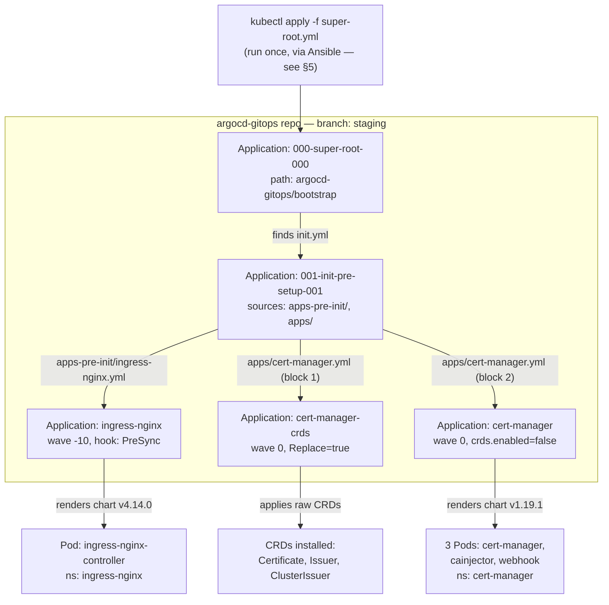
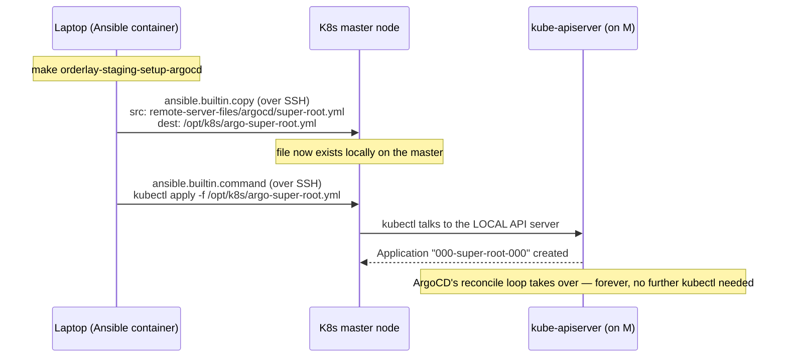
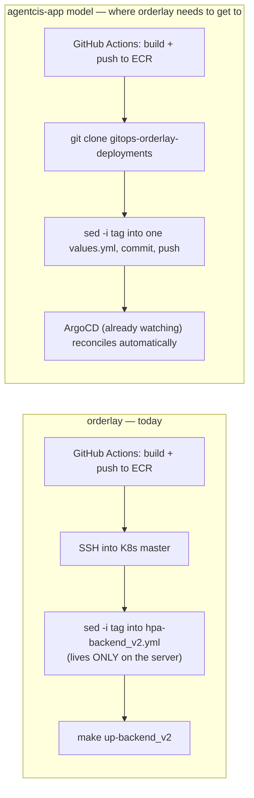

# Session Notes: Understanding the ArgoCD GitOps Model End-to-End, and Planning orderlay's Missing App-Deployment Repo

> **Audience:** Myself, mid-onboarding onto ArgoCD/GitOps — this is the session where the *mental model* finally clicked, traced against real files instead of guessed at. Written immediately after the discussion, 2026-09-10 → 2026-09-11.
> **Starting point:** `orderlay-staging`'s K8s cluster (created via Terraform) already had ArgoCD installed and syncing 5 Applications — `ingress-nginx` and `cert-manager` were up. I understood *that it worked*, not *why*, and had no idea what to do next to get orderlay's own app containers (`backend_v2`, `web-v2`, etc.) actually deployed.
> **Companion reading:** `note/ORDERLAY_TERRAFORM_BOOTSTRAP_IAM_AND_ASG_LIFECYCLE_NOTES.md` (how the server got created), `note/ORDERLAY_ARGOCD_INSTALL_AND_APP_OF_APPS_NOTES.md` (how ArgoCD got installed on it — this session picks up immediately after that one and goes much deeper on *why* it works), `note/ORDERLAY_ARGOCD_APP_OF_APPS_CASCADE_DIAGRAM.html` (the visual diagram version of §4 below).

---

## 0. Where this session started — the live cluster state

Confirmed working, before any of this discussion began:

```
ubuntu@root-master-nginx-ingress-172-34-21-146:~$ kubectl get pods -n argocd
NAME                                                READY   STATUS    RESTARTS   AGE
argocd-application-controller-0                     1/1     Running   0          5m20s
argocd-applicationset-controller-857dd4cd8b-zs5qd   1/1     Running   0          5m19s
argocd-dex-server-6b444dc946-4qtgj                  1/1     Running   0          5m20s
argocd-notifications-controller-6dd695698-cm7sj     1/1     Running   0          5m20s
argocd-redis-6ddd68458c-jn2cj                       1/1     Running   0          5m20s
argocd-repo-server-6546c667f8-5bl2r                 1/1     Running   0          5m20s
argocd-server-7565f8c89c-cc5nq                      1/1     Running   0          5m20s

$ kubectl get application -n argocd
NAME                     SYNC STATUS   HEALTH STATUS
000-super-root-000       Synced        Healthy
001-init-pre-setup-001   Synced        Healthy
cert-manager             Synced        Healthy
cert-manager-crds        Synced        Healthy
ingress-nginx            Synced        Healthy

$ kubectl get pods -n ingress-nginx
NAME                                        READY   STATUS    RESTARTS   AGE
ingress-nginx-controller-58bc5d5fd4-mlw76   1/1     Running   0          4m37s

$ kubectl get pods -n cert-manager
NAME                                       READY   STATUS    RESTARTS   AGE
cert-manager-5688bcfc59-7b88q              1/1     Running   0          4m46s
cert-manager-cainjector-5c97cd55f5-6xmp2   1/1     Running   0          4m46s
cert-manager-webhook-6645d87d9-gdg5g       1/1     Running   0          4m46s
```

The question driving this whole session: **"I only created the server and set up ArgoCD — what next, and how does any of this actually work?"**

---

## 1. TL;DR

1. There are **two conceptually separate GitOps repos** in play, not one: `argocd-gitops` (cluster *addons* — ingress, cert-manager — shared between agentcis's and orderlay's clusters) and `gitops-agentcisapp-deployments` (agentcis-app's actual *application workloads*). **orderlay has the first, and is missing an equivalent of the second entirely.** See §2.
2. ArgoCD is not "a service the server integrates with" — it's pods running *inside* the cluster (`argocd-application-controller`, `argocd-repo-server`) that continuously pull Git and force the cluster to match it. This is a control loop, not a one-shot deploy. See §3.
3. The 5 Applications you saw in `kubectl get application` are the result of exactly **one manual command, run once**, cascading through Git via the **App-of-Apps pattern** — an `Application` object's job can itself be "go apply more `Application` objects." Traced against the actual 5 files on disk in §4.
4. That one manual command (`kubectl apply -f super-root.yml`) isn't typed by a human over SSH — it's run **by Ansible**, as the tail end of `make orderlay-staging-setup-argocd`, and it's the *only* imperative step in the entire pipeline. Every downstream Application is 100% Git-driven from that point on. See §5.
5. `gitops-agentcisapp-deployments`'s `pre-apps`/`external-service`/`public-traffic` directories are **not a prerequisite gate** you need to clear before deploying an app — they're mostly solving **AWS ALB/Gateway-API problems that orderlay doesn't have**, because orderlay already chose plain `ingress-nginx`. See §6.
6. The generic Helm chart agentcis uses (`helm-charts/self-managed/backend`) **already supports `ingress-nginx` natively** (a real `nginx-ingress.yml` template, `ingress.className: nginx` in its values) and **already supports mounting an env file from an NFS-backed PVC** — the exact same pattern orderlay's `config/*.env` files already use. This makes it a strong reuse candidate for orderlay's own services. See §7.
7. **orderlay still has no equivalent of `gitops-agentcisapp-deployments`.** Its current CI/CD (`.github/workflows/k8s-*.yml`) SSHes into the K8s master and runs `sed` + `make up-<service>` directly — no Git-driven deploy exists for orderlay's actual containers yet. This is the concrete, well-scoped gap the rest of this note plans around. See §8.

---

## 2. Part A — Correcting the mental model: two repos, not one

My original assumption: *"agentcisapp has the `gitops-agentcisapp-deployments` repo where all the ArgoCD deployments are stored, and the server integrates with this repo."*

Corrected version:

- **The server doesn't "integrate with" a repo.** ArgoCD (pods running *inside* the cluster) is configured with Git credentials (a `repository`-type Kubernetes `Secret`, created by `1.2-repo-secret-setup.yml`) and continuously **polls/reconciles** whatever it finds in the repo(s) it's pointed at.
- **What ArgoCD watches is defined by `Application` custom resources** — plain Kubernetes objects that say "watch path X in repo Y, deploy it into namespace Z." One `Application` pointing at a directory of *more* `Application` manifests is the **App-of-Apps** pattern — this is exactly what produced the 5 entries in `kubectl get application`.
- There are genuinely **two separate repos** doing two different jobs for agentcis:

  | Repo | Watches for | Shared across clusters? |
  |---|---|---|
  | `argocd-gitops` (subdirectory *inside* `GH-infra-and-k8s-charts-central`) | Cluster **addons**: `ingress-nginx`, `cert-manager`, `external-secrets`, `promtail`, etc. | **Yes** — both agentcis's and orderlay's clusters sync the exact same repo/branch (`staging`) for this |
  | `gitops-agentcisapp-deployments` (own repo) | agentcis-app's actual **containers** — its API, microservices | No — agentcis-specific, own branch (`live-values`) |

- The real chain for an agentcis-app deploy: **CI builds/pushes an image → CI git-clones `gitops-agentcisapp-deployments` on `live-values`, `sed`-bumps one `tag:` field in one values file, commits, pushes → ArgoCD (already watching that repo/branch) notices the commit and syncs it onto the cluster.** The cluster is never `kubectl apply`'d directly for a routine deploy — Git is the single source of truth, exactly as the workspace's CLAUDE.md GitOps rule requires.
- **orderlay has the left column (`argocd-gitops`, shared, already working) but has no equivalent of the right column at all.** That's the actual gap — not "orderlay needs ArgoCD," which it already has, but "orderlay needs its own `gitops-agentcisapp-deployments`-shaped repo for its own services."

---

## 3. Part B — What's actually running, and the reconcile loop underneath it all

- `argocd-repo-server` and `argocd-application-controller` are **pods inside the cluster ArgoCD manages** — not an external service. The direction of control is *inward*: the cluster runs the thing that watches Git, not the other way around.
- `argocd-repo-server` reads Git credentials from the `Secret` created in `1.2-repo-secret-setup.yml` to clone/fetch private repos.
- `argocd-application-controller` runs a loop, roughly every ~3 minutes by default (no webhook is configured in this ansible pipeline, so it's polling, not push-triggered): **fetch** the Git state → **diff** it against the live cluster state → **act** (create/update/delete) if `syncPolicy.automated` is set — every Application seen in this session has `selfHeal: true`.
- This is why **`kubectl edit`/`kubectl apply` against an ArgoCD-managed object is pointless** — the next reconcile (≤~3 min later) reads Git again and reverts the manual change. This is also literally why the workspace's CLAUDE.md forbids manual `kubectl` against ArgoCD-managed resources.
- An `Application` is a real Kubernetes **Custom Resource** (`kind: Application`), stored in etcd in the `argocd` namespace — `kubectl get application -n argocd` lists genuine cluster objects, the same way `kubectl get deployment` would.

---

## 4. Part C — Tracing the live App-of-Apps cascade, file by file

One `kubectl apply -f super-root.yml`, run once, produced all 5 Applications and every Pod/CRD under `ingress-nginx` and `cert-manager`. Here is every file involved, verified by opening each one directly (paths relative to `GH-infra-and-k8s-charts-central/`):

| # | File | Role |
|---|---|---|
| 1 | `ansible-config-mgmt/remote-server-files/argocd/super-root.yml` | The only file ever applied by hand/script |
| 2 | `argocd-gitops/bootstrap/init.yml` | Found *by* File 1 — not applied directly |
| 3 | `argocd-gitops/applications/apps-pre-init/ingress-nginx.yml` | Found by File 2's source A |
| 4 | `argocd-gitops/applications/apps/cert-manager.yml` | Found by File 2's source B — contains **two** `Application` objects in one file |
| 5 | `argocd-gitops/values/general/nginx-ingress.yml` | Referenced *from inside* File 3, merged into an upstream public chart |

### File 1 — `super-root.yml`

```yaml
apiVersion: argoproj.io/v1alpha1
kind: Application
metadata:
  name: 000-super-root-000
spec:
  destination:
    namespace: argocd
    server: https://kubernetes.default.svc
  project: default
  sources:
  - repoURL: "https://github.com/GlobalyHub/GH-infra-and-k8s-charts-central.git"
    path: "argocd-gitops/bootstrap"
    targetRevision: "staging"
    directory:
      recurse: true
  syncPolicy:
    automated:
      selfHeal: true
      prune: false
    syncOptions:
      - CreateNamespace=true
      - ServerSideApply=true
      - ApplyOutOfSyncOnly=true
      - PruneLast=true
      - PrunePropagationPolicy=foreground
```

Says exactly one thing: *watch `argocd-gitops/bootstrap` on branch `staging`, and whatever `.yml` you find there (`recurse: true`), treat it as more things to apply.* `prune: false` here deliberately — this root object won't delete anything just because something vanishes from Git at this top level; that caution is reserved for this one root node, not the leaves further down.

### File 2 — `argocd-gitops/bootstrap/init.yml`

```yaml
apiVersion: argoproj.io/v1alpha1
kind: Application
metadata:
  name: 001-init-pre-setup-001
spec:
  sources:
  - repoURL: "https://github.com/GlobalyHub/GH-infra-and-k8s-charts-central.git"
    path: "argocd-gitops/applications/apps-pre-init"
    targetRevision: "staging"
    directory: { recurse: true }
  - repoURL: "https://github.com/GlobalyHub/GH-infra-and-k8s-charts-central.git"
    path: "argocd-gitops/applications/apps"
    targetRevision: "staging"
    directory: { recurse: true }
  # (commented out below: manifest-static, apps-post — future growth points)
```

`directory.recurse: true` from File 1 doesn't distinguish "a plain manifest" from "another `Application`" — it applies whatever `kind:` it finds. It found this. **This is the entire App-of-Apps mechanism, end to end** — nothing more exotic than "the desired-state file happened to itself be more Applications."

### File 3 — `argocd-gitops/applications/apps-pre-init/ingress-nginx.yml`

```yaml
apiVersion: argoproj.io/v1alpha1
kind: Application
metadata:
  name: ingress-nginx
  annotations:
    argocd.argoproj.io/sync-wave: "-10"
    argocd.argoproj.io/hook: PreSync
    argocd.argoproj.io/hook-delete-policy: BeforeHookCreation
spec:
  sources:
  - repoURL: https://kubernetes.github.io/ingress-nginx
    chart: ingress-nginx
    targetRevision: 4.14.0
    helm:
      valueFiles:
        - $values/argocd-gitops/values/general/nginx-ingress.yml
  - repoURL: https://github.com/GlobalyHub/GH-infra-and-k8s-charts-central.git
    targetRevision: "staging"
    ref: values
  destination:
    namespace: ingress-nginx
```

Two mechanics worth being precise about:

- **`sync-wave: -10` + `hook: PreSync` together, not just a wave.** `sync-wave` orders things *within* a normal sync; `hook: PreSync` puts this Application in an earlier phase that must finish before the parent's regular sync even starts — belt-and-suspenders to guarantee the ingress controller exists before anything might route through it.
- **The `$values` / `ref: values` two-source trick.** This Application deploys a real upstream chart (`kubernetes.github.io/ingress-nginx`) but needs *our own* custom values merged in. The fix: list our own repo as a second `source`, tag it `ref: values` (an arbitrary name), and `$values/<path>` in the first source's `valueFiles:` means "fetch this path from whichever source is tagged `ref: values`." That's how File 5 below actually reaches an otherwise-generic public chart.

### File 5 — `argocd-gitops/values/general/nginx-ingress.yml` (pulled in via the mechanic above)

```yaml
controller:
  hostNetwork: false
  ingressClass: nginx
  dnsPolicy: ClusterFirstWithHostNet
  hostPort:
    enabled: true
    ports:
      http: 80
      https: 443

ingressClassResource:
  name: nginx
  enabled: true
  default: false
  controllerValue: k8s.io/ingress-nginx
```

Confirms the "no LoadBalancer, binds straight to the node via hostPort 80/443" setup — the reason the earlier ArgoCD-install note could say ingress-nginx *is* the whole public-networking layer for this cluster, no AWS ALB/Gateway API involved.

### File 4 — `argocd-gitops/applications/apps/cert-manager.yml` — one file, two `Application`s

```yaml
# First: Install CRDs
apiVersion: argoproj.io/v1alpha1
kind: Application
metadata:
  name: cert-manager-crds
  annotations: { argocd.argoproj.io/sync-wave: "0" }
spec:
  source:
    repoURL: https://github.com/cert-manager/cert-manager.git
    targetRevision: v1.19.1
    path: deploy/crds
  syncOptions: [..., Replace=true, ...]
---
# Second: Install cert-manager
apiVersion: argoproj.io/v1alpha1
kind: Application
metadata:
  name: cert-manager
  annotations: { argocd.argoproj.io/sync-wave: "0" }
spec:
  sources:
  - repoURL: https://charts.jetstack.io
    chart: cert-manager
    targetRevision: v1.19.1
    helm:
      parameters:
        - name: crds.enabled
          value: "false"
        - name: global.leaderElection.namespace
          value: "cert-manager"
      valueFiles:
        - $values/argocd-gitops/values/general/cert-manager.yml
  - repoURL: .../GH-infra-and-k8s-charts-central.git
    targetRevision: "staging"
    ref: values
  destination: { namespace: cert-manager }
```

One YAML file, split by `---`, is why `kubectl get application` shows two independent objects. They're deliberately split because of a real ordering dependency: **CRDs must exist before the chart that assumes them can be validated.** `cert-manager-crds` applies raw upstream manifests (`path: deploy/crds`, no chart at all, `Replace=true` because CRDs are large enough to need a full replace, not a patch); `cert-manager` explicitly passes `crds.enabled: "false"` so the chart doesn't try to install CRDs its sibling already installed.

### Where it lands — confirmed against the real `kubectl get pods` output in §0

- `ingress-nginx` → renders its chart → **1 Pod**, `ingress-nginx-controller-...`, namespace `ingress-nginx`
- `cert-manager-crds` → applies raw manifests → **0 Pods** — just new API types (`Certificate`, `Issuer`, `ClusterIssuer`) the API server now understands
- `cert-manager` → renders its chart → **3 Pods** (`cert-manager`, `cert-manager-cainjector`, `cert-manager-webhook`), namespace `cert-manager`

**Full diagram of this exact cascade:** `note/ORDERLAY_ARGOCD_APP_OF_APPS_CASCADE_DIAGRAM.html`



---

## 5. Part D — How `super-root.yml` itself actually gets applied

Confirmed by reading `ansible-config-mgmt/tasks/argo-cd-helm/2.0-super-root-setup.yml` directly:

```yaml
- name: 2.0 A. Copying manifest to remote system
  ansible.builtin.copy:
    src: "../remote-server-files/argocd/super-root.yml"
    dest: "/opt/k8s/argo-super-root.yml"
    mode: '0644'

- name: B. Apply Kubernetes manifest
  ansible.builtin.command: kubectl apply -f /opt/k8s/argo-super-root.yml
  register: manifest_output
```

Two machines, same bridge pattern as the Helm-values `copy` task from the ArgoCD-install note:

1. **Copy** — Ansible (running in the `cytopia/ansible` Docker container on the laptop) transfers `super-root.yml` from the local Git checkout, over SSH, onto the K8s master's own disk at `/opt/k8s/argo-super-root.yml`. Nothing is applied to Kubernetes yet — pure file transfer.
2. **Apply** — Ansible then runs `kubectl apply -f /opt/k8s/argo-super-root.yml` **on the master itself**, over the same SSH session. `kubectl` there reads a purely local file and talks to the local API server — it has no notion of the laptop or GitHub at all.



**Key distinction:** this is *automated to run* (Ansible does it, not a human typing at a terminal), but it's still an **imperative** command — "make this object exist, right now" — not GitOps. It runs exactly **once per cluster bootstrap**, as the tail end of `make orderlay-staging-setup-argocd`. The moment `000-super-root-000` exists, the reconcile loop from §3 takes over permanently, and no further `kubectl apply` of any kind happens in normal operation.

---

## 6. Part E — Clearing up `pre-apps` / `external-service` / `public-traffic` / `application`

My instinct was that these `gitops-agentcisapp-deployments` directories might be a required order — "do `external-service` before `application`." Checked the real files; that's not what they are:

| Directory | What it actually contains (verified) | Blocks orderlay's first service? |
|---|---|---|
| `apps/staging/pre-apps/` | AWS Load Balancer Controller + Gateway API CRDs — needed **only** because agentcis uses AWS ALB/Gateway API for public routing | **No** — orderlay already uses `ingress-nginx` (hostPort mode), a different, simpler mechanism |
| `apps/staging/public-traffic/` | AWS API Gateway `HTTPRoute` manifests plugging services into that same ALB | **No** — orderlay's equivalent is a plain `Ingress` object, `className: nginx`, usually just a block inside a service's own Helm values |
| `apps/staging/external-service/` | Optional cluster tooling: Grafana Alloy scrapers, AWS Secret Manager sync, Dragonfly caching, ELK, Headlamp, Mailpit UI | **No** — nice-to-have observability/tooling, zero dependency in the other direction |
| `apps/staging/application/services/` | **The actual Deployments** — one `Application` per real microservice, generic chart + a per-service values file | **Yes — this is the one directory that matters to start.** |

Proof from `bootstrap/staging-root.yml` (agentcis's root, not orderlay's): `application/`, `public-traffic/`, and `external-service/` are **three equal sibling sources on one Application** (`111-stage-application-111`) — ArgoCD does not enforce "finish one folder before the next." Ordering between individual pieces is controlled per-manifest with `sync-wave` annotations (exactly like File 3/4 above), not by which top-level folder gets populated first.

**Conclusion, and why my senior's advice was exactly right:** most of `pre-apps`/`public-traffic`/`external-service` is solving an AWS-ALB problem orderlay doesn't have. The dependency graph that actually matters collapses to:

```
ingress-nginx + cert-manager  (✅ already done, via argocd-gitops)
        │
        ▼
ONE service's Application CR + values file   ← the one file to start with
        │
        ▼
(later, optional) monitoring/caching/secrets-sync add-ons
```

---

## 7. Part F — Confirming the generic Helm chart is actually reusable for orderlay

Checked `GH-infra-and-k8s-charts-central/helm-charts/self-managed/backend/` directly (the chart every agentcis Application in `application/services/` points at):

```
helm-charts/self-managed/backend/
  Chart.yaml
  values.yaml
  templates/
    deployment.yaml
    service.yaml
    hpa.yaml
    pdb.yaml
    nginx-ingress.yml        ← plain K8s Ingress, ingressClassName-driven
    aws-http-route.yml       ← AWS Gateway API variant (not needed for orderlay)
    aws-alb-target-healthcheck.yml
    gcp-http-route.yml       ← GCP variant (not needed)
    gcp-healthcheck.yml
    secretstore.yml / secretexternal.yaml   ← AWS Secrets Manager variant
```

Two findings that matter directly for orderlay:

**1. `templates/nginx-ingress.yml` already targets exactly orderlay's setup:**

```yaml
{{- if .Values.backend.ingress.enabled }}
apiVersion: networking.k8s.io/v1
kind: Ingress
metadata:
  annotations:
    cert-manager.io/cluster-issuer: {{ .Values.backend.ingress.clusterIssuer }}
    nginx.ingress.kubernetes.io/rewrite-target: /
spec:
  ingressClassName: {{ .Values.backend.ingress.className }}   # "nginx"
  ...
{{- end }}
```

`values.yaml` has this ready to flip on: `ingress: { enabled: false, clusterIssuer: lets-encrypt, className: nginx, host: ..., path: / }`, alongside `httproute.enabled` (ALB) and `gcphttproute.enabled` (GCP) — both of which orderlay simply leaves `false`.

**2. `templates/deployment.yaml`'s env-var mechanism matches orderlay's existing pattern.** Two options exist: `externalSecrets` (AWS Secrets Manager → `envFrom.secretRef`), or `volumes.defaultpvc` — a PVC mounted straight into the container, e.g. at `/app/.env`:

```yaml
volumes:
  defaultpvc:
    enabled: false
    volumeName: "microservice-backend-consumer-env-volume"
    pvcName: "nfs-data-import-config-pvc"
    containerMountPath: "/app/.env"
```

This is the **exact same shape** as orderlay's current setup (per earlier session notes): config `.env` files living on an NFS export, read via `dotenv` at Node startup. **This chart isn't AWS-only — it already speaks orderlay's existing "env file on NFS" dialect.** Strong candidate to reuse as-is rather than writing a new chart from scratch.

---

## 8. Part G — The actual gap, and the roadmap to close it

Confirmed by reading orderlay's real CI/CD (`.github/workflows/k8s-backend_v2.yml` and siblings):

**orderlay's current deploy pipeline is not GitOps at all.** It builds an image, pushes to ECR, then **SSHes directly into the K8s master** and runs `sed -i` on a manifest sitting raw on that server's filesystem (`$K8S_MANIFEST_DIR/orderlay-backend/hpa-backend_v2.yml`), followed by `make up-backend_v2`. No Git repo is involved in the deploy step at all — matching the earlier "server-only Makefile/manifests" quirk already on file from the NepBooks incident.



### Gap checklist

| Piece | Status |
|---|---|
| Terraform server + K8s cluster | ✅ Done |
| ArgoCD installed + reachable | ✅ Done |
| Cluster addons (ingress-nginx, cert-manager) | ✅ Done, via shared `argocd-gitops` |
| A `gitops-agentcisapp-deployments`-equivalent repo for orderlay's own apps | ❌ Doesn't exist — must be created |
| Reusable Helm chart for orderlay's services | ✅ Likely reusable as-is (§7) — `helm-charts/self-managed/backend`, `ingress.className: nginx` + `volumes.defaultpvc` |
| `Application` CRs for orderlay's services | ❌ None exist |
| ArgoCD repo credentials for the new repo | ❌ Not set up — orderlay's ArgoCD only knows about `argocd-gitops` today |
| CI/CD rewritten to push tag bumps to Git instead of SSH+`make` | ❌ Still SSH+`make` |

### Proposed roadmap (not yet started — open items, see §9)

1. **Create `gitops-orderlay-deployments`**, mirroring `gitops-agentcisapp-deployments`'s shape, scaled to staging only:
   ```
   gitops-orderlay-deployments/
     bootstrap/staging-root.yml
     apps/staging/application/services/     # one Application CR per real service
     gitops-values/staging/apps/             # one values.yml per service
     projects/staging.yml                    # optional AppProject
   ```
2. **Confirm the generic `backend` chart fits `backend_v2`** end-to-end (ports, probes) before writing the first values file.
3. **Register a repo-credential Secret** for the new repo against orderlay's ArgoCD (same mechanism as `1.2-repo-secret-setup.yml`, extended or duplicated for the new repo).
4. **Pilot with ONE service** (candidate discussed: `backend_v2`, the active core API) — write its `Application` CR + values file, one-time `kubectl apply` the new bootstrap root, verify it syncs and comes up healthy.
5. **Rewire that one service's CI workflow** (`k8s-backend_v2.yml`) from SSH+`make` to git-clone/sed/commit/push, mirroring agentcis-app's `1-microservice-backend.yml`.
6. **Repeat for the rest**: `web-v2`, `notification-service`, `brevo-integration-service`, `nepbooks-integration-service`, `order-service`, `back-office`.
7. **Retire the old SSH+make path**, then repeat the whole staging journey for production, mirroring how agentcis-app went staging → production.

---

## 9. Open / unclear items

- **Pilot service not yet decided.** `backend_v2` was proposed (core API, proves the pattern where it matters most) vs. `web-v2` (simpler runtime, lower blast radius) vs. `notification-service` (smallest, safest to break). Not yet chosen. As of the 2026-09-11 addendum (§11), this is now deliberately deferred until the infra layer (§11) is proven — see §11.1.
- **Repo-creation approach** — resolved: `gitops-orderlay-deployments` was created on GitHub on 2026-09-11 and is being built out directly (branch `alija-init-gitops-structure`), no placeholder-URL drafting phase was needed.
- **Whether the generic `backend` chart truly fits every orderlay service as-is**, or whether services with different runtime needs (e.g. `order-service`'s gRPC port 8089, `web-v2`'s Next.js build) will need chart tweaks — still not verified; unchanged, still pending until pilot service work starts.
- **How ArgoCD gets credentials for the new `gitops-orderlay-deployments` repo** — mechanism identified (§11.9): the existing `1.2-repo-secret-setup.yml` ansible task, not a new `argocd repo add`. **As of 2026-09-11 this is a live, unresolved blocker** — see §11.9–§11.10 for the exact bug found and the fix path.
- Everything in this note covers **staging only**; production for orderlay is a later, separate phase once staging is proven, same as agentcis-app's own history.
- **New, from the addendum**: the ingress mechanism itself changed from the plan in §2/§6/§7 above — see §11.2. Those sections are kept as-written for historical accuracy (they reflect the reasoning at the time), but their conclusion ("orderlay doesn't need agentcis's ALB/Gateway API machinery") is superseded.

---

## 10. Quick reference — files touched or read this session

| What | Path |
|---|---|
| Root app-of-apps (the one manual apply) | `GH-infra-and-k8s-charts-central/ansible-config-mgmt/remote-server-files/argocd/super-root.yml` |
| Ansible task that copies + applies it | `GH-infra-and-k8s-charts-central/ansible-config-mgmt/tasks/argo-cd-helm/2.0-super-root-setup.yml` |
| App-of-apps bootstrap (found by super-root) | `GH-infra-and-k8s-charts-central/argocd-gitops/bootstrap/init.yml` |
| ingress-nginx leaf Application | `GH-infra-and-k8s-charts-central/argocd-gitops/applications/apps-pre-init/ingress-nginx.yml` |
| cert-manager leaf Applications (2-in-1 file) | `GH-infra-and-k8s-charts-central/argocd-gitops/applications/apps/cert-manager.yml` |
| ingress-nginx custom values (hostPort 80/443) | `GH-infra-and-k8s-charts-central/argocd-gitops/values/general/nginx-ingress.yml` |
| agentcis-app's app-workload repo (the pattern to mirror) | `gitops-agentcisapp-deployments/` (own repo) |
| The generic reusable chart | `GH-infra-and-k8s-charts-central/helm-charts/self-managed/backend/` |
| orderlay's current (non-GitOps) CI/CD | `orderlay/.github/workflows/k8s-*.yml` |
| Visual diagram of §4's cascade | `note/ORDERLAY_ARGOCD_APP_OF_APPS_CASCADE_DIAGRAM.html` |

See §11.11 for the full file-by-file table of `gitops-orderlay-deployments` as it stood at the end of the 2026-09-11 session.

---

## 11. Session Addendum (2026-09-11): Building the AWS Gateway API Skeleton — a Reversed Decision, an IAM Mystery Solved, and a Live Credential Bug

> **Context:** this picks up the very next day. `gitops-orderlay-deployments` (proposed but not yet created as of §8 above) now exists on GitHub, scaffolded on branch `alija-init-gitops-structure`. This section is a detailed, chronological log of everything worked through in that follow-up session — including one outright reversal of §6/§7's conclusion above, a piece of IAM archaeology that changed the risk picture for the better, and a real misconfiguration found live on orderlay's cluster that's still unresolved as this addendum was written.

### 11.1 TL;DR of this addendum

1. **Reversed decision**: orderlay will mirror agentcis's **AWS Gateway API / ALB** pattern in full, not plain `ingress-nginx` as §6/§7 concluded — deliberate call, because upstream `kubernetes/ingress-nginx` has reached end-of-life. See §11.2.
2. **Confirmed live** (not just from files) that agentcis runs its *entire* ArgoCD setup — both staging and production — on the single built-in `project: default` AppProject; the `orderlay`-specific `AppProject` that had been scaffolded was deleted for parity. See §11.3.
3. **A resource named "IRSA role" turned out not to be IRSA at all.** It's a plain EC2 instance-profile role (trust policy is `ec2.amazonaws.com`, not an OIDC provider), already created and attached to *every* orderlay node — master, workers, and ASG launch templates — automatically by the same shared Terraform template agentcis uses. No new AWS/IAM provisioning was needed, reversing an earlier (wrong) assessment that this was a hard blocker. Confirmed live via the AWS EC2 console. See §11.5.
4. **A `nodeAffinity` block in agentcis's own reference file turned out to be dead code** — verified live on agentcis-staging that no node carries the label it looks for. Dropped entirely from orderlay's version rather than copied forward. See §11.6.
5. **Found a real, live misconfiguration**: the ArgoCD repo-credential Secret meant for `gitops-orderlay-deployments` was actually created pointing at `GH-infra-and-k8s-charts-central.git` (the *infra* repo, not even agentcis's app repo) — because the shared `.env` file used to provision it had `GITOPS_REPO_URL` mistakenly set equal to `ARGO_REPO_URL`. **As of this writing, orderlay's ArgoCD has no working credential for its own app-workload repo.** Fix identified but not yet applied — see §11.9–§11.10.

---

### 11.2 Decision reversal: AWS Gateway API instead of ingress-nginx, and why

§6/§7 above concluded orderlay didn't need agentcis's ALB/Gateway API machinery (`pre-apps/aws-crd-and-controller.yml`, `public-traffic/`, `GatewayClass`) because orderlay already runs plain `ingress-nginx`. When `gitops-orderlay-deployments` was actually scaffolded, it was built as a structural mirror of `gitops-agentcisapp-deployments` *including* that ALB/Gateway API layer — at first glance this looked like scaffolding drift (copied structure not yet pruned to match the ingress-nginx conclusion).

It wasn't drift — it was a deliberate, informed reversal: **the upstream `kubernetes/ingress-nginx` project has reached end-of-life**, so building orderlay's public-traffic layer on it now would mean inheriting a dead dependency from day one. The decision is to fully mirror agentcis's proven AWS Load Balancer Controller + Gateway API pattern instead, not a partial adoption. This makes §6's conclusion ("orderlay doesn't need this") obsolete, though §6 is left as-written above since it accurately reflects the reasoning *at the time* — orderlay's cluster still has `ingress-nginx` running too (via the shared `argocd-gitops` repo, §2 above), it's just not going to be the mechanism for the app-workload public traffic layer.

---

### 11.3 AppProject: confirmed agentcis runs entirely on `project: default`

The scaffolded `gitops-orderlay-deployments/projects/orderlay.yml` was a dedicated `AppProject` — scoped `sourceRepos` (just the one repo), scoped `destinations` (only `orderlay-{development,staging,production}` + `argocd` namespaces), and an explicit `clusterResourceWhitelist` (only `Namespace`, CRDs, `ClusterRole`, `ClusterRoleBinding`, `GatewayClass`). This diverged from what a grep of every `Application` file in `gitops-agentcisapp-deployments` and `argocd-gitops` showed: **every single Application in both repos, on every branch checked (including `live-values`, the branch ArgoCD actually watches), uses `project: default`** — the wide-open, built-in AppProject every ArgoCD install ships with. The one exception, `project: infra` in a `.disable`d file, references an AppProject that doesn't exist anywhere in the repo. A `projects/production.yml` file exists in `gitops-agentcisapp-deployments` but nothing actually references `project: production` — it's dead weight.

This was then verified **live**, not just from Git, by running on both real agentcis clusters:
```bash
kubectl get appprojects -n argocd
```
Both agentcis production and agentcis staging returned only:
```
NAME      AGE
default   168d   # production
default   83d    # staging
```
Confirming `production` and `infra` were never actually created as live objects in either cluster — the whole agentcis setup, in both environments, runs on `default` with zero AppProject-level scoping.

**Decision**: orderlay matches this for parity. `projects/orderlay.yml` was deleted, and both root Applications in `bootstrap/staging-root.yml` were changed from `project: orderlay` to `project: default`.

---

### 11.4 Branch convention: switched to `live-values`

agentcis's root Applications all use `targetRevision: "live-values"` — a dedicated deploy branch, separate from `main`, that CI pushes `sed`-bumped image tags to (keeping automated commits out of PR/dev history). Orderlay's scaffold originally used `targetRevision: "main"`. Changed to `"live-values"` in `bootstrap/staging-root.yml` for consistency and because that's the branch CI will need once the pipeline-rewiring phase (§8's roadmap) happens — no reason to defer this rename to later. **The `live-values` branch does not exist yet** in `gitops-orderlay-deployments` (only `main` and the local working branch `alija-init-gitops-structure` exist) — this is a known, accepted forward-reference; the plan (stated directly by the person doing this work) is to finish building out the file structure first, then create and push `live-values`, then do the actual ArgoCD-side registration/apply against that branch.

---

### 11.5 The "IRSA role" is actually a plain EC2 instance-profile role — no new AWS provisioning needed

agentcis's real `pre-apps/aws-crd-and-controller.yml` installs, in order (`sync-wave: -100` on both): the Gateway API CRDs (`kubernetes-sigs/gateway-api` v1.4.1) and the AWS Load Balancer Controller Helm chart (`aws.github.io/eks-charts`, `aws-load-balancer-controller` v3.0.0). The controller's Helm values reference a `serviceAccount.annotations["eks.amazonaws.com/role-arn"]` pointing at `arn:aws:iam::834033184010:role/Agentcis-staging-K8s-EC2-IRSA-role`.

The `eks.amazonaws.com/role-arn` annotation and the `-IRSA-role` name both strongly imply IRSA (IAM Roles for Service Accounts) — an OIDC/web-identity-token mechanism that requires a registered IAM OIDC identity provider. Orderlay's own Terraform bootstrap note (`ORDERLAY_TERRAFORM_BOOTSTRAP_IAM_AND_ASG_LIFECYCLE_NOTES.md`) records `oidc_create = false` for orderlay's staging/development environments — which, taken at face value, looked like a hard blocker: no OIDC provider, so no working IRSA role, so the AWS Load Balancer Controller would have no AWS credentials.

**This turned out to be a wrong inference.** Reading the actual Terraform module (`infrastructure/modules/create-services/aws-permissions/k8s-policy-and-roles/k8s-irsa-roles.tf`) shows the role's real trust policy:
```hcl
assume_role_policy = jsonencode({
  Statement = [{
    Effect    = "Allow"
    Principal = { Service = "ec2.amazonaws.com" }
    Action    = "sts:AssumeRole"
  }]
})
```
That's an **EC2 instance-profile trust policy**, not an OIDC trust policy — there is no IAM OIDC provider involved anywhere in this mechanism. `oidc_create` is unrelated; it only gates a *separate* resource (`iam-github-action-irsa-role.tf`) used for GitHub Actions' own OIDC federation into AWS, a completely different concern.

Better still: this role's instance profile (`aws_iam_instance_profile.main_aws_load_balancer_controller_profile`) is **already wired onto every node** — master, standalone EC2s, and every ASG launch template — in `infrastructure/templates-agentcis/main-template.tf` (the shared template both agentcis's and orderlay's `project/*/main.tf` call), at multiple points (lines ~113–115, ~224–229, ~384–385). It's also already attached to the full, real upstream AWS Load Balancer Controller IAM policy (`aws-elb-policy-file.json`, sourced directly from the `kubernetes-sigs/aws-load-balancer-controller` repo's official install policy) via `attach-policy-with-role.tf`.

**Net effect: this was created and attached automatically the moment `terraform apply` ran for orderlay-staging.** No new IAM/OIDC provisioning was needed at all — every pod on every orderlay node already inherits these AWS permissions via the node's EC2 instance metadata (IMDS), regardless of which Kubernetes ServiceAccount it runs as. The `eks.amazonaws.com/role-arn` annotation is inert in this setup (there's no pod-identity-webhook on a self-managed cluster to interpret it) — harmless to keep for parity with agentcis's file, but not what's actually granting access.

**Confirmed live** via the AWS EC2 console: instance `i-0a3f76c7e1745525d` (`[orderlay-staging]-k8s-root-master-nginx`, account `381491939487`, `ap-south-1`) shows `IAM role: orderlay-staging-K8s-EC2-IRSA-role` already attached, VPC `vpc-0956141e90f4f7a4e (orderlay-staging-vpc)`. Naming convention confirmed as `${project_name}-${environment}-K8s-EC2-IRSA-role`.

---

### 11.6 The `nodeAffinity` block in agentcis's reference file is dead code

agentcis's `gateway-api-aws.yml` Helm values (for the AWS Load Balancer Controller chart) include:
```yaml
affinity:
  nodeAffinity:
    preferredDuringSchedulingIgnoredDuringExecution:
      - weight: 100
        preference:
          matchExpressions:
            - key: role
              operator: In
              values:
                - aws-elb-master
```
with an adjacent comment showing the manual command needed to make it do anything: `kubectl label node aws-elb--master-172-34-17-55 role=aws-elb-master`.

Mechanically, `preferredDuringSchedulingIgnoredDuringExecution` is a **soft** preference — if no node carries the matching label, it silently has zero effect and the pod schedules normally via the default scheduler; there's no error either way. Since §11.5 already established that *every* orderlay node carries the IAM instance profile (not just one specially-labeled node), there was no IAM-based reason to expect this pinning was actually required.

**Verified empirically, live, on agentcis's own staging cluster:**
```bash
kubectl get nodes -L role
# NAME                                    ...  ROLE
# default-server-worker-172-34-13-92      ...  (blank)
# default-server-worker-172-34-16-76      ...  (blank)
# root-master-nginx-ingress-172-34-6-25   ...  (blank)

kubectl get nodes -l role=aws-elb-master
# No resources found
```
No node in agentcis's real, running staging cluster carries this label. The block has been sitting in agentcis's file doing nothing — the controller pod has simply been scheduled wherever the default scheduler put it. **Decision: dropped this block entirely from orderlay's `gateway-api-aws.yml`** rather than copying forward dead configuration. If node-pinning is ever needed for an unrelated reason later (e.g. wanting a stable host for the controller's `hostNetwork: true` webhook port), it should be added back deliberately *and* the matching `kubectl label` step actually performed — otherwise it repeats the exact same no-op agentcis has carried for months.

---

### 11.7 `gitops-values/staging/others/gateway-api-aws.yml` — built with orderlay's real values

Using the findings above, the values file was populated with orderlay's actual `vpcId` and role ARN (both confirmed live, §11.5), `region: ap-south-1`, and the `nodeAffinity` block omitted (§11.6):

```yaml
#### reference : https://github.com/kubernetes-sigs/aws-load-balancer-controller/blob/main/helm/aws-load-balancer-controller/values.yaml
clusterName: orderlay-staging
region: ap-south-1

vpcId: vpc-0956141e90f4f7a4e
serviceAccount:
  create: true
  name: aws-load-balancer-controller
  annotations:
    eks.amazonaws.com/role-arn: "arn:aws:iam::381491939487:role/orderlay-staging-K8s-EC2-IRSA-role"

hostNetwork: true
replicaCount: 1

enableServiceMutatorWebhook: false
webhookConfig:
  webhookBindPort: 9443
  disableIngressValidation: true

controllerConfig:
  featureGates:
    ALBGatewayAPI: true
    NLBGatewayAPI: true

enableShield: false
enableWaf: false
enableWafv2: false

logLevel: info
```

**As actually committed to the repo as of this addendum, three things from this recommendation were not yet applied**, worth fixing on the next pass:
- `clusterName` is still literally `default-cluster` (copied verbatim from agentcis, never updated to `orderlay-staging`). Low severity — this is just a tracking tag AWS puts on ALB/target-group resources, and since orderlay is a separate AWS account it wouldn't collide with anything — but it's sloppy and worth fixing for clarity.
- The `nodeAffinity` block discussed in §11.6 is **still present** in the file as committed — the decision to drop it was made and agreed, but the edit hadn't landed as of the last file check this session.
- agentcis's own troubleshooting-history comments (informal notes in Nepali/English about a service-creation issue they'd hit) are still present verbatim. Cosmetic only, but confusing noise in a fresh orderlay file.

`enableServiceMutatorWebhook: false` was deliberately kept as-is (not re-enabled) since the reason agentcis disabled it isn't known — safer to inherit than guess, revisit only if `TargetGroupBinding` issues show up later.

---

### 11.8 `manifest/` layer: one real bug fixed, one open risk still unresolved

**`gw-class.yml`** — the file as originally drafted had a placeholder/guessed `controllerName: gateway.k8s.aws/gateway-controller` with a TODO to verify against agentcis. Checked agentcis's real file and found the guess was wrong. Corrected to match agentcis exactly (this string is fixed by the AWS Load Balancer Controller product itself, not something to invent):
```yaml
apiVersion: gateway.networking.k8s.io/v1beta1
kind: GatewayClass
metadata:
  name: aws-alb-gateway-class
  annotations:
    argocd.argoproj.io/sync-wave: "-40"
spec:
  controllerName: gateway.k8s.aws/alb
```
This fix has been applied and confirmed in the repo.

**`certificate-issuer.yml`** — now byte-identical to agentcis's real file, including the **production** Let's Encrypt ACME endpoint (`acme-v02.api.letsencrypt.org`) and agentcis's real email. Flagged risk, **still unresolved as of this addendum**: Let's Encrypt's production endpoint rate-limits to 5 certificates per exact domain per week. Since this `ClusterIssuer` is likely to be deleted/reapplied repeatedly while testing ArgoCD sync behavior (matching the explicit "we are in test phase, finalizers left commented so it's easy to delete" stance taken this session, §11.9 note below), hitting that limit is a real risk that would then block real cert issuance later. Recommended (not yet applied): switch to `acme-staging-v02.api.letsencrypt.org` until the plumbing is proven, then switch to production for real TLS.

**On `finalizers`**: both `Application` objects in `pre-apps/aws-crd-and-controller.yml` have `finalizers: [resources-finalizer.argocd.argoproj.io/background]` commented out, same as originally scaffolded. This was raised as a possible parity gap with agentcis (whose real file has them active) but **deliberately left commented, by direct decision**: the project is in an active test phase where these Applications may need to be deleted and recreated, and the finalizer would force a cascading delete of everything the Application created (CRDs, the controller deployment) on every such delete — undesirable friction while iterating. Revisit once past the test phase.

**Still outstanding, unfixed as of this addendum**: `pre-apps/aws-crd-and-controller.yml`'s `aws-load-balancer-controller` Application still has a copy-paste bug in its second `sources` entry — `repoURL: https://github.com/GlobalyHub/gitops-agentcisapp-deployments.git`, which should read `gitops-orderlay-deployments.git`. This is the `ref: values` source that the `$values/gitops-values/staging/others/gateway-api-aws.yml` reference resolves against — until fixed, that lookup would resolve against the *agentcis* repo, not orderlay's own (freshly created, §11.7) values file.

---

### 11.9 ArgoCD repo-credentials: how the mechanism actually works, and a live misconfiguration found

Traced the full mechanism, since "how does ArgoCD get credentials for a new repo" was an open item from §9 above:

1. `main/argocd-setup.yml` (an Ansible playbook, run via `make <project>-<env>-setup-argocd` from `GH-infra-and-k8s-charts-central/ansible-config-mgmt/`) runs a chain of tasks against the K8s master over SSH, including `tasks/argo-cd-helm/1.2-repo-secret-setup.yml`.
2. That task copies a Secret template (`remote-server-files/k8s/secrets/repo-secrets.yml`, with `%placeholder%` tokens) onto the master's disk **twice**, `sed`-substitutes real values into each copy, and `kubectl apply`s both:
   - One populated from `ARGO_SECRET_NAME` / `ARGO_REPO_URL` (for the shared `argocd-gitops` addons repo)
   - One populated from `GITOPS_SECRET_NAME` / `GITOPS_REPO_URL` (for the app-workload repo — this is the one that matters for `gitops-orderlay-deployments`)
   - Both also read `REPO_USERNAME` / `REPO_TOKEN`
   - The resulting Kubernetes `Secret` objects, in the `argocd` namespace, are labeled `argocd.argoproj.io/secret-type: repository` — the specific label ArgoCD watches to recognize "here's a Git credential."
3. **Critically, none of these env vars are set per-project/per-environment.** They come from `ansible-config-mgmt/.env` (git-ignored; only `.env.sample` is tracked), loaded via `docker-compose.yml`'s `env_file: .env` for the whole `ansible` container — the *same* file regardless of which `project=`/`env=` you pass to the Makefile. This is a real structural gotcha: nothing stops you from running this against a different project's inventory while `.env` still holds the previous project's repo/token.

Checked the actual live `.env` on this machine: it currently holds agentcis's values (`GITOPS_REPO_URL=.../gitops-agentcisapp-deployments.git`, `REPO_USERNAME=agentcisapp-argocd-token`, `AWS_DEFAULT_REGION=ap-southeast-2` — agentcis's region, not orderlay's `ap-south-1`). Running the Makefile target against orderlay's inventory with this `.env` unchanged would misconfigure orderlay's cluster — which is exactly what turned out to have already happened, from a **different laptop**, the day before this addendum:

**Verified live on the orderlay master:**
```bash
kubectl get secrets -n argocd -l argocd.argoproj.io/secret-type=repository
# NAME                                          TYPE     DATA   AGE
# argocd-ansible-github-secret-github-secret   Opaque   5      21h
# gitops-ansible-github-secret-github-secret   Opaque   5      21h
```
(Both secret names are double-suffixed — `...-github-secret-github-secret` — because whoever set `ARGO_SECRET_NAME`/`GITOPS_SECRET_NAME` in that `.env` already included `-github-secret` in the value itself, and the template appends `-github-secret` again. Cosmetic only, not a functional problem.)

```bash
kubectl get secret argocd-ansible-github-secret-github-secret -n argocd -o jsonpath='{.data.url}' | base64 -d
# https://github.com/GlobalyHub/GH-infra-and-k8s-charts-central.git   ← correct, this one's fine

kubectl get secret gitops-ansible-github-secret-github-secret -n argocd -o jsonpath='{.data.username}' | base64 -d
# agentcisapp-argocd-token   ← wrong: agentcis's token identity, not a new orderlay one

kubectl get secret gitops-ansible-github-secret-github-secret -n argocd -o jsonpath='{.data.url}' | base64 -d
# https://github.com/GlobalyHub/GH-infra-and-k8s-charts-central.git   ← wrong: same URL as the ARGO secret above
```

**Finding**: the Secret meant to give orderlay's ArgoCD read access to `gitops-orderlay-deployments` was actually created pointing at `GH-infra-and-k8s-charts-central.git` — not even agentcis's app repo, but the *infra* repo, identical to the `argocd-ansible` secret. This means whoever ran the Ansible playbook against orderlay's inventory that day had `.env`'s `GITOPS_REPO_URL` set equal to `ARGO_REPO_URL` (both pointing at charts-central) rather than pointing it at `gitops-orderlay-deployments.git`. **As of this addendum, orderlay's ArgoCD has zero working credential for its own app-workload repo.**

---

### 11.10 The fix (identified, not yet applied as of this addendum)

Two independent things are needed:

1. **A real Git credential** with read access to `gitops-orderlay-deployments` — a new fine-grained GitHub PAT scoped to just that repo (mirroring agentcis's own dedicated `agentcisapp-argocd-token` convention), not yet created as of this writing.
2. **Fix the Secret**, either or both of:
   - **Immediate/direct** (`kubectl apply` on the orderlay master, replacing the Secret in place):
     ```yaml
     apiVersion: v1
     kind: Secret
     metadata:
       name: gitops-ansible-github-secret-github-secret
       namespace: argocd
       labels:
         argocd.argoproj.io/secret-type: repository
     stringData:
       type: git
       name: ansible-applied-repo-secret
       url: https://github.com/GlobalyHub/gitops-orderlay-deployments.git
       username: <new-token-identity>
       password: <the-real-PAT>
     ```
   - **Durable** — fix `ansible-config-mgmt/.env`'s `GITOPS_REPO_URL`/`REPO_USERNAME`/`REPO_TOKEN`, then re-run `make orderlay-staging-setup-argocd`.

**The trap to avoid**: doing only the direct `kubectl apply` fix without also fixing `.env` means the *next* time anyone re-runs that Makefile target against orderlay (for any reason — it's not a repo-secret-only target, it re-runs the whole ArgoCD setup chain), Ansible will silently overwrite the manual fix back to the broken state, since `.env` is still wrong. This is the same "edited but not actually applied / applied but not actually source-of-truth" trap flagged repeatedly in the companion Terraform note (`ORDERLAY_TERRAFORM_BOOTSTRAP_IAM_AND_ASG_LIFECYCLE_NOTES.md`, Mistake 1), just inverted — there the *file* was fixed but not *pushed*; here the *cluster* would be fixed but not the *file that regenerates cluster state*.

**Verification once fixed**, in order of strength:
```bash
# 1. Shape check
kubectl get secret gitops-ansible-github-secret-github-secret -n argocd -o jsonpath='{.data.url}' | base64 -d
# should now print gitops-orderlay-deployments.git

# 2. Real proof — an actual authenticated connection test
argocd repo list
# look for gitops-orderlay-deployments with Connection Status: Successful

# 3. Fallback if argocd CLI isn't available on that box
kubectl logs -n argocd deploy/argocd-repo-server --tail=200 | grep -i "orderlay-deployments"
```

---

### 11.11 File-by-file state of `gitops-orderlay-deployments` at end of session (2026-09-11)

Deliberately scoped to **staging only, infra layer only** — no app-workload Applications (`services/`, `persistent-volume/`, `external-service/`) have been added yet, by explicit decision: the CI/CD pipeline that would push real image tags into this repo hasn't been built yet, and the stated plan is to prove the infra layer works end-to-end first, then build the pipeline, then start adding app files here.

| File | Status | Notes |
|---|---|---|
| `bootstrap/staging-root.yml` | ✅ Done | Matches agentcis exactly: `project: default`, `targetRevision: "live-values"`, unlimited retry policy |
| `bootstrap/production-root.yml`, `development-root.yml` | ⚪ Empty | Correct for staging-only scope right now |
| `projects/orderlay.yml` | 🗑️ Deleted | Was a scoped AppProject; removed for parity with agentcis's `default`-only live setup (§11.3) |
| `apps/staging/pre-apps/aws-crd-and-controller.yml` | 🟡 Mostly done | `finalizers` deliberately commented (test phase); `repoURL` on the `aws-load-balancer-controller` Application's second source **still wrong** — points at `gitops-agentcisapp-deployments.git`, needs to be this repo |
| `gitops-values/staging/others/gateway-api-aws.yml` | 🟡 Mostly done | Real `vpcId`/`region`/role ARN in place (§11.5/§11.7); `clusterName` still says `default-cluster`; `nodeAffinity` block still present despite the decision to drop it (§11.6); agentcis's old troubleshooting comments still present (cosmetic) |
| `apps/staging/application/manifest/gw-class.yml` | ✅ Done | Fixed `controllerName` to the confirmed-correct `gateway.k8s.aws/alb`, matches agentcis |
| `apps/staging/application/manifest/certificate-issuer.yml` | 🟡 Works, one open risk | Byte-identical to agentcis's file; still points at the **production** ACME endpoint — rate-limit risk during repeated test-phase apply/delete cycles, recommended switch to staging endpoint not yet made |
| `apps/staging/public-traffic/aws-gw-orderlay-parent.yml` | ❌ Empty (0 bytes) | Not started. This is the file that would actually create the real ALB — highest-value next step to prove the infra chain end-to-end, since it doesn't need any real backend service to test (a Gateway with listeners and no routes is enough to prove provisioning works) |
| `apps/staging/public-traffic/aws-gw-orderlay-microservice.yml` | ❌ Empty (0 bytes) | Not started; inherently needs a real backend service to be meaningful, so correctly deferred until the pilot service exists |
| `apps/staging/application/0-waiting-job.yml` | ⚪ Placeholder | Fine as-is until a real migration/init job is needed |
| `apps/staging/application/{services,persistent-volume,cron-jobs}/` | ❌ Empty directories | Deliberately deferred — no CI/CD pipeline wired to this repo yet (§8 above), by direct decision this session |
| `apps/staging/external-service/` | ❌ Doesn't exist yet | Deferred, correctly last per the original roadmap (§8) |
| ArgoCD repo-credential Secret for this repo | 🔴 **Broken, live** | Points at the wrong repo entirely (§11.9) — see §11.10 for the fix, not yet applied |
| `live-values` branch | ❌ Doesn't exist yet | Accepted forward-reference (§11.4) — to be created once the file structure above is finished |

---

### 11.12 Follow-up: "do we even need the repo secret, since we apply the root file directly?" — resolved with live proof

A objection came up after §11.9–§11.10 were written: *"we did not push `staging-root.yml` via Ansible — we applied it directly on the server ourselves, the same way agentcis does it, so maybe we don't need the `gitops-orderlay-deployments` repo secret at all."*

**Correction to §5 above, first**: on agentcis, `staging-root.yml` (the second-tier root — `010-stage-pre-setup-010` / `111-stage-application-111`, pointing at the *app-workload* repo) is confirmed to have been applied **by hand, via SSH + `kubectl apply -f`**, sitting in `~/bootstrap/staging-root.yml` on the master — not through the Ansible `2.0-super-root-setup.yml` task documented in §5. That task, as traced in §5, applies a *different* file (`super-root.yml`, the top-tier root pointing at the shared `argocd-gitops` *addons* repo). Both are real, both exist, but they're not the same file and not applied the same way. Worth remembering there are two independent root layers here, not one.

That correction, however, turned out to be irrelevant to the actual question — which is a distinction worth stating plainly since it's easy to conflate:

- **Applying the root `Application` object** (`kubectl apply -f staging-root.yml`, whether done by Ansible or by hand) is a one-time write straight to the Kubernetes API. It creates a CR in etcd. Kubernetes validates it only against the `Application` CRD's schema — it never checks whether `repoURL` is reachable or whether any credential exists. **This step never needs a repo secret, by construction, regardless of how it's applied.**
- **What happens immediately after** is a different, ongoing process: `argocd-application-controller` reads the new object's `sources:` and asks `argocd-repo-server` to clone/fetch that repo, continuously, forever (well, every reconcile cycle) — to discover the child manifests it's supposed to create. *This* is the step that needs a matching `Secret` labeled `argocd.argoproj.io/secret-type: repository`, and it happens whether the parent object was applied by Ansible, by hand, or by a puppy stepping on the keyboard.

So "we applied it directly, not via Ansible" was true, but doesn't bear on whether a repo secret is needed — that was never a function of *who* ran the `kubectl apply`, only of what's written inside the file.

**Settled with live evidence, in three steps, all run against agentcis's real staging master:**

1. `kubectl get application -n argocd | grep -i agentcisapp` showed real app-workload Applications (`agentcisapp-parent-api`, `agentcisapp-webhook-api`, `agentcisapp-registration-api`, etc.) as `Synced`/`Healthy` — these live at `apps/staging/application/services/*.yml` inside `gitops-agentcisapp-deployments.git`, so their existing/healthy state alone proves `argocd-repo-server` is successfully, continuously authenticating to that repo.
2. `kubectl get application 010-stage-pre-setup-010 -n argocd -o jsonpath='{.status.conditions}'` returned **completely empty**. An empty `.status.conditions` means ArgoCD has never recorded a reconcile/comparison error on this Application — i.e., the repo fetch has succeeded on every cycle since it was created. If the secret were missing or wrong, this field would show a `ComparisonError` condition (authentication failure / repository not found), not silence.
3. Decoded the actual secret and confirmed it matches exactly what `010-stage-pre-setup-010`'s `sources:` expects:
   ```bash
   kubectl get secrets -n argocd -l argocd.argoproj.io/secret-type=repository
   # argocd-ansible-github-secret   (single-suffixed — correctly named, unlike orderlay's)
   # gitops-ansible-github-secret

   kubectl get secret gitops-ansible-github-secret -n argocd -o jsonpath='{.data.url}' | base64 -d
   # https://github.com/GlobalyHub/gitops-agentcisapp-deployments.git   ← exact match
   ```

**Conclusion**: the repo secret is required, and on agentcis it's working — silently, invisibly, which is exactly why applying `staging-root.yml` there "just worked" with no extra steps taken at apply-time. The credential had already been set up correctly beforehand (at some point via the Ansible `1.2-repo-secret-setup.yml` task, per §11.9); nobody had to think about it again after that. That invisibility was mistaken for "not needed."

Side-by-side, so the contrast is explicit:

| | agentcis (working) | orderlay (broken, §11.9) |
|---|---|---|
| Secret name | `gitops-ansible-github-secret` | `gitops-ansible-github-secret-github-secret` (double-suffixed — cosmetic only, not the actual bug) |
| `.data.url` | `gitops-agentcisapp-deployments.git` ✅ matches its root Application's `sources:` | `GH-infra-and-k8s-charts-central.git` ❌ — wrong repo entirely |
| `.data.username` | (agentcis's own dedicated token identity) | `agentcisapp-argocd-token` ❌ — agentcis's identity, not orderlay's |
| Root Application's `.status.conditions` | empty — never had a reconcile error | not yet applied; would be expected to show a `ComparisonError`/auth-failure condition given the current secret state |

**Practical takeaway for orderlay**: `kubectl apply -f staging-root.yml` will succeed on orderlay's cluster today regardless of the secret's state — that part was never in doubt. But nothing downstream of that apply will progress — no `pre-apps` children, no CRDs, nothing — until `gitops-ansible-github-secret-github-secret` is fixed to point at `gitops-orderlay-deployments.git` with a valid token (§11.10). The failure mode isn't a rejected `apply` command, it's a silent, indefinite retry loop (this file's `syncPolicy.retry.limit: -1`) — checkable via the same `.status.conditions` field used above, which is expected to show a real error the moment it's checked on orderlay's version of this Application post-apply.

---

*Companion reading (updated): `note/ORDERLAY_TERRAFORM_BOOTSTRAP_IAM_AND_ASG_LIFECYCLE_NOTES.md` (server/IAM side — §11.5 of this addendum directly corrects an over-cautious reading of that note's `oidc_create` discussion), `note/ORDERLAY_ARGOCD_INSTALL_AND_APP_OF_APPS_NOTES.md` (the original ArgoCD-install run), `note/ORDERLAY_ARGOCD_APP_OF_APPS_CASCADE_DIAGRAM.html` (visual version of §4).*
