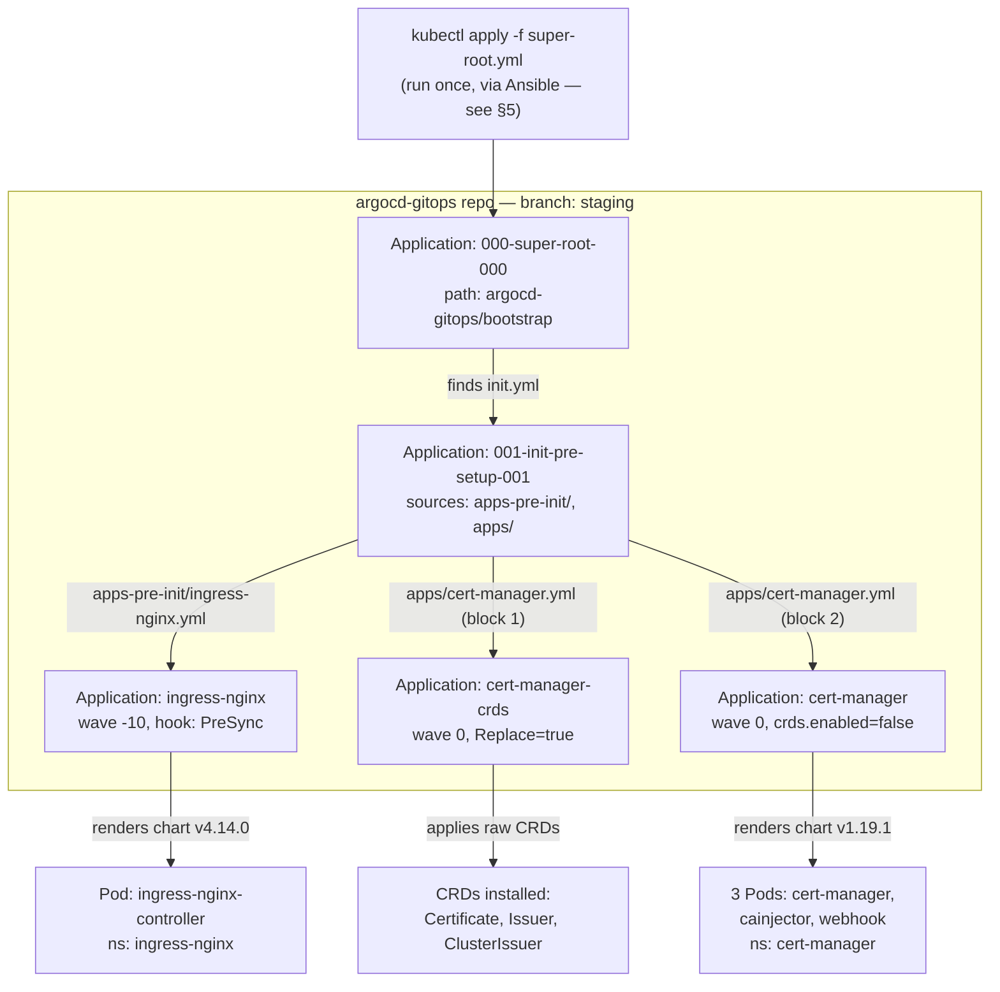
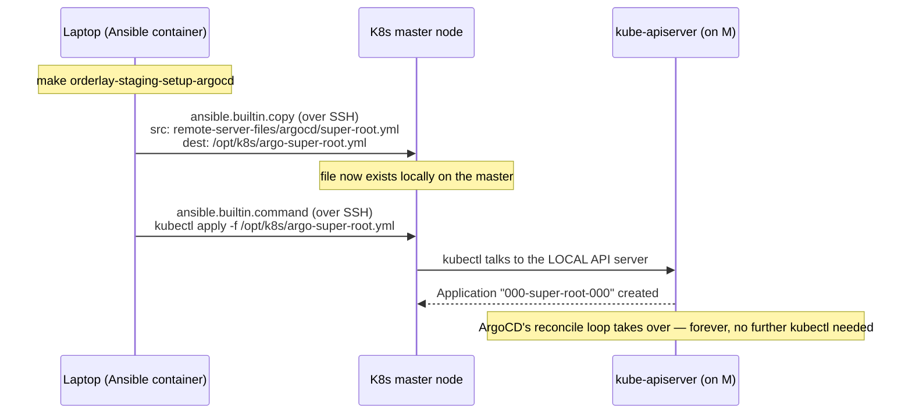
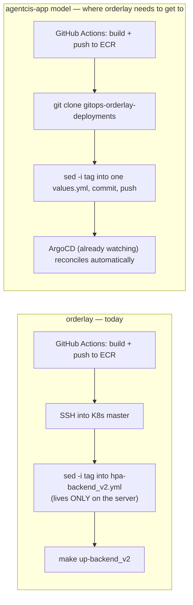

# Session Notes: Understanding the ArgoCD GitOps Model End-to-End, and Planning orderlay's Missing App-Deployment Repo

> **Audience:** Myself, mid-onboarding onto ArgoCD/GitOps — this is the session where the *mental model* finally clicked, traced against real files instead of guessed at. Written immediately after the discussion, 2026-09-10 → 2026-09-11.
> **Starting point:** `orderlay-staging`'s K8s cluster (created via Terraform) already had ArgoCD installed and syncing 5 Applications — `ingress-nginx` and `cert-manager` were up. I understood *that it worked*, not *why*, and had no idea what to do next to get orderlay's own app containers (`backend_v2`, `web-v2`, etc.) actually deployed.
> **Companion reading:** `note/ORDERLAY_TERRAFORM_BOOTSTRAP_IAM_AND_ASG_LIFECYCLE_NOTES.md` (how the server got created), `note/ORDERLAY_ARGOCD_INSTALL_AND_APP_OF_APPS_NOTES.md` (how ArgoCD got installed on it — this session picks up immediately after that one and goes much deeper on *why* it works), `note/ORDERLAY_ARGOCD_APP_OF_APPS_CASCADE_DIAGRAM.html` (the visual diagram version of §4 below).

---

## 0. Where this session started — the live cluster state

Confirmed working, before any of this discussion began:

```
ubuntu@root-master-nginx-ingress-172-34-21-146:~$ kubectl get pods -n argocd
NAME                                                READY   STATUS    RESTARTS   AGE
argocd-application-controller-0                     1/1     Running   0          5m20s
argocd-applicationset-controller-857dd4cd8b-zs5qd   1/1     Running   0          5m19s
argocd-dex-server-6b444dc946-4qtgj                  1/1     Running   0          5m20s
argocd-notifications-controller-6dd695698-cm7sj     1/1     Running   0          5m20s
argocd-redis-6ddd68458c-jn2cj                       1/1     Running   0          5m20s
argocd-repo-server-6546c667f8-5bl2r                 1/1     Running   0          5m20s
argocd-server-7565f8c89c-cc5nq                      1/1     Running   0          5m20s

$ kubectl get application -n argocd
NAME                     SYNC STATUS   HEALTH STATUS
000-super-root-000       Synced        Healthy
001-init-pre-setup-001   Synced        Healthy
cert-manager             Synced        Healthy
cert-manager-crds        Synced        Healthy
ingress-nginx            Synced        Healthy

$ kubectl get pods -n ingress-nginx
NAME                                        READY   STATUS    RESTARTS   AGE
ingress-nginx-controller-58bc5d5fd4-mlw76   1/1     Running   0          4m37s

$ kubectl get pods -n cert-manager
NAME                                       READY   STATUS    RESTARTS   AGE
cert-manager-5688bcfc59-7b88q              1/1     Running   0          4m46s
cert-manager-cainjector-5c97cd55f5-6xmp2   1/1     Running   0          4m46s
cert-manager-webhook-6645d87d9-gdg5g       1/1     Running   0          4m46s
```

The question driving this whole session: **"I only created the server and set up ArgoCD — what next, and how does any of this actually work?"**

---

## 1. TL;DR

1. There are **two conceptually separate GitOps repos** in play, not one: `argocd-gitops` (cluster *addons* — ingress, cert-manager — shared between agentcis's and orderlay's clusters) and `gitops-agentcisapp-deployments` (agentcis-app's actual *application workloads*). **orderlay has the first, and is missing an equivalent of the second entirely.** See §2.
2. ArgoCD is not "a service the server integrates with" — it's pods running *inside* the cluster (`argocd-application-controller`, `argocd-repo-server`) that continuously pull Git and force the cluster to match it. This is a control loop, not a one-shot deploy. See §3.
3. The 5 Applications you saw in `kubectl get application` are the result of exactly **one manual command, run once**, cascading through Git via the **App-of-Apps pattern** — an `Application` object's job can itself be "go apply more `Application` objects." Traced against the actual 5 files on disk in §4.
4. That one manual command (`kubectl apply -f super-root.yml`) isn't typed by a human over SSH — it's run **by Ansible**, as the tail end of `make orderlay-staging-setup-argocd`, and it's the *only* imperative step in the entire pipeline. Every downstream Application is 100% Git-driven from that point on. See §5.
5. `gitops-agentcisapp-deployments`'s `pre-apps`/`external-service`/`public-traffic` directories are **not a prerequisite gate** you need to clear before deploying an app — they're mostly solving **AWS ALB/Gateway-API problems that orderlay doesn't have**, because orderlay already chose plain `ingress-nginx`. See §6.
6. The generic Helm chart agentcis uses (`helm-charts/self-managed/backend`) **already supports `ingress-nginx` natively** (a real `nginx-ingress.yml` template, `ingress.className: nginx` in its values) and **already supports mounting an env file from an NFS-backed PVC** — the exact same pattern orderlay's `config/*.env` files already use. This makes it a strong reuse candidate for orderlay's own services. See §7.
7. **orderlay still has no equivalent of `gitops-agentcisapp-deployments`.** Its current CI/CD (`.github/workflows/k8s-*.yml`) SSHes into the K8s master and runs `sed` + `make up-<service>` directly — no Git-driven deploy exists for orderlay's actual containers yet. This is the concrete, well-scoped gap the rest of this note plans around. See §8.

---

## 2. Part A — Correcting the mental model: two repos, not one

My original assumption: *"agentcisapp has the `gitops-agentcisapp-deployments` repo where all the ArgoCD deployments are stored, and the server integrates with this repo."*

Corrected version:

- **The server doesn't "integrate with" a repo.** ArgoCD (pods running *inside* the cluster) is configured with Git credentials (a `repository`-type Kubernetes `Secret`, created by `1.2-repo-secret-setup.yml`) and continuously **polls/reconciles** whatever it finds in the repo(s) it's pointed at.
- **What ArgoCD watches is defined by `Application` custom resources** — plain Kubernetes objects that say "watch path X in repo Y, deploy it into namespace Z." One `Application` pointing at a directory of *more* `Application` manifests is the **App-of-Apps** pattern — this is exactly what produced the 5 entries in `kubectl get application`.
- There are genuinely **two separate repos** doing two different jobs for agentcis:

  | Repo | Watches for | Shared across clusters? |
  |---|---|---|
  | `argocd-gitops` (subdirectory *inside* `GH-infra-and-k8s-charts-central`) | Cluster **addons**: `ingress-nginx`, `cert-manager`, `external-secrets`, `promtail`, etc. | **Yes** — both agentcis's and orderlay's clusters sync the exact same repo/branch (`staging`) for this |
  | `gitops-agentcisapp-deployments` (own repo) | agentcis-app's actual **containers** — its API, microservices | No — agentcis-specific, own branch (`live-values`) |

- The real chain for an agentcis-app deploy: **CI builds/pushes an image → CI git-clones `gitops-agentcisapp-deployments` on `live-values`, `sed`-bumps one `tag:` field in one values file, commits, pushes → ArgoCD (already watching that repo/branch) notices the commit and syncs it onto the cluster.** The cluster is never `kubectl apply`'d directly for a routine deploy — Git is the single source of truth, exactly as the workspace's CLAUDE.md GitOps rule requires.
- **orderlay has the left column (`argocd-gitops`, shared, already working) but has no equivalent of the right column at all.** That's the actual gap — not "orderlay needs ArgoCD," which it already has, but "orderlay needs its own `gitops-agentcisapp-deployments`-shaped repo for its own services."

---

## 3. Part B — What's actually running, and the reconcile loop underneath it all

- `argocd-repo-server` and `argocd-application-controller` are **pods inside the cluster ArgoCD manages** — not an external service. The direction of control is *inward*: the cluster runs the thing that watches Git, not the other way around.
- `argocd-repo-server` reads Git credentials from the `Secret` created in `1.2-repo-secret-setup.yml` to clone/fetch private repos.
- `argocd-application-controller` runs a loop, roughly every ~3 minutes by default (no webhook is configured in this ansible pipeline, so it's polling, not push-triggered): **fetch** the Git state → **diff** it against the live cluster state → **act** (create/update/delete) if `syncPolicy.automated` is set — every Application seen in this session has `selfHeal: true`.
- This is why **`kubectl edit`/`kubectl apply` against an ArgoCD-managed object is pointless** — the next reconcile (≤~3 min later) reads Git again and reverts the manual change. This is also literally why the workspace's CLAUDE.md forbids manual `kubectl` against ArgoCD-managed resources.
- An `Application` is a real Kubernetes **Custom Resource** (`kind: Application`), stored in etcd in the `argocd` namespace — `kubectl get application -n argocd` lists genuine cluster objects, the same way `kubectl get deployment` would.

---

## 4. Part C — Tracing the live App-of-Apps cascade, file by file

One `kubectl apply -f super-root.yml`, run once, produced all 5 Applications and every Pod/CRD under `ingress-nginx` and `cert-manager`. Here is every file involved, verified by opening each one directly (paths relative to `GH-infra-and-k8s-charts-central/`):

| # | File | Role |
|---|---|---|
| 1 | `ansible-config-mgmt/remote-server-files/argocd/super-root.yml` | The only file ever applied by hand/script |
| 2 | `argocd-gitops/bootstrap/init.yml` | Found *by* File 1 — not applied directly |
| 3 | `argocd-gitops/applications/apps-pre-init/ingress-nginx.yml` | Found by File 2's source A |
| 4 | `argocd-gitops/applications/apps/cert-manager.yml` | Found by File 2's source B — contains **two** `Application` objects in one file |
| 5 | `argocd-gitops/values/general/nginx-ingress.yml` | Referenced *from inside* File 3, merged into an upstream public chart |

### File 1 — `super-root.yml`

```yaml
apiVersion: argoproj.io/v1alpha1
kind: Application
metadata:
  name: 000-super-root-000
spec:
  destination:
    namespace: argocd
    server: https://kubernetes.default.svc
  project: default
  sources:
  - repoURL: "https://github.com/GlobalyHub/GH-infra-and-k8s-charts-central.git"
    path: "argocd-gitops/bootstrap"
    targetRevision: "staging"
    directory:
      recurse: true
  syncPolicy:
    automated:
      selfHeal: true
      prune: false
    syncOptions:
      - CreateNamespace=true
      - ServerSideApply=true
      - ApplyOutOfSyncOnly=true
      - PruneLast=true
      - PrunePropagationPolicy=foreground
```

Says exactly one thing: *watch `argocd-gitops/bootstrap` on branch `staging`, and whatever `.yml` you find there (`recurse: true`), treat it as more things to apply.* `prune: false` here deliberately — this root object won't delete anything just because something vanishes from Git at this top level; that caution is reserved for this one root node, not the leaves further down.

### File 2 — `argocd-gitops/bootstrap/init.yml`

```yaml
apiVersion: argoproj.io/v1alpha1
kind: Application
metadata:
  name: 001-init-pre-setup-001
spec:
  sources:
  - repoURL: "https://github.com/GlobalyHub/GH-infra-and-k8s-charts-central.git"
    path: "argocd-gitops/applications/apps-pre-init"
    targetRevision: "staging"
    directory: { recurse: true }
  - repoURL: "https://github.com/GlobalyHub/GH-infra-and-k8s-charts-central.git"
    path: "argocd-gitops/applications/apps"
    targetRevision: "staging"
    directory: { recurse: true }
  # (commented out below: manifest-static, apps-post — future growth points)
```

`directory.recurse: true` from File 1 doesn't distinguish "a plain manifest" from "another `Application`" — it applies whatever `kind:` it finds. It found this. **This is the entire App-of-Apps mechanism, end to end** — nothing more exotic than "the desired-state file happened to itself be more Applications."

### File 3 — `argocd-gitops/applications/apps-pre-init/ingress-nginx.yml`

```yaml
apiVersion: argoproj.io/v1alpha1
kind: Application
metadata:
  name: ingress-nginx
  annotations:
    argocd.argoproj.io/sync-wave: "-10"
    argocd.argoproj.io/hook: PreSync
    argocd.argoproj.io/hook-delete-policy: BeforeHookCreation
spec:
  sources:
  - repoURL: https://kubernetes.github.io/ingress-nginx
    chart: ingress-nginx
    targetRevision: 4.14.0
    helm:
      valueFiles:
        - $values/argocd-gitops/values/general/nginx-ingress.yml
  - repoURL: https://github.com/GlobalyHub/GH-infra-and-k8s-charts-central.git
    targetRevision: "staging"
    ref: values
  destination:
    namespace: ingress-nginx
```

Two mechanics worth being precise about:

- **`sync-wave: -10` + `hook: PreSync` together, not just a wave.** `sync-wave` orders things *within* a normal sync; `hook: PreSync` puts this Application in an earlier phase that must finish before the parent's regular sync even starts — belt-and-suspenders to guarantee the ingress controller exists before anything might route through it.
- **The `$values` / `ref: values` two-source trick.** This Application deploys a real upstream chart (`kubernetes.github.io/ingress-nginx`) but needs *our own* custom values merged in. The fix: list our own repo as a second `source`, tag it `ref: values` (an arbitrary name), and `$values/<path>` in the first source's `valueFiles:` means "fetch this path from whichever source is tagged `ref: values`." That's how File 5 below actually reaches an otherwise-generic public chart.

### File 5 — `argocd-gitops/values/general/nginx-ingress.yml` (pulled in via the mechanic above)

```yaml
controller:
  hostNetwork: false
  ingressClass: nginx
  dnsPolicy: ClusterFirstWithHostNet
  hostPort:
    enabled: true
    ports:
      http: 80
      https: 443

ingressClassResource:
  name: nginx
  enabled: true
  default: false
  controllerValue: k8s.io/ingress-nginx
```

Confirms the "no LoadBalancer, binds straight to the node via hostPort 80/443" setup — the reason the earlier ArgoCD-install note could say ingress-nginx *is* the whole public-networking layer for this cluster, no AWS ALB/Gateway API involved.

### File 4 — `argocd-gitops/applications/apps/cert-manager.yml` — one file, two `Application`s

```yaml
# First: Install CRDs
apiVersion: argoproj.io/v1alpha1
kind: Application
metadata:
  name: cert-manager-crds
  annotations: { argocd.argoproj.io/sync-wave: "0" }
spec:
  source:
    repoURL: https://github.com/cert-manager/cert-manager.git
    targetRevision: v1.19.1
    path: deploy/crds
  syncOptions: [..., Replace=true, ...]
---
# Second: Install cert-manager
apiVersion: argoproj.io/v1alpha1
kind: Application
metadata:
  name: cert-manager
  annotations: { argocd.argoproj.io/sync-wave: "0" }
spec:
  sources:
  - repoURL: https://charts.jetstack.io
    chart: cert-manager
    targetRevision: v1.19.1
    helm:
      parameters:
        - name: crds.enabled
          value: "false"
        - name: global.leaderElection.namespace
          value: "cert-manager"
      valueFiles:
        - $values/argocd-gitops/values/general/cert-manager.yml
  - repoURL: .../GH-infra-and-k8s-charts-central.git
    targetRevision: "staging"
    ref: values
  destination: { namespace: cert-manager }
```

One YAML file, split by `---`, is why `kubectl get application` shows two independent objects. They're deliberately split because of a real ordering dependency: **CRDs must exist before the chart that assumes them can be validated.** `cert-manager-crds` applies raw upstream manifests (`path: deploy/crds`, no chart at all, `Replace=true` because CRDs are large enough to need a full replace, not a patch); `cert-manager` explicitly passes `crds.enabled: "false"` so the chart doesn't try to install CRDs its sibling already installed.

### Where it lands — confirmed against the real `kubectl get pods` output in §0

- `ingress-nginx` → renders its chart → **1 Pod**, `ingress-nginx-controller-...`, namespace `ingress-nginx`
- `cert-manager-crds` → applies raw manifests → **0 Pods** — just new API types (`Certificate`, `Issuer`, `ClusterIssuer`) the API server now understands
- `cert-manager` → renders its chart → **3 Pods** (`cert-manager`, `cert-manager-cainjector`, `cert-manager-webhook`), namespace `cert-manager`

**Full diagram of this exact cascade:** `note/ORDERLAY_ARGOCD_APP_OF_APPS_CASCADE_DIAGRAM.html`



---

## 5. Part D — How `super-root.yml` itself actually gets applied

Confirmed by reading `ansible-config-mgmt/tasks/argo-cd-helm/2.0-super-root-setup.yml` directly:

```yaml
- name: 2.0 A. Copying manifest to remote system
  ansible.builtin.copy:
    src: "../remote-server-files/argocd/super-root.yml"
    dest: "/opt/k8s/argo-super-root.yml"
    mode: '0644'

- name: B. Apply Kubernetes manifest
  ansible.builtin.command: kubectl apply -f /opt/k8s/argo-super-root.yml
  register: manifest_output
```

Two machines, same bridge pattern as the Helm-values `copy` task from the ArgoCD-install note:

1. **Copy** — Ansible (running in the `cytopia/ansible` Docker container on the laptop) transfers `super-root.yml` from the local Git checkout, over SSH, onto the K8s master's own disk at `/opt/k8s/argo-super-root.yml`. Nothing is applied to Kubernetes yet — pure file transfer.
2. **Apply** — Ansible then runs `kubectl apply -f /opt/k8s/argo-super-root.yml` **on the master itself**, over the same SSH session. `kubectl` there reads a purely local file and talks to the local API server — it has no notion of the laptop or GitHub at all.



**Key distinction:** this is *automated to run* (Ansible does it, not a human typing at a terminal), but it's still an **imperative** command — "make this object exist, right now" — not GitOps. It runs exactly **once per cluster bootstrap**, as the tail end of `make orderlay-staging-setup-argocd`. The moment `000-super-root-000` exists, the reconcile loop from §3 takes over permanently, and no further `kubectl apply` of any kind happens in normal operation.

---

## 6. Part E — Clearing up `pre-apps` / `external-service` / `public-traffic` / `application`

My instinct was that these `gitops-agentcisapp-deployments` directories might be a required order — "do `external-service` before `application`." Checked the real files; that's not what they are:

| Directory | What it actually contains (verified) | Blocks orderlay's first service? |
|---|---|---|
| `apps/staging/pre-apps/` | AWS Load Balancer Controller + Gateway API CRDs — needed **only** because agentcis uses AWS ALB/Gateway API for public routing | **No** — orderlay already uses `ingress-nginx` (hostPort mode), a different, simpler mechanism |
| `apps/staging/public-traffic/` | AWS API Gateway `HTTPRoute` manifests plugging services into that same ALB | **No** — orderlay's equivalent is a plain `Ingress` object, `className: nginx`, usually just a block inside a service's own Helm values |
| `apps/staging/external-service/` | Optional cluster tooling: Grafana Alloy scrapers, AWS Secret Manager sync, Dragonfly caching, ELK, Headlamp, Mailpit UI | **No** — nice-to-have observability/tooling, zero dependency in the other direction |
| `apps/staging/application/services/` | **The actual Deployments** — one `Application` per real microservice, generic chart + a per-service values file | **Yes — this is the one directory that matters to start.** |

Proof from `bootstrap/staging-root.yml` (agentcis's root, not orderlay's): `application/`, `public-traffic/`, and `external-service/` are **three equal sibling sources on one Application** (`111-stage-application-111`) — ArgoCD does not enforce "finish one folder before the next." Ordering between individual pieces is controlled per-manifest with `sync-wave` annotations (exactly like File 3/4 above), not by which top-level folder gets populated first.

**Conclusion, and why my senior's advice was exactly right:** most of `pre-apps`/`public-traffic`/`external-service` is solving an AWS-ALB problem orderlay doesn't have. The dependency graph that actually matters collapses to:

```
ingress-nginx + cert-manager  (✅ already done, via argocd-gitops)
        │
        ▼
ONE service's Application CR + values file   ← the one file to start with
        │
        ▼
(later, optional) monitoring/caching/secrets-sync add-ons
```

---

## 7. Part F — Confirming the generic Helm chart is actually reusable for orderlay

Checked `GH-infra-and-k8s-charts-central/helm-charts/self-managed/backend/` directly (the chart every agentcis Application in `application/services/` points at):

```
helm-charts/self-managed/backend/
  Chart.yaml
  values.yaml
  templates/
    deployment.yaml
    service.yaml
    hpa.yaml
    pdb.yaml
    nginx-ingress.yml        ← plain K8s Ingress, ingressClassName-driven
    aws-http-route.yml       ← AWS Gateway API variant (not needed for orderlay)
    aws-alb-target-healthcheck.yml
    gcp-http-route.yml       ← GCP variant (not needed)
    gcp-healthcheck.yml
    secretstore.yml / secretexternal.yaml   ← AWS Secrets Manager variant
```

Two findings that matter directly for orderlay:

**1. `templates/nginx-ingress.yml` already targets exactly orderlay's setup:**

```yaml
{{- if .Values.backend.ingress.enabled }}
apiVersion: networking.k8s.io/v1
kind: Ingress
metadata:
  annotations:
    cert-manager.io/cluster-issuer: {{ .Values.backend.ingress.clusterIssuer }}
    nginx.ingress.kubernetes.io/rewrite-target: /
spec:
  ingressClassName: {{ .Values.backend.ingress.className }}   # "nginx"
  ...
{{- end }}
```

`values.yaml` has this ready to flip on: `ingress: { enabled: false, clusterIssuer: lets-encrypt, className: nginx, host: ..., path: / }`, alongside `httproute.enabled` (ALB) and `gcphttproute.enabled` (GCP) — both of which orderlay simply leaves `false`.

**2. `templates/deployment.yaml`'s env-var mechanism matches orderlay's existing pattern.** Two options exist: `externalSecrets` (AWS Secrets Manager → `envFrom.secretRef`), or `volumes.defaultpvc` — a PVC mounted straight into the container, e.g. at `/app/.env`:

```yaml
volumes:
  defaultpvc:
    enabled: false
    volumeName: "microservice-backend-consumer-env-volume"
    pvcName: "nfs-data-import-config-pvc"
    containerMountPath: "/app/.env"
```

This is the **exact same shape** as orderlay's current setup (per earlier session notes): config `.env` files living on an NFS export, read via `dotenv` at Node startup. **This chart isn't AWS-only — it already speaks orderlay's existing "env file on NFS" dialect.** Strong candidate to reuse as-is rather than writing a new chart from scratch.

---

## 8. Part G — The actual gap, and the roadmap to close it

Confirmed by reading orderlay's real CI/CD (`.github/workflows/k8s-backend_v2.yml` and siblings):

**orderlay's current deploy pipeline is not GitOps at all.** It builds an image, pushes to ECR, then **SSHes directly into the K8s master** and runs `sed -i` on a manifest sitting raw on that server's filesystem (`$K8S_MANIFEST_DIR/orderlay-backend/hpa-backend_v2.yml`), followed by `make up-backend_v2`. No Git repo is involved in the deploy step at all — matching the earlier "server-only Makefile/manifests" quirk already on file from the NepBooks incident.



### Gap checklist

| Piece | Status |
|---|---|
| Terraform server + K8s cluster | ✅ Done |
| ArgoCD installed + reachable | ✅ Done |
| Cluster addons (ingress-nginx, cert-manager) | ✅ Done, via shared `argocd-gitops` |
| A `gitops-agentcisapp-deployments`-equivalent repo for orderlay's own apps | ❌ Doesn't exist — must be created |
| Reusable Helm chart for orderlay's services | ✅ Likely reusable as-is (§7) — `helm-charts/self-managed/backend`, `ingress.className: nginx` + `volumes.defaultpvc` |
| `Application` CRs for orderlay's services | ❌ None exist |
| ArgoCD repo credentials for the new repo | ❌ Not set up — orderlay's ArgoCD only knows about `argocd-gitops` today |
| CI/CD rewritten to push tag bumps to Git instead of SSH+`make` | ❌ Still SSH+`make` |

### Proposed roadmap (not yet started — open items, see §9)

1. **Create `gitops-orderlay-deployments`**, mirroring `gitops-agentcisapp-deployments`'s shape, scaled to staging only:
   ```
   gitops-orderlay-deployments/
     bootstrap/staging-root.yml
     apps/staging/application/services/     # one Application CR per real service
     gitops-values/staging/apps/             # one values.yml per service
     projects/staging.yml                    # optional AppProject
   ```
2. **Confirm the generic `backend` chart fits `backend_v2`** end-to-end (ports, probes) before writing the first values file.
3. **Register a repo-credential Secret** for the new repo against orderlay's ArgoCD (same mechanism as `1.2-repo-secret-setup.yml`, extended or duplicated for the new repo).
4. **Pilot with ONE service** (candidate discussed: `backend_v2`, the active core API) — write its `Application` CR + values file, one-time `kubectl apply` the new bootstrap root, verify it syncs and comes up healthy.
5. **Rewire that one service's CI workflow** (`k8s-backend_v2.yml`) from SSH+`make` to git-clone/sed/commit/push, mirroring agentcis-app's `1-microservice-backend.yml`.
6. **Repeat for the rest**: `web-v2`, `notification-service`, `brevo-integration-service`, `nepbooks-integration-service`, `order-service`, `back-office`.
7. **Retire the old SSH+make path**, then repeat the whole staging journey for production, mirroring how agentcis-app went staging → production.

---

## 9. Open / unclear items

- **Pilot service not yet decided.** `backend_v2` was proposed (core API, proves the pattern where it matters most) vs. `web-v2` (simpler runtime, lower blast radius) vs. `notification-service` (smallest, safest to break). Not yet chosen.
- **Repo-creation approach not yet decided** — whether to create the empty `gitops-orderlay-deployments` repo on GitHub first (so file drafts reference the real URL) or draft locally against a placeholder and push later.
- **Whether the generic `backend` chart truly fits every orderlay service as-is**, or whether services with different runtime needs (e.g. `order-service`'s gRPC port 8089, `web-v2`'s Next.js build) will need chart tweaks — not yet verified against each service individually, only spot-checked for `backend_v2`-shaped Node services.
- **How ArgoCD gets credentials for the new `gitops-orderlay-deployments` repo** — extend the existing `1.2-repo-secret-setup.yml` ansible task to register a second repo, or add it via `argocd repo add` directly — not yet decided.
- Everything in this note covers **staging only**; production for orderlay is a later, separate phase once staging is proven, same as agentcis-app's own history.

---

## 10. Quick reference — files touched or read this session

| What | Path |
|---|---|
| Root app-of-apps (the one manual apply) | `GH-infra-and-k8s-charts-central/ansible-config-mgmt/remote-server-files/argocd/super-root.yml` |
| Ansible task that copies + applies it | `GH-infra-and-k8s-charts-central/ansible-config-mgmt/tasks/argo-cd-helm/2.0-super-root-setup.yml` |
| App-of-apps bootstrap (found by super-root) | `GH-infra-and-k8s-charts-central/argocd-gitops/bootstrap/init.yml` |
| ingress-nginx leaf Application | `GH-infra-and-k8s-charts-central/argocd-gitops/applications/apps-pre-init/ingress-nginx.yml` |
| cert-manager leaf Applications (2-in-1 file) | `GH-infra-and-k8s-charts-central/argocd-gitops/applications/apps/cert-manager.yml` |
| ingress-nginx custom values (hostPort 80/443) | `GH-infra-and-k8s-charts-central/argocd-gitops/values/general/nginx-ingress.yml` |
| agentcis-app's app-workload repo (the pattern to mirror) | `gitops-agentcisapp-deployments/` (own repo) |
| The generic reusable chart | `GH-infra-and-k8s-charts-central/helm-charts/self-managed/backend/` |
| orderlay's current (non-GitOps) CI/CD | `orderlay/.github/workflows/k8s-*.yml` |
| Visual diagram of §4's cascade | `note/ORDERLAY_ARGOCD_APP_OF_APPS_CASCADE_DIAGRAM.html` |

---

*Companion reading: `note/ORDERLAY_TERRAFORM_BOOTSTRAP_IAM_AND_ASG_LIFECYCLE_NOTES.md` (server/IAM side), `note/ORDERLAY_ARGOCD_INSTALL_AND_APP_OF_APPS_NOTES.md` (the original ArgoCD-install run this session's §4–§5 dig much deeper into), `note/ORDERLAY_ARGOCD_APP_OF_APPS_CASCADE_DIAGRAM.html` (visual version of §4).*
