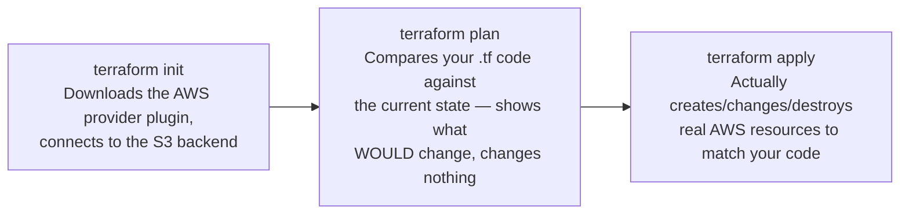

# Learning Terraform From Zero — A Stepwise Path, Mapped to This Repo

> **Who this is for:** you, right now, a junior DevOps engineer who inherited a real Terraform codebase (`GH-infra-and-k8s-charts-central/terraform-iaac/`) written by someone else, trying to build a genuine mental model instead of just copy-pasting changes.
> **Why this note exists:** official docs teach *the language*, in the abstract. They will never show you *your* repo. This note is the bridge — every concept links to the real HashiCorp docs page, and then points at the exact file and lines where you can see it being used for real, in code you already have.
> **All doc links below were verified live on 2026-09-02** — if a link ever 404s, search `developer.hashicorp.com` or `registry.terraform.io` for the page title given.

---

## 0. Read this first — why the docs feel like a maze

This is almost certainly your actual blocker, more than any single concept: **HashiCorp's documentation is split across three genuinely different sites, and they teach three different things.** Nobody tells you this up front.

| Site | What it teaches | When you need it |
|---|---|---|
| `developer.hashicorp.com/terraform/language/` | The **core Terraform language** — `resource`, `variable`, `module`, `for_each`, etc. Same syntax no matter what you're deploying to (AWS, Azure, a pizza API, doesn't matter). | Almost always. This is where you spend most of your early learning time. |
| `developer.hashicorp.com/terraform/cli/` | The **`terraform` command itself** — `init`, `plan`, `apply`, `destroy`. Separate from the language. | When you want to know what a command actually does before you run it. |
| `registry.terraform.io/providers/hashicorp/aws/latest/docs` | The **AWS provider's** own docs — every single `resource "aws_xxx"` block's exact arguments, one page per resource type. **This is a completely different website, not developer.hashicorp.com at all.** | Every time you need to know "what fields does `aws_instance` actually accept?" |

**This third one is very likely where you got stuck.** If you were searching `developer.hashicorp.com` for `aws_instance` or `aws_autoscaling_group` and not finding a clear answer, that's expected — those pages don't live there. They live on the **Terraform Registry**, a separate site, because AWS itself is just one of thousands of independently-maintained "providers" (plugins) Terraform can talk to. The core language docs never mention AWS-specific resource fields at all — that's the provider's job to document, on its own site.

**And the tutorial you linked** (`developer.hashicorp.com/terraform/tutorials/aws-get-started`) is a **fourth kind of page** — a guided, hands-on walkthrough, meant to be *done*, not read as reference material. It'll have you create one plain EC2 instance from an empty folder. That's intentionally as simple as possible — it will not resemble this repo, which has modules calling modules, environment-specific variable files, and Auto Scaling Groups. That's not a sign you're missing something; the tutorial is step 0 of a staircase, not the whole staircase. Do it once for the hands-on feel, then come back here for the part that actually maps to your job.

---

## 1. The core vocabulary, one concept at a time, each tied to a real block of code in this repo

Read each row's doc link, then immediately go open the file listed and find the exact block quoted. Do this in order — each concept builds on the last.

### 1.1 The `terraform {}` block and providers

**Docs:**
- [Terraform block reference](https://developer.hashicorp.com/terraform/language/block/terraform) — what this block configures
- [Providers overview / `required_providers`](https://developer.hashicorp.com/terraform/language) — why you have to declare which plugins you're using

**In this repo:** `terraform-iaac/project/agentcis/terraform-provider.tf`

```hcl
terraform {
  required_providers {
    aws = {
      source  = "hashicorp/aws"
      version = "~> 4.16"
    }
  }
  required_version = ">= 1.2.0"
  backend "s3" {
    encrypt = true
  }
}

provider "aws" {
  region                   = var.region
  profile                  = var.aws_profile
  shared_config_files      = [pathexpand("~/.aws/config")]
  shared_credentials_files = [pathexpand("~/.aws/credentials")]
}
```

**What to notice:**
- `required_providers` says "this configuration needs the AWS provider, version `~> 4.16`" — this is the line that connects your code to that whole separate Registry documentation site from §0.
- `backend "s3"` — this is **where Terraform's own memory of what it created lives** (much more on this in §1.8 — don't worry about it yet, just notice it exists).
- `provider "aws" { profile = var.aws_profile }` — this tells Terraform to authenticate using an AWS CLI profile from your own machine's `~/.aws/credentials` file, not a hardcoded key. Whoever runs this needs that profile configured locally first.

### 1.2 Resources — the actual "things" Terraform creates

**Docs:**
- [`resource` block reference](https://developer.hashicorp.com/terraform/language/block/resource) — the language-level syntax, provider-agnostic
- [`aws_instance` — AWS Provider Registry](https://registry.terraform.io/providers/hashicorp/aws/latest/docs/resources/instance) — every argument this *specific* resource type accepts
- [`aws_launch_template` — AWS Provider Registry](https://registry.terraform.io/providers/hashicorp/aws/latest/docs/resources/launch_template)
- [`aws_autoscaling_group` — AWS Provider Registry](https://registry.terraform.io/providers/hashicorp/aws/latest/docs/resources/autoscaling_group)

**In this repo:** `terraform-iaac/infrastructure/modules/create-services/ec2-list/main-ec2.tf`

```hcl
resource "aws_instance" "ec2_instance" {
  for_each      = local.instances_map
  ami           = each.value.ami_id
  instance_type = each.value.instance_type
  ...
}
```

**What to notice:** the general *shape* — `resource "<TYPE>" "<LOCAL NAME>" { ... }` — is core-language syntax (§0's first row). But every argument *inside* the braces (`ami`, `instance_type`, `subnet_id`, and dozens more you haven't used yet) is defined by the AWS provider, documented on the Registry page above, not by Terraform itself. **This is the single habit worth building early: when you see a `resource "aws_X"` block and don't recognize a field, go to `registry.terraform.io/providers/hashicorp/aws/latest/docs/resources/<X without aws_>` — that page lists every valid argument for that exact resource type.**

### 1.3 Variables — making configuration reusable instead of hardcoded

**Docs:** [Input Variables](https://developer.hashicorp.com/terraform/language/values/variables)

**In this repo:** `terraform-iaac/project/agentcis/variables.tf` (the declarations) — for example:

```hcl
variable "default_asg_ec2_desired_capacities" {
  ...
}
```

A `variable` block is just a *placeholder* — it says "this configuration needs a value called `default_asg_ec2_desired_capacities`, here's its type/description," but doesn't say what that value actually *is* yet. That's step 1.4.

### 1.4 `.tfvars` files — where the actual values live, one file per environment

**Docs:** [Variable Definitions (`.tfvars`) Files](https://developer.hashicorp.com/terraform/language/values/variables#variable-definitions-tfvars-files) (same page as §1.3, scroll down)

**In this repo:** `terraform-iaac/project/agentcis/environment/staging/terraform.tfvars` and `.../production/terraform.tfvars` — for example:

```hcl
# staging
default_asg_ec2_desired_capacities = 2

# production
default_asg_ec2_desired_capacities = 2
webserver_asg_ec2_desired_capacities = 2
queue_asg_ec2_desired_capacities = 3
```

**What to notice — this is the entire mechanism behind "why does staging look different from production":** the *code* (`main-template.tf`, the modules) is identical for both environments. The only thing that differs is which `.tfvars` file you point Terraform at when you run it. One codebase, many environments, driven entirely by different input files. This is *the* pattern to internalize before anything else in this repo will make sense.

### 1.5 Modules — reusable blocks of Terraform, called with different inputs

**Docs:**
- [Modules — Configuration Language](https://developer.hashicorp.com/terraform/language/modules/syntax) — how to *call* a module
- [Standard Module Structure](https://developer.hashicorp.com/terraform/language/modules/develop/structure) — how a module's own files are typically organized (`variables.tf`, `main.tf`, `outputs.tf` inside it)

**In this repo:** `terraform-iaac/infrastructure/templates-agentcis/main-template.tf` *calling* the `ec2-list` module:

```hcl
module "create_ec2_k8s_root_servers" {
  source        = "../modules/create-services/ec2-list"
  ssh_key_name  = var.ssh_key_name
  instance_name = ["k8s-nfs-storage", "k8s-root-master-nginx"]
  ...
}
```

**What to notice:** a `module` block looks a bit like a `resource` block, but it doesn't create AWS infrastructure directly — it runs a whole separate `.tf` file (or folder) elsewhere in the repo, and hands it inputs. This is exactly how this repo avoids repeating the same "create an EC2 instance" logic five separate times — one module (`ec2-list`), called with different `instance_name` lists.

### 1.6 `locals` — computed values you reference by a short name

**Docs:** [Local Values](https://developer.hashicorp.com/terraform/language/values/locals)

**In this repo:** the very top of `ec2-list/main-ec2.tf`:

```hcl
locals {
  instances_map = {
    for idx, name in var.instance_name : name => {
      instance_type = var.instance_type[idx]
      ami_id        = var.ami_id[idx]
      ...
    }
  }
}
```

**What to notice:** this takes the parallel *lists* passed in as variables (`instance_name`, `instance_type`, `ami_id`) and reshapes them into one combined *map*, so the `resource` block below can loop over one clean structure (`local.instances_map`) instead of juggling several separate lists by index. Locals are just named shortcuts for "a value I computed once and want to reuse below."

### 1.7 `count` and `for_each` — creating more than one of something

**Docs:**
- [Meta-Arguments overview, in the `resource` block reference](https://developer.hashicorp.com/terraform/language/block/resource)
- [Manage similar resources with `count` — official tutorial](https://developer.hashicorp.com/terraform/tutorials/configuration-language/count)

**In this repo, two different examples worth comparing:**

`count` — a whole number, used as an on/off switch here (not for repetition):
```hcl
# main-template.tf
module "create_k8s_autoscaling_group_other" {
  count = var.other_auto_scaling ? 1 : 0   # 1 = create it, 0 = don't
  ...
}
```

`for_each` — loops over a map, creating one resource per entry, each addressable by its key (not just a number):
```hcl
# ec2-list/main-ec2.tf
resource "aws_instance" "ec2_instance" {
  for_each = local.instances_map   # one instance per entry in the map from §1.6
  ...
}
```

**What to notice:** `count = var.other_auto_scaling ? 1 : 0` is a genuinely clever, common trick — since `count` just needs *any* whole number, `condition ? 1 : 0` becomes a way to make an entire resource or module conditional: "create exactly one of these if the condition's true, otherwise create zero." This is precisely the mechanism that makes staging skip four of the five worker node pools — see `note/TERRAFORM_SERVER_CREATION_AND_NAMING_CONCEPT_NOTES.md` §A.3 for that full story, now that you know the underlying language feature.

### 1.8 State — Terraform's memory of what it already created

**Docs:**
- [State: Purpose](https://developer.hashicorp.com/terraform/language/state/purpose)
- [Backends: State Storage and Locking](https://developer.hashicorp.com/terraform/language/state/backends)

**In this repo:** back in §1.1's `terraform-provider.tf` — `backend "s3" { encrypt = true }`.

**What state actually is, in plain terms:** when Terraform creates an EC2 instance, AWS gives it back a real instance ID. Terraform has to remember "the resource I called `aws_instance.ec2_instance["k8s-root-master-nginx"]` in my code corresponds to real AWS instance `i-059034996c...`" — otherwise, next time you run `terraform apply`, it wouldn't know whether to create a *new* instance or recognize the existing one. That memory is called **state**, and it's stored in a file (normally `terraform.tfstate`).

**Where this repo keeps it:** in an **S3 bucket** (`backend "s3"`), not on anyone's laptop — meaning multiple engineers can safely share the same "memory" of what's been created. `encrypt = true` means that file is encrypted at rest.

**Worth knowing as a real, live gap, not just theory:** right below that line, there's a commented-out line: `#dynamodb_table = "terraform-state-lock"`. That table would provide **state locking** — preventing two people from running `terraform apply` at the exact same time and corrupting the shared state file. As written, that protection is currently **disabled**. Worth being aware of if you're ever coordinating a Terraform change with someone else at the same time — right now, nothing in this repo prevents two simultaneous applies from stepping on each other.

---

## 2. The CLI — the actual commands, and what each one does

**Docs:**
- [Terraform CLI overview](https://developer.hashicorp.com/terraform/cli)
- [`terraform plan` reference](https://developer.hashicorp.com/terraform/cli/commands/plan)
- [`terraform apply` reference](https://developer.hashicorp.com/terraform/cli/commands/apply)
- [Tutorial: Create a Terraform plan](https://developer.hashicorp.com/terraform/tutorials/cli/plan)



- **`terraform init`** — run once per repo checkout (or whenever you add a new module/provider). Downloads the AWS provider plugin and connects to the S3 backend from §1.8.
- **`terraform plan`** — the single most important safety habit to build. It computes and shows you exactly what would change, **without changing anything**. Always read this output before ever applying.
- **`terraform apply`** — actually makes the changes. On a shared environment like staging or production, this should never be a surprise — it should always follow a `plan` you've read and understood.

**The one thing worth over-learning as a beginner:** `terraform plan` is *always* safe to run. `terraform apply` is not — it changes real, live infrastructure that other engineers and (in production's case) real customers depend on. Never let those two commands feel equally casual in your head.

---

## 3. A safe first exercise

Don't start by editing anything. Start by just running, on a checkout of this repo, pointed at the **staging** `.tfvars` (never production, as a first exercise):

```bash
terraform init
terraform plan -var-file="environment/staging/terraform.tfvars"
```

If nothing in the actual AWS infrastructure has changed since the last apply, and nobody has edited the `.tf` files, this should show **"No changes."** That's a genuinely useful first exercise: it proves your local setup can talk to the real state, and it costs you nothing — `plan` never creates, modifies, or deletes anything.

---

## 4. Suggested reading order through this actual repo, now that you have the vocabulary

1. `terraform-iaac/project/agentcis/terraform-provider.tf` — smallest file, §1.1's concepts, read it end to end.
2. `terraform-iaac/project/agentcis/variables.tf` — every variable this project accepts (just declarations, no values).
3. `terraform-iaac/project/agentcis/environment/staging/terraform.tfvars` — the actual values for staging.
4. `terraform-iaac/project/agentcis/main.tf` — how those variables get passed down into the template.
5. `terraform-iaac/infrastructure/templates-agentcis/main-template.tf` — the big one; by now you should be able to recognize every `module`, `count`, `for_each`, and `var.x` reference in it.
6. Then the individual modules under `terraform-iaac/infrastructure/modules/create-services/` — `ec2-list`, `launch-template`, `auto-scaling-group` — each is small enough to read fully in one sitting once you know the vocabulary.

---

## 5. Common beginner mistakes worth knowing about in advance

**Mistake 1: Searching `developer.hashicorp.com` for AWS-specific resource fields.** They aren't there — that site only documents the core language. Resource-specific arguments live on `registry.terraform.io/providers/hashicorp/aws/latest/docs`.

**Mistake 2: Treating the official "Get Started" tutorial as if it should resemble this repo.** It's intentionally a bare-minimum example. This repo layers modules-calling-modules, environment-specific `.tfvars`, and meta-arguments on top of those basics — expect a gap, and use this note to cross it.

**Mistake 3: Running `terraform apply` without reading the `plan` output first**, especially against a shared environment. Always read what's about to change before confirming it.

**Mistake 4: Assuming every `.tf` file in a folder is independent.** Terraform reads *every* `.tf` file in a directory together, as one combined configuration — `main-template.tf`, `variables.tf`, and any other `.tf` file sitting next to it are not separate programs, they're one program split across files for readability.

**Mistake 5: Forgetting `count`/`for_each` can gate an entire module, not just a single resource.** As seen in §1.7 — a whole module, with everything inside it, can vanish from a plan with one `count = 0`. If something you expect to exist doesn't show up in a plan, check whether a `count` or `for_each` condition above it evaluated to nothing.

---

## 6. References — every link used in this note

- [Terraform Language — Overview](https://developer.hashicorp.com/terraform/language)
- [`terraform` block reference](https://developer.hashicorp.com/terraform/language/block/terraform)
- [`resource` block reference](https://developer.hashicorp.com/terraform/language/block/resource)
- [Input Variables](https://developer.hashicorp.com/terraform/language/values/variables)
- [Local Values](https://developer.hashicorp.com/terraform/language/values/locals)
- [Modules — Configuration Language](https://developer.hashicorp.com/terraform/language/modules/syntax)
- [Standard Module Structure](https://developer.hashicorp.com/terraform/language/modules/develop/structure)
- [References to Values](https://developer.hashicorp.com/terraform/language/expressions/references)
- [Style Guide](https://developer.hashicorp.com/terraform/language/style)
- [Tutorial: Manage similar resources with `count`](https://developer.hashicorp.com/terraform/tutorials/configuration-language/count)
- [State: Purpose](https://developer.hashicorp.com/terraform/language/state/purpose)
- [Backends: State Storage and Locking](https://developer.hashicorp.com/terraform/language/state/backends)
- [Terraform CLI overview](https://developer.hashicorp.com/terraform/cli)
- [`terraform plan` reference](https://developer.hashicorp.com/terraform/cli/commands/plan)
- [`terraform apply` reference](https://developer.hashicorp.com/terraform/cli/commands/apply)
- [Tutorial: Create a Terraform plan](https://developer.hashicorp.com/terraform/tutorials/cli/plan)
- [AWS Provider — `aws_instance`](https://registry.terraform.io/providers/hashicorp/aws/latest/docs/resources/instance)
- [AWS Provider — `aws_launch_template`](https://registry.terraform.io/providers/hashicorp/aws/latest/docs/resources/launch_template)
- [AWS Provider — `aws_autoscaling_group`](https://registry.terraform.io/providers/hashicorp/aws/latest/docs/resources/autoscaling_group)
- [Original "Get Started" tutorial you linked](https://developer.hashicorp.com/terraform/tutorials/aws-get-started)

---

*Companion reading: `note/TERRAFORM_SERVER_CREATION_AND_NAMING_CONCEPT_NOTES.md` for a deep, worked example applying everything in this note to how Agentcis's actual servers get created and named — read that one second, once these fundamentals feel solid.*
